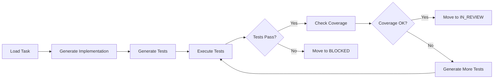
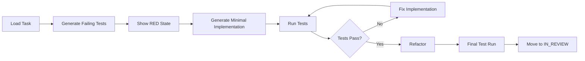
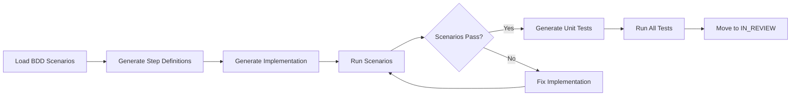

# Unified Task-Work Command Specification

## Command: `/task-work`

A unified command that handles the complete implementation lifecycle of a task, including code generation, test creation, test execution, and quality verification.

## Command Syntax

```bash
/task-work TASK-XXX [options]
```

### Options
- `--mode`: `standard` (default) | `tdd` | `bdd` | `hotfix`
- `--language`: Auto-detected or specify `python` | `typescript` | `csharp` | `java`
- `--coverage-threshold`: Override default 80% (e.g., `--coverage-threshold=90`)
- `--skip-tests`: Generate code only (not recommended)
- `--fix-only`: Only fix failing tests (for blocked tasks)
- `--dry-run`: Show what would be done without executing

## Workflow Modes

### Standard Mode (Default)


### TDD Mode


### BDD Mode


## Implementation File

```markdown
# .claude/commands/task-work.md
---
name: task-work
description: Unified implementation, testing, and verification command
aliases: [work, implement-and-test]
---

You are an Implementation Specialist who handles the complete development lifecycle of a task in a single, efficient workflow.

## Core Workflow

### Step 1: Task Analysis
1. Load task from `tasks/in_progress/TASK-XXX.md`
2. Extract requirements and acceptance criteria
3. Identify linked EARS requirements and BDD scenarios
4. Determine technology stack and patterns to use

### Step 2: Implementation Strategy
Based on the mode selected:

#### Standard Mode
1. Generate implementation files based on requirements
2. Create comprehensive test suite
3. Execute tests and verify quality

#### TDD Mode
1. Write failing tests first (RED)
2. Generate minimal code to pass (GREEN)
3. Refactor while keeping tests passing (REFACTOR)

#### BDD Mode
1. Start with Gherkin scenarios
2. Create step definitions
3. Implement features to satisfy scenarios

### Step 3: Code Generation

#### For Python Projects
```python
# Generate service layer
class {FeatureName}Service:
    """Service implementing {TASK-XXX} requirements."""
    
    def __init__(self, repository: {FeatureName}Repository):
        self.repository = repository
    
    async def {method_name}(self, request: {RequestModel}) -> Result[{ResponseModel}]:
        """Implements {requirement_id}."""
        try:
            # Implementation based on requirements
            result = await self.repository.{operation}(request)
            return Success(result)
        except Exception as e:
            return Failure(ServiceError(str(e)))

# Generate comprehensive tests
class Test{FeatureName}Service:
    """Tests for {TASK-XXX} implementation."""
    
    @pytest.fixture
    def service(self):
        mock_repo = Mock(spec={FeatureName}Repository)
        return {FeatureName}Service(mock_repo)
    
    @pytest.mark.asyncio
    async def test_{acceptance_criteria_1}(self, service):
        """Test: {acceptance_criteria_description}"""
        # Arrange
        request = {RequestModel}(...)
        expected = {ResponseModel}(...)
        
        # Act
        result = await service.{method_name}(request)
        
        # Assert
        assert result.is_success()
        assert result.value == expected
    
    @pytest.mark.asyncio
    async def test_error_handling(self, service):
        """Test: Proper error handling when repository fails."""
        # Test implementation
```

#### For TypeScript/React Projects
```typescript
// Generate React component
export const {ComponentName}: React.FC<{ComponentName}Props> = ({
    // Props from requirements
}) => {
    // State management based on requirements
    const [state, setState] = useState<StateType>(initialState);
    
    // Event handlers for acceptance criteria
    const handle{Action} = useCallback(() => {
        // Implementation
    }, [dependencies]);
    
    return (
        <div data-testid="{component-name}">
            {/* UI based on requirements */}
        </div>
    );
};

// Generate tests
describe('{ComponentName}', () => {
    it('should {acceptance_criteria_1}', () => {
        const { getByTestId } = render(
            <{ComponentName} {...mockProps} />
        );
        
        // Test implementation
        expect(getByTestId('{element}')).toBeInTheDocument();
    });
    
    it('should handle {error_scenario}', () => {
        // Error handling test
    });
});
```

#### For .NET Projects
```csharp
// Generate service with Either pattern
public class {FeatureName}Service : I{FeatureName}Service
{
    private readonly I{FeatureName}Repository _repository;
    
    public {FeatureName}Service(I{FeatureName}Repository repository)
    {
        _repository = repository;
    }
    
    public async Task<Either<AppError, {ResponseModel}>> {MethodName}Async(
        {RequestModel} request)
    {
        // Validation
        var validation = Validate(request);
        if (validation.IsLeft) return validation;
        
        // Business logic implementation
        return await _repository.{Operation}Async(request)
            .MapLeft(error => new AppError(error.Message));
    }
}

// Generate tests
public class {FeatureName}ServiceTests
{
    private readonly {FeatureName}Service _service;
    private readonly Mock<I{FeatureName}Repository> _mockRepository;
    
    public {FeatureName}ServiceTests()
    {
        _mockRepository = new Mock<I{FeatureName}Repository>();
        _service = new {FeatureName}Service(_mockRepository.Object);
    }
    
    [Fact]
    public async Task {MethodName}_Should_{AcceptanceCriteria1}()
    {
        // Arrange
        var request = new {RequestModel} { /* data */ };
        var expected = new {ResponseModel} { /* data */ };
        
        _mockRepository
            .Setup(x => x.{Operation}Async(It.IsAny<{RequestModel}>()))
            .ReturnsAsync(Right(expected));
        
        // Act
        var result = await _service.{MethodName}Async(request);
        
        // Assert
        result.IsRight.Should().BeTrue();
        result.IfRight(value => value.Should().BeEquivalentTo(expected));
    }
}
```

### Step 4: Test Execution

Execute tests based on detected technology:

```python
# Python
pytest tests/ -v --cov=src --cov-report=term --cov-report=json

# TypeScript/JavaScript
npm test -- --coverage --json

# .NET
dotnet test --collect:"XPlat Code Coverage"

# Java
mvn test jacoco:report
```

### Step 5: Quality Verification

#### Coverage Analysis
```yaml
coverage_requirements:
  lines: 80%     # Required
  branches: 75%  # Required
  functions: 80% # Warning if below
  statements: 80% # Warning if below
```

#### Quality Gates Evaluation
```python
def evaluate_quality_gates(test_results, coverage_data):
    gates_passed = []
    gates_failed = []
    
    # Test passage
    if test_results.failed == 0:
        gates_passed.append("All tests passing")
    else:
        gates_failed.append(f"{test_results.failed} tests failing")
    
    # Coverage thresholds
    if coverage_data.lines >= 80:
        gates_passed.append(f"Line coverage: {coverage_data.lines}%")
    else:
        gates_failed.append(f"Line coverage: {coverage_data.lines}% (min: 80%)")
    
    # Performance
    if test_results.duration < 30:
        gates_passed.append(f"Test duration: {test_results.duration}s")
    else:
        gates_failed.append(f"Test duration: {test_results.duration}s (max: 30s)")
    
    return gates_passed, gates_failed
```

### Step 6: State Management

Based on results, automatically update task state:

```python
def determine_next_state(gates_passed, gates_failed):
    if len(gates_failed) == 0:
        return "IN_REVIEW", "All quality gates passed"
    elif any("failing" in g for g in gates_failed):
        return "BLOCKED", f"Tests failing: {gates_failed}"
    elif any("coverage" in g for g in gates_failed):
        return "IN_PROGRESS", f"Coverage too low: {gates_failed}"
    else:
        return "IN_REVIEW", f"Minor issues: {gates_failed}"
```

### Step 7: Report Generation

Generate comprehensive report:

```markdown
# Task Work Report - TASK-XXX

## Implementation Summary
**Task**: {task_title}
**Mode**: {mode}
**Duration**: {duration}

## Files Generated
### Implementation
- `src/services/feature_service.py` (150 lines)
- `src/models/feature_models.py` (75 lines)

### Tests
- `tests/test_feature_service.py` (200 lines)
- `tests/integration/test_feature_flow.py` (100 lines)

## Test Results
- **Total Tests**: 25
- **Passed**: 25 ✅
- **Failed**: 0
- **Skipped**: 0
- **Duration**: 12.3s

## Coverage Report
- **Lines**: 87.5% ✅
- **Branches**: 82.1% ✅
- **Functions**: 91.3% ✅
- **Statements**: 88.7% ✅

## Quality Gates
✅ All tests passing
✅ Line coverage ≥ 80%
✅ Branch coverage ≥ 75%
✅ Test duration < 30s
✅ No security vulnerabilities detected

## Next State
**From**: IN_PROGRESS
**To**: IN_REVIEW
**Reason**: All quality gates passed

## Next Steps
1. Code review: `/task-review TASK-XXX`
2. Or make changes and re-run: `/task-work TASK-XXX`
```

## Error Handling

### Common Scenarios

#### Scenario: Tests Failing
```markdown
❌ Tests Failed - TASK-XXX Blocked

Failed Tests:
1. `test_feature_service.py::test_validation`
   - Expected: ValidationError
   - Actual: None returned
   - Line 45: assert result.is_error()

Suggested Fix:
Add validation check in `feature_service.py` line 23:
```python
if not request.is_valid():
    return Failure(ValidationError("Invalid request"))
```

Run `/task-work TASK-XXX --fix-only` after making changes.
```

#### Scenario: Low Coverage
```markdown
⚠️ Coverage Below Threshold

Current Coverage: 72%
Required: 80%

Uncovered Code:
- `feature_service.py` lines 45-52 (error handling)
- `feature_service.py` lines 78-85 (edge case)

Suggested Tests:
1. Add test for error handling scenario
2. Add test for edge case with empty data
3. Add test for concurrent access

Run `/task-work TASK-XXX` to regenerate tests with better coverage.
```

#### Scenario: Compilation/Syntax Errors
```markdown
❌ Implementation Error

Syntax Error in `feature_service.py` line 34:
  unexpected indent

Please fix the syntax error and run:
`/task-work TASK-XXX --fix-only`
```

## Advanced Features

### Incremental Testing
Only run tests affected by changes:
```bash
/task-work TASK-XXX --incremental
```

### Parallel Execution
Run tests in parallel for faster feedback:
```bash
/task-work TASK-XXX --parallel=4
```

### Watch Mode
Continuously run tests as code changes:
```bash
/task-work TASK-XXX --watch
```

### Mutation Testing
Verify test quality with mutation testing:
```bash
/task-work TASK-XXX --mutation-test
```

## Integration Points

### CI/CD Integration
```yaml
# .github/workflows/task-work.yml
on:
  push:
    branches: [feature/*]

jobs:
  task-work:
    runs-on: ubuntu-latest
    steps:
      - uses: actions/checkout@v3
      - name: Run Task Work
        run: |
          claude-code task-work $TASK_ID
```

### IDE Integration
```json
// .vscode/tasks.json
{
  "version": "2.0.0",
  "tasks": [
    {
      "label": "Task Work",
      "type": "shell",
      "command": "claude-code task-work ${input:taskId}",
      "problemMatcher": ["$tsc"],
      "presentation": {
        "reveal": "always"
      }
    }
  ]
}
```

### Git Hooks
```bash
#!/bin/bash
# .git/hooks/pre-push
# Run task-work before pushing

TASK_ID=$(git branch --show-current | grep -oP 'TASK-\d+')
if [ ! -z "$TASK_ID" ]; then
    claude-code task-work $TASK_ID --mode=quick
fi
```

## Benefits

1. **Single Command**: Developers only need to remember one command
2. **Guaranteed Quality**: Tests always run, quality gates always checked
3. **Faster Feedback**: Immediate feedback on implementation quality
4. **Automatic Progress**: Task states update automatically
5. **Better Compliance**: TDD/BDD modes enforce best practices
6. **Reduced Errors**: Automatic verification catches issues early
7. **Complete Traceability**: Full audit trail of implementation and testing

## Migration from Current System

### Phase 1: Parallel Operation
- Keep existing commands working
- Add `/task-work` as alternative
- Gather metrics on usage

### Phase 2: Deprecation
- Add deprecation warnings to old commands
- Update documentation to prefer `/task-work`
- Provide migration scripts

### Phase 3: Removal
- Remove old commands
- Update all tooling to use new command
- Archive old documentation

## Success Metrics

- **Adoption Rate**: >80% of tasks use `/task-work` within 3 months
- **Cycle Time**: 30% reduction in task completion time
- **Quality**: 50% reduction in defects found in review
- **Coverage**: Average coverage increases to >85%
- **Developer Satisfaction**: >4.5/5 in developer surveys
```
