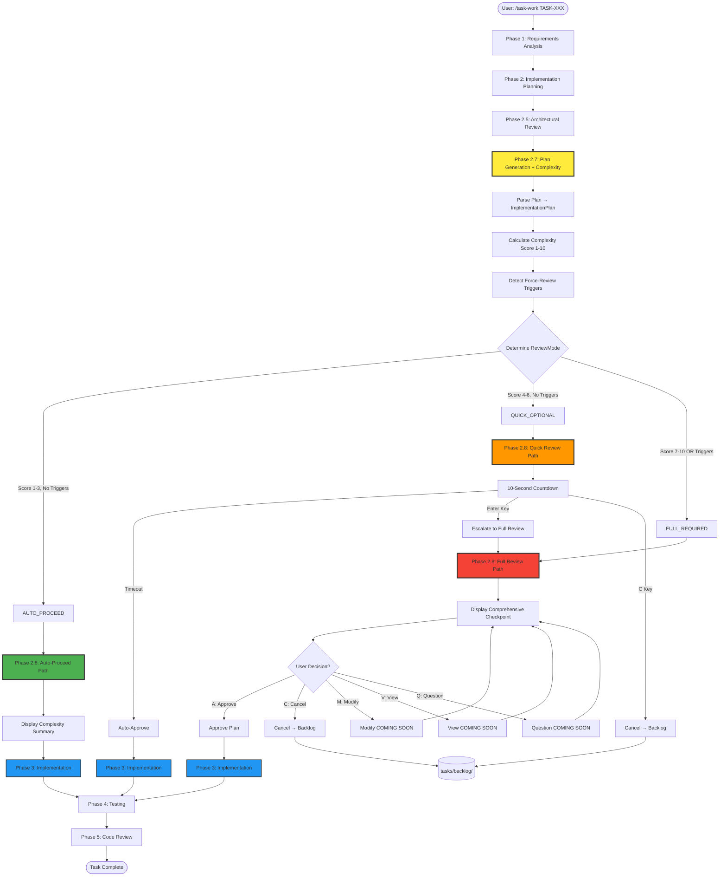
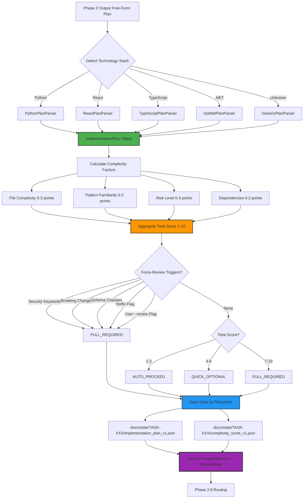
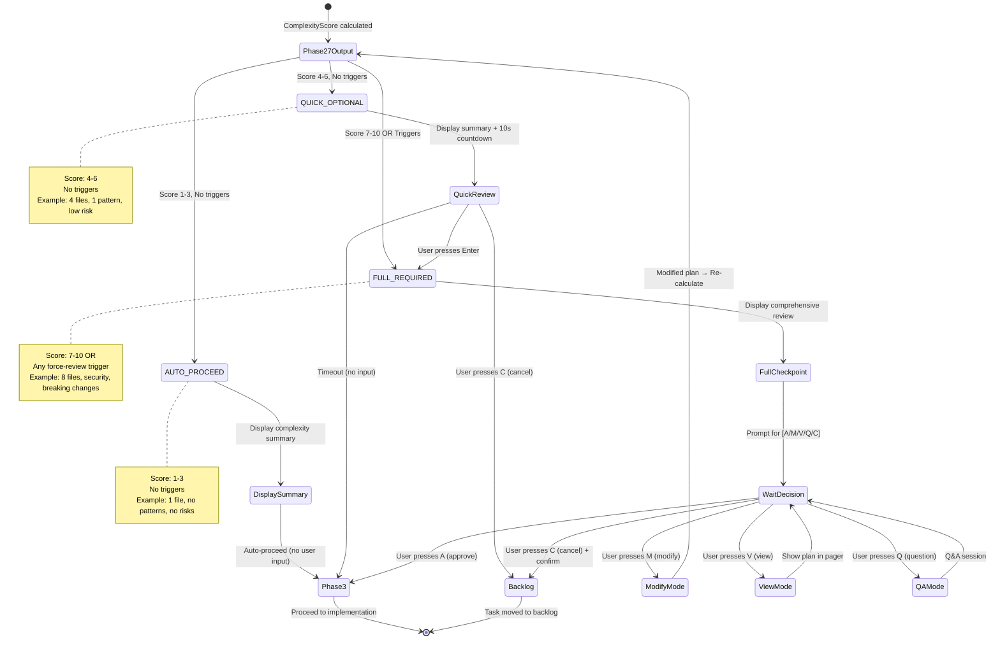
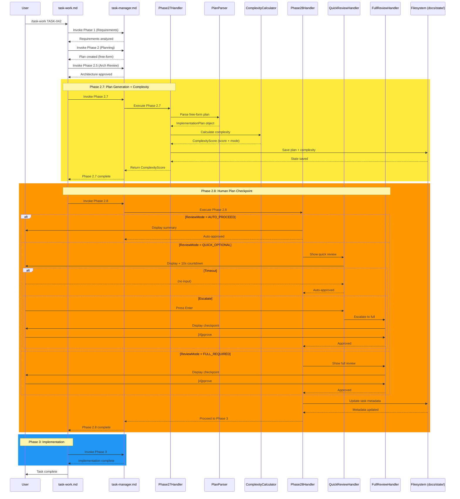
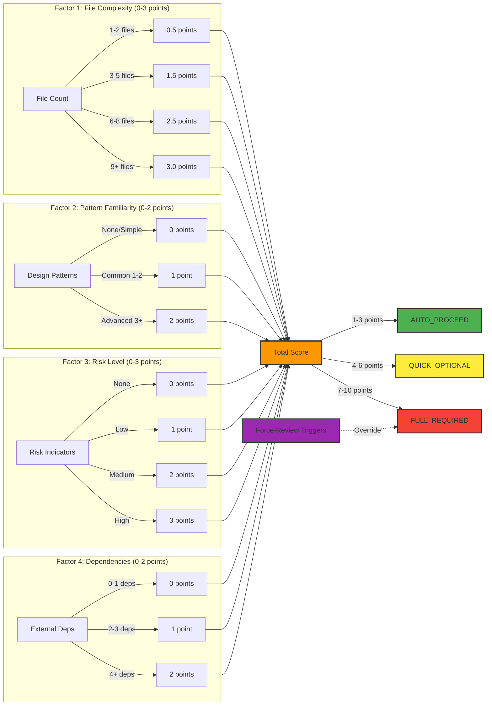
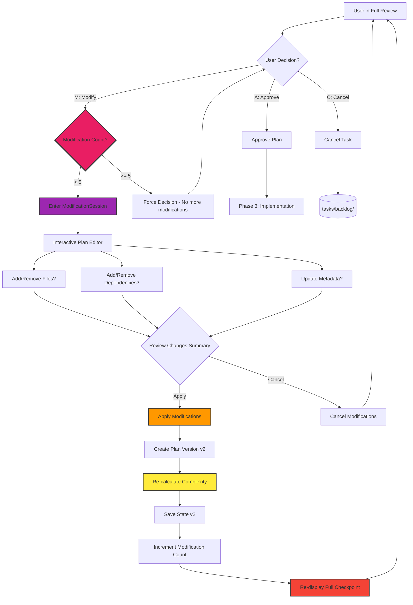
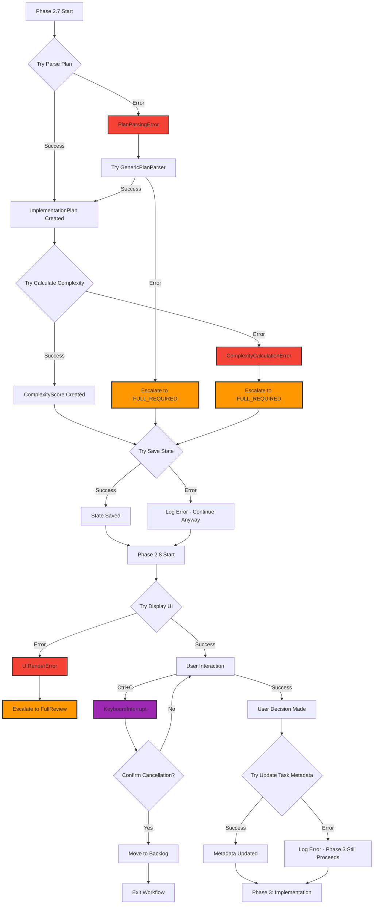
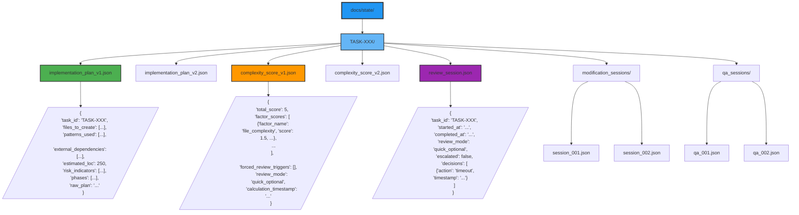
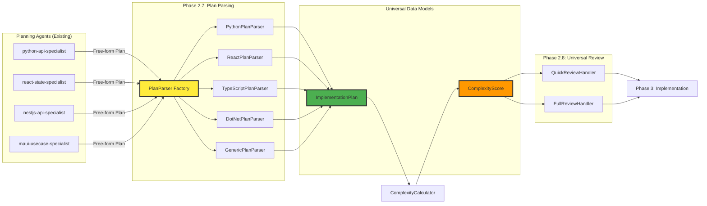

# TASK-003C: Architecture Diagrams
## Visual Reference for Phase 2.7 & 2.8 Integration

**Created**: 2025-10-10
**Purpose**: Visual representation of system architecture

---

## 1. Complete Workflow Diagram

---

## 2. Phase 2.7 Detail Diagram

---

## 3. Phase 2.8 State Machine Diagram

---

## 4. Component Architecture Diagram

```mermaid
graph TB
    subgraph "Task Work Command (task-work.md)"
        TaskWork[task-work.md Entry Point]
    end

    subgraph "Task Manager Orchestrator (task-manager.md)"
        TaskManager[Task Manager Agent]
        Phase27Orch[Phase 2.7 Orchestrator]
        Phase28Orch[Phase 2.8 Orchestrator]
    end

    subgraph "Phase 2.7 Components"
        TaskContext[TaskContext Shared State]
        PlanParser[PlanParser Factory]
        ComplexityCalc[ComplexityCalculator]

        PlanParser --> StackParsers[Stack-Specific Parsers]
        StackParsers --> PythonP[PythonPlanParser]
        StackParsers --> ReactP[ReactPlanParser]
        StackParsers --> GenericP[GenericPlanParser]
    end

    subgraph "Phase 2.8 Components"
        ReviewSM[ReviewStateMachine]
        ReviewCommands[ReviewCommands]
        Phase28Handler[Phase28Handler]

        ReviewCommands --> ApproveCmd[ApproveCommand]
        ReviewCommands --> CancelCmd[CancelCommand]
        ReviewCommands --> ModifyCmd[ModifyCommand STUB]
    end

    subgraph "UI Components (from TASK-003B-1)"
        QuickReview[QuickReviewHandler]
        FullReview[FullReviewHandler]
        Countdown[countdown_timer]

        QuickReview --> Countdown
    end

    subgraph "Data Models (from TASK-003A)"
        Models[ComplexityScore]
        Models2[ImplementationPlan]
        Models3[ReviewMode Enum]
    end

    subgraph "Filesystem State"
        StateFiles[(docs/state/TASK-XXX/)]
        StateFiles --> PlanJSON[implementation_plan_v1.json]
        StateFiles --> ComplexityJSON[complexity_score_v1.json]
        StateFiles --> SessionJSON[review_session.json]
    end

    TaskWork --> TaskManager
    TaskManager --> Phase27Orch
    Phase27Orch --> TaskContext
    Phase27Orch --> PlanParser
    Phase27Orch --> ComplexityCalc

    PlanParser --> Models2
    ComplexityCalc --> Models
    ComplexityCalc --> Models3

    Phase27Orch --> StateFiles

    TaskManager --> Phase28Orch
    Phase28Orch --> ReviewSM
    Phase28Orch --> Phase28Handler
    Phase28Handler --> QuickReview
    Phase28Handler --> FullReview

    Phase28Handler --> ReviewCommands
    Phase28Orch --> StateFiles

    style TaskWork fill:#e1bee7,stroke:#333,stroke-width:3px
    style TaskManager fill:#ce93d8,stroke:#333,stroke-width:2px
    style Phase27Orch fill:#ffeb3b,stroke:#333,stroke-width:3px
    style Phase28Orch fill:#ff9800,stroke:#333,stroke-width:3px
    style StateFiles fill:#2196f3,stroke:#333,stroke-width:2px
```

---

## 5. Data Flow Diagram

---

## 6. Complexity Scoring Formula Diagram

---

## 7. Modification Loop Diagram

---

## 8. Error Handling Flow Diagram

---

## 9. State File Structure Diagram

---

## 10. Technology Stack Integration Diagram

---

## Legend

### Color Coding

- 🟡 **Yellow** (#ffeb3b): Phase 2.7 components
- 🟠 **Orange** (#ff9800): Phase 2.8 components / Medium complexity
- 🟢 **Green** (#4caf50): Success paths / Auto-proceed
- 🔴 **Red** (#f44336): Full review / High complexity
- 🔵 **Blue** (#2196f3): Phase 3 / State storage
- 🟣 **Purple** (#9c27b0): Special actions / Modification

### Shape Meanings

- **Rectangles**: Processes/Components
- **Diamonds**: Decision points
- **Rounded rectangles**: Start/End states
- **Cylinders**: Data storage
- **Dashed lines**: Optional/Override paths

---

## How to Use These Diagrams

1. **Workflow Diagram (#1)**: High-level overview for stakeholders
2. **Phase 2.7 Detail (#2)**: For implementing Phase 2.7 components
3. **State Machine (#3)**: For understanding Phase 2.8 routing logic
4. **Component Architecture (#4)**: For understanding system structure
5. **Data Flow (#5)**: For understanding sequence of operations
6. **Complexity Scoring (#6)**: For understanding scoring algorithm
7. **Modification Loop (#7)**: For implementing future modification feature
8. **Error Handling (#8)**: For implementing robust error handling
9. **State Files (#9)**: For understanding filesystem structure
10. **Stack Integration (#10)**: For adding new technology stacks

---

**Document Version**: 1.0
**Created**: 2025-10-10
**Format**: Mermaid.js diagrams (render in GitHub, GitLab, or Mermaid Live Editor)
