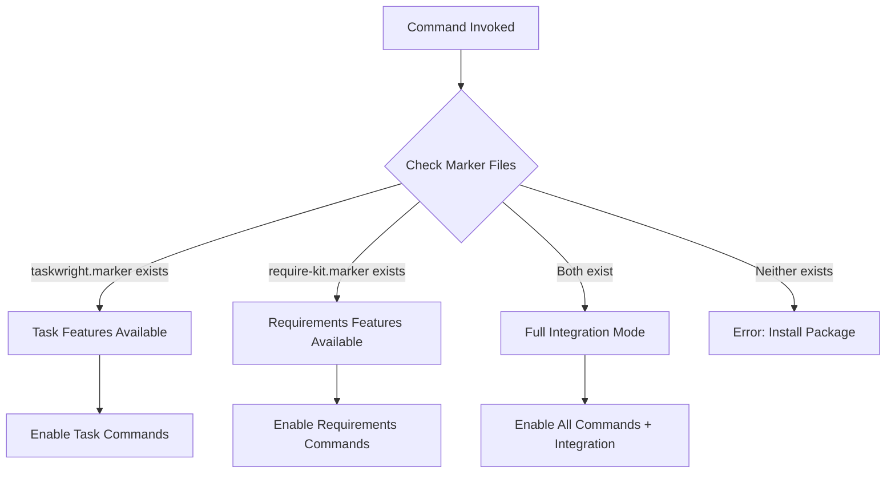

# Bidirectional Optional Integration Model

## Overview

The **Agentecflow ecosystem** consists of two independent but complementary packages:
- **taskwright**: Task execution with quality gates
- **require-kit**: Requirements management with EARS/BDD

Both packages follow a **bidirectional optional integration** model, meaning:
- ✅ Each works standalone
- ✅ No hard dependencies
- ✅ Enhanced features when both installed
- ✅ Automatic detection and integration

## Architecture Principles

### 1. Independence
Each package is **fully functional on its own**:

**taskwright alone:**
```
- Task workflow (create, work, complete, status)
- Quality gates (architectural review, test enforcement)
- Stack templates (React, Python, .NET, etc.)
- Implementation execution
```

**require-kit alone:**
```
- Requirements engineering (EARS notation)
- Epic/Feature hierarchy management
- BDD/Gherkin scenario generation
- Requirements traceability
- PM tool export (Jira, Linear, GitHub, Azure DevOps)
```

### 2. Mutual Discovery
Packages detect each other via **marker files**:

```
~/.agentecflow/
├── taskwright.marker     # JSON metadata (name, version, installed_at)
└── require-kit.marker    # JSON metadata (name, version, installed_at)
```

The `feature_detection.py` library provides:
```python
from lib.feature_detection import (
    is_taskwright_installed,
    is_require_kit_installed,
    supports_requirements,
    supports_epics,
    get_available_features
)
```

### 3. Progressive Enhancement
Commands adapt based on available packages:

**Example: task-create**
```bash
# taskwright only
/task-create "Build login page"
# Creates task with: title, priority, complexity

# Both installed (enhanced)
/task-create "Build login page" epic:EPIC-001 requirements:[REQ-005]
# Creates task with: title, priority, complexity, epic, feature, requirements
```

**Example: epic-create**
```bash
# require-kit only
/epic-create "User Authentication"
# Creates epic with requirements, features, BDD scenarios

# Both installed (enhanced)
/epic-create "User Authentication"
# Creates epic AND automatically creates backlog tasks via taskwright
```

## Use Cases

### Use Case 1: Lean Startup (taskwright only)
**Scenario**: Small team, move fast, no upfront requirements

**Installation:**
```bash
cd taskwright
./installer/scripts/install.sh
```

**Workflow:**
```bash
/task-create "Build MVP landing page"
/task-work TASK-001
/task-complete TASK-001
```

**Benefits:**
- ✅ Minimal overhead
- ✅ Quick iteration
- ✅ Quality gates still enforced
- ✅ Can add require-kit later when ready

### Use Case 2: Enterprise Requirements (require-kit only)
**Scenario**: Requirements team, no implementation yet

**Installation:**
```bash
cd require-kit
./installer/scripts/install.sh
```

**Workflow:**
```bash
/gather-requirements
/formalize-ears
/epic-create "User Management"
/feature-create "Login" epic:EPIC-001
/generate-bdd FEAT-001
# Export to Jira/Linear for dev team
```

**Benefits:**
- ✅ Formal requirements management
- ✅ Traceability
- ✅ PM tool integration
- ✅ No task execution overhead

### Use Case 3: Full Integration (both)
**Scenario**: Complete requirements-to-implementation workflow

**Installation:**
```bash
cd taskwright
./installer/scripts/install.sh

cd ../require-kit
./installer/scripts/install.sh
```

**Workflow:**
```bash
# 1. Requirements
/gather-requirements
/formalize-ears

# 2. Planning
/epic-create "User Authentication"
/feature-create "Login Page" epic:EPIC-001

# 3. Tasks
/task-create "Implement login form" feature:FEAT-001 requirements:[REQ-005,REQ-006]

# 4. Implementation
/task-work TASK-001  # Automatically loads requirements context

# 5. Traceability
/task-status --epic EPIC-001  # Show all tasks for epic
/hierarchy-view EPIC-001      # Full requirements → tasks view
```

**Benefits:**
- ✅ Complete traceability
- ✅ Requirements → Epics → Features → Tasks → Code
- ✅ Integrated reporting
- ✅ Best of both worlds

## Technical Implementation

### Feature Detection Flow



### Marker File Format

**taskwright.marker:**
```json
{
  "name": "taskwright",
  "version": "1.0.0",
  "installed_at": "2025-10-28T12:00:00Z",
  "install_dir": "~/.agentecflow"
}
```

**require-kit.marker:**
```json
{
  "name": "require-kit",
  "version": "1.0.0",
  "installed_at": "2025-10-28T13:00:00Z",
  "install_dir": "~/.agentecflow"
}
```

### Compatibility Checking

The `feature_detection.py` library provides non-blocking compatibility checks:

```python
detector = FeatureDetector()
result = detector.check_compatibility()

# Returns:
{
    "compatible": True,
    "warnings": [
        "taskwright installed without require-kit - task execution available, "
        "install require-kit for full integration (requirements management)"
    ],
    "errors": []  # No blocking errors
}
```

## Manifest Integration Section

Both packages declare their integration model in `manifest.json`:

**require-kit/installer/global/manifest.json:**
```json
{
  "integration": {
    "taskwright": {
      "type": "bidirectional-optional",
      "provides": "Requirements can be linked to tasks",
      "description": "When both installed, enable full requirements-to-implementation traceability"
    }
  }
}
```

**taskwright/installer/global/manifest.json:**
```json
{
  "integration": {
    "require-kit": {
      "type": "bidirectional-optional",
      "provides": "Tasks can reference requirements, epics, and features",
      "description": "When both installed, enable full requirements-to-implementation traceability"
    }
  }
}
```

## Migration Paths

### From Monolithic to Modular

**Current state**: Full agentecflow bundle
**Target**: Separate taskwright + require-kit

**Migration steps:**
1. Install taskwright → Gets core task workflow
2. Install require-kit → Gets requirements features
3. Both coexist, all features work as before
4. No data migration needed (file structure unchanged)

### Adding Capabilities

**Scenario 1**: Have taskwright, need requirements
```bash
cd require-kit
./installer/scripts/install.sh
# Automatically detects taskwright, enables integration
```

**Scenario 2**: Have require-kit, need task execution
```bash
cd taskwright
./installer/scripts/install.sh
# Automatically detects require-kit, enables integration
```

## Benefits Summary

| Aspect | Benefit |
|--------|---------|
| **Flexibility** | Install only what you need |
| **No Lock-in** | Each package works standalone |
| **Progressive** | Start simple, add features later |
| **Scalable** | Works for 1 developer or 100+ team |
| **Maintainable** | Clear separation of concerns |
| **Discoverable** | Auto-detection, no config needed |
| **Upgradeable** | Update packages independently |
| **Robust** | No breaking changes when adding/removing |

## Anti-Patterns Avoided

❌ **Hard dependency** (require-kit requires taskwright)
- Would force users to install both
- Prevents standalone requirements work

❌ **Monolithic bundle** (one package with everything)
- Forces users to adopt entire workflow
- Harder to maintain and test

❌ **Fragile integration** (manual configuration required)
- Error-prone setup
- Poor user experience

✅ **Bidirectional optional** (our model)
- Flexible, maintainable, robust
- Best user experience

## Future Extensibility

The bidirectional model supports future packages:

**Potential additions:**
- `agentecflow-pm` (PM tool sync)
- `agentecflow-metrics` (analytics)
- `agentecflow-security` (security scanning)

Each would:
- Work standalone
- Detect other packages
- Enhance features when combined
- No hard dependencies

## Related Documentation

- [REQ-003: Shared Installer Strategy](../../tasks/backlog/REQ-003-shared-installer.md)
- [REQ-003A: require-kit Installer](../../tasks/backlog/REQ-003A-require-kit-installer.md)
- [feature_detection.py](../../installer/global/lib/feature_detection.py)
- [taskwright TASK-012](https://github.com/yourusername/taskwright/tasks/TASK-012)

## Conclusion

The **bidirectional optional integration** model provides the best of both worlds:
- **Simplicity** when you need just one package
- **Power** when you need full integration
- **Flexibility** to evolve as needs change

This architecture ensures Agentecflow can scale from solo developers to enterprise teams without compromising on usability or maintainability.
