# Agentecflow Lite: The Sweet Spot Workflow

**Version**: 1.0.0
**Last Updated**: 2025-10-19
**Compatibility**: Claude Code with task-work command v2.0+
**Document Type**: Comprehensive Workflow Guide

---

## Table of Contents

### Part 1: Quick Start (2 Minutes)
- [What is Agentecflow Lite?](#what-is-agentecflow-lite)
- [The 3-Minute Getting Started](#the-3-minute-getting-started)
- [Decision Framework: Is This Right for You?](#decision-framework-is-this-right-for-you)

### Part 2: Core Concepts (10 Minutes)
- [The 9 Core Features](#the-9-core-features)
- [Understanding Progressive Enhancement](#understanding-progressive-enhancement)
- [The Lightweight Philosophy](#the-lightweight-philosophy)

### Part 3: Feature Deep Dives (30+ Minutes)
- [3.1 Complexity Evaluation](#31-complexity-evaluation)
- [3.2 Design-First Workflow](#32-design-first-workflow)
- [3.3 Test Enforcement Loop](#33-test-enforcement-loop)
- [3.4 Architectural Review](#34-architectural-review)
- [3.5 Human Checkpoints](#35-human-checkpoints)
- [3.6 Plan Audit](#36-plan-audit)
- [3.7 Iterative Refinement](#37-iterative-refinement)
- [3.8 MCP Tool Discovery](#38-mcp-tool-discovery)
- [3.9 Design System Detection](#39-design-system-detection)

### Part 4: Practical Workflows
- [4.1 Complete Workflow Examples](#41-complete-workflow-examples)
- [4.2 Decision Trees & Flowcharts](#42-decision-trees--flowcharts)

### Part 5: Integration & Advanced Topics
- [5.1 Integration with Full Spec-Kit](#51-integration-with-full-spec-kit)
- [5.2 Cross-Reference Map](#52-cross-reference-map)
- [5.3 Troubleshooting & FAQ](#53-troubleshooting--faq)

### Part 6: Appendices
- [Appendix A: Complete Feature Comparison Table](#appendix-a-complete-feature-comparison-table)
- [Appendix B: Glossary of Terms](#appendix-b-glossary-of-terms)
- [Appendix C: Additional Resources](#appendix-c-additional-resources)

---

# Part 1: QUICK START (2 Minutes)

## What is Agentecflow Lite?

**Agentecflow Lite** is a lightweight workflow methodology embedded directly into the `/task-work` command that provides **80% of the benefits with 20% of the complexity** of full specification-driven development.

### The Sweet Spot

Think of software development on a spectrum:

```
Plain AI Coding ←──────── Agentecflow Lite ──────────→ Full Spec-Kit
(Cursor, Claude)        (THIS GUIDE)              (Enterprise SDD)

✗ No structure          ✓ Structured workflow      ✓ Complete traceability
✗ No quality gates      ✓ Quality gates           ✓ Comprehensive gates
✗ No verification       ✓ Automated testing       ✓ Multi-level validation
✓ Zero overhead         ✓ Minimal overhead        ✗ Heavy overhead
✓ Fast iteration        ✓ Fast with safety        ✗ Slow iteration
```

**Agentecflow Lite provides**:
- Automatic architectural review before implementation
- Zero-tolerance test enforcement (100% passing required)
- Complexity-based routing (simple tasks auto-proceed, complex tasks get checkpoints)
- Human approval points for critical decisions
- Plan auditing to catch scope creep
- Iterative refinement for continuous improvement

**Without requiring**:
- EARS requirements notation
- BDD/Gherkin scenarios
- Epic/Feature hierarchy
- External PM tool integration
- Multi-agent orchestration
- Separate MCP servers or installation

### When to Use Agentecflow Lite

**Use Agentecflow Lite when**:
- ✅ Working on individual tasks (not full epics)
- ✅ You want quality gates without heavy process
- ✅ Team size is 1-3 developers
- ✅ Project is small-to-medium scale
- ✅ You value speed with safety

**Upgrade to Full Spec-Kit when**:
- ⚡ Multi-epic projects with 10+ features
- ⚡ Team size >5 developers
- ⚡ Enterprise compliance required
- ⚡ External PM tool integration needed
- ⚡ Multi-agent orchestration valuable

---

## The 3-Minute Getting Started

### Prerequisites Check

```bash
# Verify you have task-work command available
/task-work --help

# Expected: Command specification with phases listed
```

### Your First Workflow Run

**Step 1**: Create a simple task file

```bash
# Create a task file (if not using task-create)
cat > tasks/backlog/TASK-001-fix-typo.md <<EOF
---
id: TASK-001
title: Fix typo in error message
status: backlog
---

# Fix typo in error message

## Description
Change "occured" to "occurred" in AuthService error message.

## Acceptance Criteria
- [ ] Typo fixed in src/services/AuthService.py:45
- [ ] Tests still passing
EOF
```

**Step 2**: Run the workflow

```bash
/task-work TASK-001
```

**Step 3**: Watch the magic happen

```
═══════════════════════════════════════════════════════
🔄 PHASE 1: LOAD TASK CONTEXT
═══════════════════════════════════════════════════════
✅ Found: TASK-001-fix-typo.md (state: backlog)
✅ Transitioned TASK-001 from backlog to IN_PROGRESS

═══════════════════════════════════════════════════════
📋 PHASE 2: IMPLEMENTATION PLANNING
═══════════════════════════════════════════════════════
Plan: Edit src/services/AuthService.py line 45
Estimated duration: 2 minutes

═══════════════════════════════════════════════════════
🔍 PHASE 2.5B: ARCHITECTURAL REVIEW
═══════════════════════════════════════════════════════
Score: 95/100 (Auto-approved)
  SOLID: 95/100 ✅
  DRY: 100/100 ✅
  YAGNI: 90/100 ✅

═══════════════════════════════════════════════════════
📊 PHASE 2.7: COMPLEXITY EVALUATION
═══════════════════════════════════════════════════════
Complexity: 1/10 (Simple)
Review Mode: AUTO_PROCEED

Auto-approving (low complexity)...

═══════════════════════════════════════════════════════
🚀 PHASE 3: IMPLEMENTATION
═══════════════════════════════════════════════════════
Edited src/services/AuthService.py:45
  - raise Exception("Authentication occured successfully")
  + raise Exception("Authentication occurred successfully")

═══════════════════════════════════════════════════════
✅ PHASE 4: TESTING
═══════════════════════════════════════════════════════
Compilation: PASSED ✅
Tests: 5/5 PASSED ✅
Coverage: 85% line, 78% branch ✅

═══════════════════════════════════════════════════════
👀 PHASE 5: CODE REVIEW
═══════════════════════════════════════════════════════
Quality: APPROVED ✅
  Lint: 0 issues
  Style: Consistent
  Documentation: Adequate

═══════════════════════════════════════════════════════
✅ TASK WORK COMPLETE
═══════════════════════════════════════════════════════
State: BACKLOG → IN_REVIEW
Duration: 1 minute 47 seconds
All quality gates passed ✅
```

### What Just Happened?

In under 2 minutes, Agentecflow Lite:

1. **Analyzed** your task requirements
2. **Planned** the implementation approach
3. **Reviewed** the architecture (SOLID/DRY/YAGNI)
4. **Evaluated** complexity (determined it was simple)
5. **Implemented** the fix automatically
6. **Tested** the change (compilation + tests)
7. **Reviewed** code quality
8. **Moved** the task to IN_REVIEW state

All without you writing any code, running any tests, or managing state transitions manually.

---

## Decision Framework: Is This Right for You?

### Quick Assessment Checklist

Ask yourself these 3 questions:

**1. Project Scale**
- [ ] Individual tasks or small features (not full epics)?
- [ ] Codebase <100K lines?
- [ ] Team <5 developers?

**2. Quality Needs**
- [ ] Need automated testing and quality gates?
- [ ] Want architectural review without manual process?
- [ ] Care about test coverage and code quality?

**3. Overhead Tolerance**
- [ ] Want workflow to be fast (minutes, not hours)?
- [ ] Don't need formal requirements notation (EARS)?
- [ ] Don't need external PM tool integration (Jira, Linear)?

**Scoring**:
- **7-9 Yes**: ✅ Agentecflow Lite is perfect for you
- **4-6 Yes**: ⚠️  Agentecflow Lite will help, but consider Full Spec-Kit for some features
- **0-3 Yes**: ❌ You might need Full Spec-Kit or plain AI coding

### Workflow Comparison Matrix

| Criteria | Plain AI | **Agentecflow Lite** | Full Spec-Kit |
|----------|----------|---------------------|---------------|
| **Setup Time** | None | 5 minutes | 2-4 hours |
| **Per-Task Overhead** | 0 min | 10-15 min | 30-60 min |
| **Quality Gates** | None | Strong | Comprehensive |
| **Test Enforcement** | Manual | Automatic | Automatic |
| **Architectural Review** | None | Automatic | Multi-agent |
| **Requirements Tracing** | None | Task-level | Epic→Feature→Task |
| **State Management** | Manual | Automatic | Automatic |
| **Complexity Evaluation** | Manual | Automatic | Automatic |
| **Human Checkpoints** | None | Smart | Always |
| **Plan Auditing** | None | Yes | Yes |
| **Learning Curve** | None | 1 hour | 1 week |

### Next Steps by Role

**If you're a Solo Developer**:
→ Start with Agentecflow Lite (this guide)
→ Graduate to Full Spec-Kit when projects grow beyond 10 features

**If you're on a Small Team (2-5 people)**:
→ Use Agentecflow Lite for individual task workflow
→ Consider Full Spec-Kit for epic-level planning and coordination

**If you're in an Enterprise**:
→ Use Full Spec-Kit for complete traceability and compliance
→ Use Agentecflow Lite for rapid prototyping and experiments

---

# Part 2: CORE CONCEPTS (10 Minutes)

## The 9 Core Features

Agentecflow Lite synthesizes **9 key features** into a unified workflow embedded in the `/task-work` command. These features were developed based on research by John Hubbard (senior engineer at Anthropic) and align with his proven 6-step workflow.

### Feature Map Overview

```
/task-work TASK-XXX
│
├─ PHASE 1: Load Task Context
│
├─ PHASE 2: Implementation Planning
│   ├─ Feature 8: MCP Tool Discovery
│   └─ Feature 9: Design System Detection
│
├─ PHASE 2.5A: Pattern Suggestion
│
├─ PHASE 2.5B: Architectural Review ────────┐
│   └─ Feature 4: SOLID/DRY/YAGNI Review    │ Quality
│                                            │ Gates
├─ PHASE 2.7: Complexity Evaluation ────────┤
│   └─ Feature 1: Complexity Scoring        │
│                                            │
├─ PHASE 2.8: Human Checkpoint ─────────────┤
│   └─ Feature 5: Smart Checkpoints         │
│                                            │
├─ PHASE 3: Implementation                  │
│   └─ Feature 2: Design-First Workflow     │
│                                            │
├─ PHASE 4: Testing                         │
│                                            │
├─ PHASE 4.5: Test Enforcement Loop ────────┤
│   └─ Feature 3: Zero-Tolerance Testing    │
│                                            │
├─ PHASE 5: Code Review                     │
│                                            │
├─ PHASE 5.5: Plan Audit ───────────────────┤
│   └─ Feature 6: Scope Creep Detection     │
│                                            │
└─ PHASE 6: Iterative Refinement            │
    └─ Feature 7: /task-refine Command ─────┘
```

### The 9 Features Explained

**Workflow Features** (Embedded in task-work):

1. **Complexity Evaluation** (Phase 2.7)
   - Automatically scores tasks 1-10 based on files, patterns, risk, dependencies
   - Suggests task breakdown for complex tasks (≥7)
   - Routes to appropriate review mode (auto/quick/full)

2. **Design-First Workflow** (Phase 2-3)
   - Optional flags: `--design-only` and `--implement-only`
   - Enables multi-day workflows (design Day 1, implement Day 2)
   - Supports architect-designs-dev-implements collaboration

3. **Test Enforcement Loop** (Phase 4.5)
   - Zero tolerance for test failures or compilation errors
   - Automatic fix attempts (up to 3 iterations)
   - Only moves to IN_REVIEW when 100% tests pass

4. **Architectural Review** (Phase 2.5B)
   - Evaluates plan against SOLID, DRY, YAGNI principles
   - Scores 0-100 (≥80 auto-approve, 60-79 approve with recs, <60 reject)
   - Catches design issues before implementation (saves 40-50% time)

5. **Human Checkpoints** (Phase 2.8)
   - Complexity-based routing (simple auto-proceeds, complex requires approval)
   - Interactive plan review and modification
   - Critical decision points with clear options

6. **Plan Audit** (Phase 5.5)
   - Compares actual implementation vs. planned implementation
   - Detects scope creep (unplanned files, dependencies, features)
   - Flags variance >50% for human review

7. **Iterative Refinement** (Phase 6)
   - Lightweight `/task-refine` command for IN_REVIEW tasks
   - Preserves context from original implementation
   - Re-runs quality gates after refinement

**Enhancement Features** (Phase 2.8 Extensions):

8. **MCP Tool Discovery** (Phase 2.8)
   - Detects available MCP tools (Figma, Zeplin, etc.)
   - Enhances plan with tool-specific capabilities
   - Suggests appropriate commands for design integration

9. **Design System Detection** (Phase 2.8)
   - Identifies design URLs in task descriptions
   - Automatically suggests design-to-code workflows
   - Integrates visual regression testing

### Integration Points

The 9 features work together as a system:

```
Complexity Evaluation ──→ Human Checkpoint ──→ Architectural Review
        ↓                        ↓                      ↓
    Auto-proceed         Interactive modify      SOLID scoring
        ↓                        ↓                      ↓
Test Enforcement ←───────────────┴──────────────────────┘
        ↓
   Plan Audit ──→ Scope Creep Detection ──→ Refinement
        ↓                                        ↓
   Quality Gate                          /task-refine
```

**Example Integration**:
1. Complexity Evaluation scores task as 8/10 (complex)
2. Human Checkpoint triggers (mandatory for 7+)
3. User modifies plan at checkpoint
4. Architectural Review evaluates modified plan
5. Implementation proceeds
6. Test Enforcement ensures 100% passing
7. Plan Audit detects 2 unplanned files added
8. User approves variance or refines implementation

---

## Understanding Progressive Enhancement

Agentecflow Lite sits between two extremes of AI-assisted development.

### The Spectrum

**Level 0: Plain AI Coding** (Cursor, ChatGPT, Claude)
- Chat with AI, copy-paste code
- No automation, no structure
- Manual testing, manual state tracking
- Fast but risky

**Level 1: Agentecflow Lite** (This Guide) ⭐
- Structured workflow with phases
- Automated quality gates
- State management (BACKLOG → IN_PROGRESS → IN_REVIEW)
- Fast with safety

**Level 2: Full Spec-Kit** (Enterprise Agentecflow)
- EARS requirements notation
- BDD/Gherkin scenarios
- Epic → Feature → Task hierarchy
- External PM tool integration
- Multi-agent orchestration
- Comprehensive but heavy

### What Lite Adds to Plain AI

| Capability | Plain AI | Agentecflow Lite |
|-----------|----------|------------------|
| **Planning** | You plan manually | AI generates structured plan |
| **Architecture** | No review | SOLID/DRY/YAGNI scoring |
| **Complexity** | You estimate | Automatic 1-10 scoring |
| **Implementation** | You write code | AI implements from plan |
| **Testing** | You run tests | AI tests + enforces 100% pass |
| **Quality Gates** | None | Compilation, tests, coverage |
| **State Management** | Manual | Automatic (backlog → in_progress → in_review) |
| **Scope Creep** | Undetected | Plan audit flags deviations |
| **Refinement** | Start over | Iterative /task-refine |

### What Lite Removes from Full Spec-Kit

| Capability | Full Spec-Kit | Agentecflow Lite |
|-----------|---------------|------------------|
| **Requirements** | EARS notation | Task descriptions only |
| **Test Specs** | BDD/Gherkin | Test code only |
| **Hierarchy** | Epic → Feature → Task | Tasks only |
| **PM Integration** | Jira, Linear, GitHub | None |
| **Multi-Agent** | Orchestration | Single agent |
| **Setup Time** | 2-4 hours | 5 minutes |
| **Per-Task Overhead** | 30-60 min | 10-15 min |

**Key Insight**: Agentecflow Lite gives you the **essential workflow benefits** (planning, testing, quality) without the **ceremony** (EARS, BDD, multi-agent).

---

## The Lightweight Philosophy

### No-Install Benefits

Agentecflow Lite is embedded directly in the `/task-work` command. No separate installation, no MCP servers to configure, no template initialization.

**You get**:
- ✅ Workflow phases (planning, architecture, testing)
- ✅ Quality gates (SOLID review, test enforcement)
- ✅ State management (task file moves between folders)
- ✅ Complexity routing (auto-proceed vs. checkpoints)

**Without needing**:
- ❌ Separate `agentecflow` CLI installation
- ❌ MCP server configuration
- ❌ Template selection and initialization
- ❌ Epic/Feature file creation
- ❌ Requirements files (EARS)
- ❌ BDD scenario files (Gherkin)

### State Management Approach

Agentecflow Lite uses **filesystem-based state** via task file locations:

```
tasks/
├── backlog/              # BACKLOG state
│   └── TASK-XXX.md
├── in_progress/          # IN_PROGRESS state
│   └── TASK-XXX.md
├── in_review/            # IN_REVIEW state (quality gates passed)
│   └── TASK-XXX.md
├── blocked/              # BLOCKED state (quality gates failed)
│   └── TASK-XXX.md
└── completed/            # COMPLETED state
    └── TASK-XXX.md
```

**State Transitions**:
- `/task-work` automatically moves BACKLOG → IN_PROGRESS
- Quality gates determine IN_PROGRESS → IN_REVIEW or BLOCKED
- `/task-complete` moves IN_REVIEW → COMPLETED
- `/task-refine` keeps in IN_REVIEW (iterative improvement)

**No database, no external tool** - just file locations.

### When to Graduate to Full Spec-Kit

Consider upgrading when you experience these pain points:

**Trigger 1: Multi-Epic Projects**
- You have 10+ features spanning 3+ epics
- Manual epic management becomes tedious
- **Solution**: Full Spec-Kit epic/feature hierarchy

**Trigger 2: Team Coordination**
- Team size >5 developers
- Need to track who's working on what
- **Solution**: Full Spec-Kit with PM tool integration (Jira, Linear)

**Trigger 3: Requirements Traceability**
- Regulatory compliance requires tracing code → requirements
- Audit trail needed for changes
- **Solution**: Full Spec-Kit EARS notation and BDD scenarios

**Trigger 4: Multi-Agent Workflows**
- Complex tasks benefit from specialized agents (API, UI, testing)
- Agent orchestration adds value
- **Solution**: Full Spec-Kit multi-agent system

**Migration Path**:
1. Continue using Agentecflow Lite for individual tasks
2. Add Full Spec-Kit at epic level (hybrid approach)
3. Gradually migrate all tasks to Full Spec-Kit as needed

See [Integration with Full Spec-Kit](#51-integration-with-full-spec-kit) for details.

---

## Part 3: Feature Deep Dives

This section provides comprehensive documentation for each of the 9 features in Agentecflow Lite, organized into 3 tiers based on importance and usage patterns.

### 3.1 Complexity Evaluation

**Hubbard Alignment**: Step 1 (Plan) - Complexity evaluation as part of planning phase

**Phase**: 2.7 of /task-work command
**Purpose**: Automatically evaluate task complexity to route to appropriate review mode and suggest task breakdown for oversized work.

#### Quick Start (2 minutes)

The most common use case is automatic complexity evaluation during task execution:

```bash
/task-work TASK-042

# Phase 2.7 executes automatically:
Phase 2.7: Complexity Evaluation
  Analyzing implementation plan...

  Complexity Score: 3/10 (Simple)

  Factors:
    File Complexity: 1/3 (2 files)
    Pattern Familiarity: 0/2 (familiar patterns)
    Risk Level: 0/3 (low risk)
    Dependencies: 0/2 (no new deps)

  Review Mode: AUTO_PROCEED

  ✅ Auto-proceeding to implementation...
```

**Success Criteria**: Complexity score calculated and appropriate review mode selected (AUTO_PROCEED, QUICK_OPTIONAL, or FULL_REQUIRED).

#### Core Concepts (10 minutes)

**Complexity Scoring System**

Tasks are scored on a 1-10 scale using 4 weighted factors:

| Factor | Max Points | Scoring Rules |
|--------|------------|---------------|
| **File Complexity** | 3 | 1-2 files: 1pt, 3-5 files: 2pt, 6+ files: 3pt |
| **Pattern Familiarity** | 2 | All familiar: 0pt, Mixed: 1pt, New/unfamiliar: 2pt |
| **Risk Level** | 3 | Low: 0pt, Medium (ext deps): 1pt, High (security/breaking): 3pt |
| **Dependencies** | 2 | 0 deps: 0pt, 1-2 deps: 1pt, 3+ deps: 2pt |

**Score Thresholds**:
- **1-3 (Simple)**: Single developer, <4 hours, clear approach → AUTO_PROCEED
- **4-6 (Medium)**: Single developer, 4-8 hours, may need research → QUICK_OPTIONAL
- **7-10 (Complex)**: Consider breakdown, >8 hours, high risk → FULL_REQUIRED

**Integration with Human Checkpoints**

Complexity evaluation feeds directly into Phase 2.8 (Human Plan Checkpoint):

```python
if complexity_score <= 3:
    review_mode = "AUTO_PROCEED"  # Skip checkpoint, proceed to Phase 3
elif complexity_score <= 6:
    review_mode = "QUICK_OPTIONAL"  # 30-second optional checkpoint
else:  # complexity_score >= 7
    review_mode = "FULL_REQUIRED"  # Mandatory checkpoint, no timeout
```

**Common Pattern: Medium Complexity Task**

```bash
/task-work TASK-045

Phase 2.7: Complexity Evaluation

  Complexity Score: 5/10 (Medium)

  Factors:
    File Complexity: 2/3 (4 files to modify)
    Pattern Familiarity: 1/2 (some new patterns)
    Risk Level: 1/3 (external API dependency)
    Dependencies: 1/2 (2 new packages)

  Review Mode: QUICK_OPTIONAL

  Optional checkpoint in Phase 2.8 (30s timeout)
```

#### Complete Reference (30 minutes)

**Full Scoring Algorithm**

The complexity evaluator analyzes the implementation plan from Phase 2 to calculate each factor:

**Factor 1: File Complexity (0-3 points)**
```python
files_to_create = len(plan.files_to_create)
files_to_modify = len(plan.files_to_modify)
total_files = files_to_create + files_to_modify

if total_files <= 2:
    file_complexity = 1
elif total_files <= 5:
    file_complexity = 2
else:  # 6+
    file_complexity = 3
```

**Factor 2: Pattern Familiarity (0-2 points)**
```python
patterns = extract_patterns(plan.architecture)
known_patterns = ["MVVM", "Repository", "Factory", "Singleton", ...]

if all(p in known_patterns for p in patterns):
    pattern_score = 0  # All familiar
elif any(p not in known_patterns for p in patterns):
    pattern_score = 1  # Mixed
else:
    pattern_score = 2  # All new/unfamiliar
```

**Factor 3: Risk Level (0-3 points)**
```python
high_risk_keywords = ["security", "authentication", "encryption",
                      "database migration", "schema change", "breaking change"]
medium_risk_keywords = ["external API", "third-party", "async", "performance"]

if any(keyword in plan.description.lower() for keyword in high_risk_keywords):
    risk_score = 3
elif any(keyword in plan.description.lower() for keyword in medium_risk_keywords):
    risk_score = 1
else:
    risk_score = 0
```

**Factor 4: Dependencies (0-2 points)**
```python
new_deps = len(plan.external_dependencies)

if new_deps == 0:
    dep_score = 0
elif new_deps <= 2:
    dep_score = 1
else:  # 3+
    dep_score = 2
```

**Advanced Example: Complex Task with Auto-Split Suggestion**

```bash
/task-work TASK-050

Phase 2.7: Complexity Evaluation

  ⚠️  Complexity Score: 8/10 (Complex)

  Factors:
    File Complexity: 3/3 (8 files - 5 create, 3 modify)
    Pattern Familiarity: 2/2 (Event Sourcing - unfamiliar)
    Risk Level: 3/3 (database schema migration)
    Dependencies: 2/2 (4 new packages: event store, CQRS libs)

  Review Mode: FULL_REQUIRED

  ⚠️  RECOMMENDATION: Consider splitting this task

  SUGGESTED BREAKDOWN:
  1. TASK-050.1: Design Event Sourcing architecture (Complexity: 5/10)
  2. TASK-050.2: Implement EventStore infrastructure (Complexity: 6/10)
  3. TASK-050.3: Implement Order aggregate with events (Complexity: 5/10)
  4. TASK-050.4: Add schema migration (Complexity: 4/10)
  5. TASK-050.5: Testing and integration (Complexity: 6/10)

  OPTIONS:
  1. [C]ontinue - Proceed with current scope (complexity 8/10)
  2. [S]plit - Create 5 subtasks instead (recommended)
  3. [M]odify - Adjust task scope to reduce complexity
  4. [A]bort - Cancel task and re-plan

  Your choice (C/S/M/A):
```

**Troubleshooting**

| Issue | Cause | Solution |
|-------|-------|----------|
| Score too low for complex task | Implementation plan lacks detail | Re-run Phase 2 with more thorough planning |
| Score too high for simple task | Over-engineered solution | Simplify approach, remove unnecessary patterns |
| Auto-split suggestion unwanted | Threshold too low (default: 7) | Configure in `.claude/settings.json`: `complexity_threshold: 9` |
| Missing factor data | Incomplete implementation plan | Ensure Phase 2 output includes all required fields |

**Related Features**

- **3.2 Design-First Workflow**: Uses complexity score to determine if --design-only is recommended
- **3.3 Human Checkpoints**: Receives complexity score to select review mode (auto/quick/full)
- **3.8 MCP Tool Discovery**: Complexity affects MCP tool selection strategy
- **4.2 Multi-Day Task Workflow**: High complexity tasks benefit from design-first approach

**Best Practices**

**Do**:
- Trust the complexity score for initial routing (auto-proceed, quick, full)
- Use auto-split suggestions for scores ≥ 7 to improve predictability
- Review complexity factors when task feels "too big" or "too small"
- Configure custom threshold in settings for team preferences

**Don't**:
- Override auto-proceed for simple tasks (1-3) without good reason
- Ignore breakdown suggestions for complex tasks (7-10)
- Use complexity score as absolute measure (context matters)
- Skip complexity evaluation by modifying task-work command

**Configuration**

Customize complexity behavior in `.claude/settings.json`:

```json
{
  "agentecflow": {
    "complexity": {
      "auto_split_threshold": 7,
      "auto_proceed_max": 3,
      "quick_review_max": 6,
      "factor_weights": {
        "file_complexity": 1.0,
        "pattern_familiarity": 1.0,
        "risk_level": 1.0,
        "dependencies": 1.0
      }
    }
  }
}
```

---

### 3.2 Design-First Workflow

**Hubbard Alignment**: Step 1 (Plan) - Separation of planning from execution, enabling design approval before implementation

**Phase**: 2-3 of /task-work command with optional flags
**Purpose**: Separate design and implementation phases for complex tasks requiring upfront design approval, multi-day workflows, or architect-led design.

#### Quick Start (2 minutes)

The most common use case is separating design from implementation for complex tasks:

```bash
# Step 1: Design-only (stops at approval checkpoint)
/task-work TASK-042 --design-only

# Phase 1-2.8 execute, task moves to design_approved state
✅ Design Approved
Task State: BACKLOG → DESIGN_APPROVED
Implementation plan saved: docs/state/TASK-042/implementation_plan.json

# Step 2: Human reviews saved design, approves

# Step 3: Implement approved design (same day or later, same person or different)
/task-work TASK-042 --implement-only

# Phase 3-5 execute, task moves to in_review state
✅ Task Complete
Task State: DESIGN_APPROVED → IN_REVIEW
Tests: 100% passing
```

**Success Criteria**: Design saved to disk, task in design_approved state, implementation executes with saved plan.

#### Core Concepts (10 minutes)

**Workflow Flags**

The design-first workflow provides three execution modes:

| Mode | Flag | Phases Executed | Use Case |
|------|------|----------------|----------|
| **Design-Only** | `--design-only` | 1 → 2 → 2.5A → 2.5B → 2.7 → 2.8 | Design approval before implementation |
| **Implement-Only** | `--implement-only` | 3 → 4 → 4.5 → 5 | Implement previously approved design |
| **Standard** | (no flags) | 1 → 2 → ... → 5 | Complete workflow in single session |

**Flag: --design-only**

Executes design phases only, stops at approval checkpoint:

```bash
/task-work TASK-006 --design-only

Phase 1: Requirements Analysis ✅
Phase 2: Implementation Planning ✅
Phase 2.5B: Architectural Review ✅ (Score: 85/100)
Phase 2.7: Complexity Evaluation ✅ (Score: 7/10)
Phase 2.8: Human Checkpoint

🎨 Design Approval Required

Complexity: 7/10 (Complex)
Files: 6 files to create
Estimated: 12 hours

[A]pprove  [M]odify  [V]iew  [C]ancel

Your choice: A

✅ Design Approved
Task State: BACKLOG → DESIGN_APPROVED
```

**Flag: --implement-only**

Executes implementation phases using saved plan:

```bash
/task-work TASK-006 --implement-only

# Prerequisite: Task must be in design_approved state

🚀 Loading Approved Design

APPROVED DESIGN:
  Approved: 2025-10-11T14:30:00Z
  Architectural score: 85/100
  Complexity: 7/10

Phase 3: Implementation ✅
Phase 4: Testing ✅
Phase 4.5: Fix Loop ✅
Phase 5: Code Review ✅

✅ Task Complete
Task State: DESIGN_APPROVED → IN_REVIEW
```

**State Machine**

```
BACKLOG
   ├─ (task-work) ──────────────────→ IN_PROGRESS ──→ IN_REVIEW
   │                                         ↓
   │                                     BLOCKED
   │
   └─ (task-work --design-only) ─→ DESIGN_APPROVED
                                        │
                                        └─ (task-work --implement-only) ─→ IN_PROGRESS ──→ IN_REVIEW
                                                                                   ↓
                                                                               BLOCKED
```

**When to Use Design-First Workflow**

Use `--design-only` when:
- **High complexity** (score ≥7) - system recommends automatically
- **High-risk changes** (security, breaking changes, schema changes)
- **Multiple team members** (architect designs, developer implements)
- **Multi-day tasks** (design Day 1, implement Day 2+)
- **Unclear requirements** (need design exploration)

Use `--implement-only` when:
- Task is in `design_approved` state
- Different person implementing than who designed
- Continuing work after design approval

Use default workflow (no flags) when:
- **Simple to medium complexity** (score ≤6)
- **Low risk changes** (bug fixes, minor features)
- **Single developer** handling both design and implementation
- **Same-day tasks** (design and implement in one session)

#### Complete Reference (30 minutes)

**Flag Validation Rules**

**Mutual Exclusivity**: `--design-only` and `--implement-only` cannot be used together

```bash
# ❌ Invalid usage
/task-work TASK-006 --design-only --implement-only

# Error:
❌ Cannot use both --design-only and --implement-only flags together

Choose one workflow mode:
  --design-only     Execute design phases only (Phases 1-2.8)
  --implement-only  Execute implementation phases only (Phases 3-5)
  (no flags)        Execute complete workflow (default)
```

**State Validation**: `--implement-only` requires task to be in `design_approved` state

```bash
# ❌ Invalid usage (task in backlog state)
/task-work TASK-006 --implement-only

# Error:
❌ Cannot execute --implement-only workflow

Task TASK-006 is in 'backlog' state.
Required state: design_approved

To approve design first, run:
  /task-work TASK-006 --design-only

Or run complete workflow without flags:
  /task-work TASK-006
```

**Design Metadata Schema**

Design-only runs save comprehensive metadata in task frontmatter:

```yaml
design:
  status: approved
  approved_at: "2025-10-11T14:30:00Z"
  approved_by: "human"
  implementation_plan_version: "v1"
  architectural_review_score: 85
  complexity_score: 7
  design_session_id: "design-TASK-006-20251011143000"
  design_notes: "Reviewed by lead architect, approved for implementation"
```

**Implementation Plan Storage**

Plans are saved to: `docs/state/{task_id}/implementation_plan.json`

```json
{
  "task_id": "TASK-006",
  "version": "v1",
  "complexity_score": 7,
  "architectural_review": {
    "overall_score": 85,
    "status": "approved_with_recommendations",
    "principles": {
      "solid": 90,
      "dry": 85,
      "yagni": 80
    }
  },
  "plan": {
    "files_to_create": [...],
    "external_dependencies": [...],
    "estimated_duration": "12 hours",
    "implementation_phases": [...]
  }
}
```

**Real-World Examples**

**Example 1: Architect-Led Design, Developer Implementation**
```bash
# Day 1: Architect designs
/task-work TASK-101 --design-only
# Architect reviews, approves
# Task → DESIGN_APPROVED

# Day 2: Developer implements
/task-work TASK-101 --implement-only
# Developer follows approved plan
# Task → IN_REVIEW
```

**Example 2: Multi-Day Sprint Workflow**
```bash
# Monday: Design all sprint tasks
/task-work TASK-201 --design-only
/task-work TASK-202 --design-only
/task-work TASK-203 --design-only

# Tuesday-Friday: Implement approved designs
/task-work TASK-201 --implement-only
/task-work TASK-202 --implement-only
/task-work TASK-203 --implement-only
```

**Example 3: High-Risk Security Change**
```bash
/task-work TASK-301 --design-only
# Task: "Update password hashing algorithm"

# Security review required before implementation
# Design includes security patterns
# Send to security team for approval

# After security approval:
/task-work TASK-301 --implement-only
```

**Parameters Table**

| Parameter | Values | Default | Description |
|-----------|--------|---------|-------------|
| `--design-only` | (flag) | false | Execute design phases only (1-2.8) |
| `--implement-only` | (flag) | false | Execute implementation phases only (3-5) |
| (no flags) | - | - | Execute all phases (complete workflow) |

**Troubleshooting Table**

| Issue | Cause | Solution |
|-------|-------|----------|
| `--implement-only` fails with state error | Task not in design_approved state | Run `--design-only` first to approve design |
| Cannot use both flags error | Mutually exclusive flags used | Choose one flag: --design-only OR --implement-only |
| Implementation plan not found | Design plan file missing/deleted | Re-run `--design-only` to recreate plan |
| Tests fail during implement-only | Implementation diverged from plan | Fix loop attempts fixes; if exhausted, task → BLOCKED |
| Want to modify approved design | Need design changes after approval | Re-run `--design-only` to create v2 plan |

**Related Features**

- **3.1 Complexity Evaluation**: Recommends design-first for complexity ≥7
- **3.4 Architectural Review**: Phase 2.5B evaluates design before saving
- **3.5 Human Checkpoints**: Phase 2.8 mandatory for design-only workflow
- **3.6 Plan Audit**: Compares implementation vs. saved plan (scope creep detection)

**Best Practices**

**Do**:
- Use design-first for complex tasks (complexity ≥7)
- Review saved implementation plan before approving
- Use for high-risk changes (security, breaking, schema)
- Enable architect-developer collaboration workflows
- Use for multi-day tasks spanning multiple sessions

**Don't**:
- Use design-first for simple tasks (complexity ≤3) - overhead not justified
- Skip design approval for security-sensitive changes
- Modify implementation without updating approved design
- Use both flags together (mutually exclusive)
- Forget to transition to design_approved state

**Configuration**

No additional configuration required - design-first workflow is enabled by default.

Optional: Configure automatic design-first suggestion threshold in `.claude/settings.json`:

```json
{
  "agentecflow": {
    "design_first": {
      "auto_suggest_threshold": 7,
      "force_for_security": true,
      "force_for_breaking_changes": true
    }
  }
}
```

**Learn More**: See [Design-First Workflow Guide](../workflows/design-first-workflow.md) for comprehensive examples and detailed state machine documentation.

---

### 3.3 Test Enforcement Loop (Phase 4.5)

**Quick Start** (2 minutes)

Zero-tolerance testing enforcement with automatic fix attempts:

```bash
# Phase 4.5 runs automatically after Phase 4 (Testing)
# No manual intervention needed - system auto-fixes failing tests

Phase 4.5: Test Enforcement Loop

Attempt 1/3:
  Compilation: PASSED ✅
  Tests: 8/10 PASSED ❌ (2 failures)

  Auto-fixing failures...

Attempt 2/3:
  Compilation: PASSED ✅
  Tests: 10/10 PASSED ✅
  Coverage: 82% line, 76% branch ✅

✅ All quality gates passed - proceeding to code review
```

**When This Feature Runs**: Automatically after Phase 4 (Testing), whenever tests fail or compilation errors exist.

**Hubbard Alignment**: Steps 3-5 (Write Tests, Run Tests, Re-execute after fixes).

---

#### Core Concepts (10 minutes)

**Zero-Tolerance Policy**

Phase 4.5 enforces absolute quality requirements:

```
MANDATORY REQUIREMENTS (100% enforcement):
  ✅ Code compiles with ZERO errors
  ✅ ALL tests pass (100% pass rate)
  ✅ NO tests skipped or ignored
  ✅ Coverage ≥ 80% line, ≥ 75% branch
```

**ONLY** when all requirements are met does the task proceed to Phase 5 (Code Review) and IN_REVIEW state.

**Fix Loop Process**

Automatic recovery with up to 3 fix attempts:

```
┌─────────────────────────────────────┐
│ Phase 4: Testing                    │
│ - Run test suite                    │
│ - Measure coverage                  │
│ - Report results                    │
└──────────┬──────────────────────────┘
           │
           ↓
    ┌──────────────┐
    │ Tests Pass?  │
    └──┬────────┬──┘
       │        │
      YES       NO
       │        │
       │        ↓
       │   ┌─────────────────────────┐
       │   │ Phase 4.5: Fix Loop     │
       │   │ Max 3 attempts          │
       │   └──────────┬──────────────┘
       │              │
       │              ↓
       │         Attempt 1: Fix failures → Re-test
       │              │
       │              ↓
       │         ┌──────────────┐
       │         │ Tests Pass?  │
       │         └──┬────────┬──┘
       │            │        │
       │           YES       NO
       │            │        │
       │            │        ↓
       │            │   Attempt 2: Fix failures → Re-test
       │            │        │
       │            │        ↓
       │            │   ┌──────────────┐
       │            │   │ Tests Pass?  │
       │            │   └──┬────────┬──┘
       │            │      │        │
       │            │     YES       NO
       │            │      │        │
       │            │      │        ↓
       │            │      │   Attempt 3: Fix failures → Re-test
       │            │      │        │
       │            │      │        ↓
       │            │      │   ┌──────────────┐
       │            │      │   │ Tests Pass?  │
       │            │      │   └──┬────────┬──┘
       │            │      │      │        │
       │            │      │     YES       NO
       │            │      │      │        │
       │            └──────┴──────┘        ↓
       │                   │          ┌─────────────────┐
       │                   │          │ BLOCKED State   │
       │                   │          │ Manual fix req. │
       │                   │          └─────────────────┘
       │                   │
       ↓                   ↓
  ┌────────────────────────────────┐
  │ Phase 5: Code Review           │
  │ (Only if tests pass)           │
  └────────────────────────────────┘
```

**Quality Gates**

| Gate | Threshold | Enforcement |
|------|-----------|-------------|
| **Compilation** | 100% success | MANDATORY - Checked before tests run |
| **Test Pass Rate** | 100% (all tests) | MANDATORY - Zero tolerance for failures |
| **Tests Skipped** | 0 (none allowed) | MANDATORY - No ignored/skipped tests |
| **Line Coverage** | ≥ 80% | MANDATORY - Re-invoke testing if below |
| **Branch Coverage** | ≥ 75% | MANDATORY - Re-invoke testing if below |

---

#### Complete Reference (30 minutes)

**Fix Loop Algorithm**

Pseudocode implementation:

```python
def phase_4_5_fix_loop(phase_4_results, task_id, stack):
    """
    Automatic test fix loop with zero tolerance for failures.

    Returns:
        status: "success" | "blocked"
        final_results: TestResults with final metrics
    """
    compilation_errors = phase_4_results.compilation_errors
    test_failures = phase_4_results.test_failures
    coverage = phase_4_results.coverage

    max_attempts = 3
    attempt = 1

    # Loop until tests pass or max attempts exhausted
    while (compilation_errors > 0 or test_failures > 0) and attempt <= max_attempts:
        # Display failure report
        print(f"⚠️  TESTS FAILING - Entering Fix Loop (Attempt {attempt}/3)")
        print(f"Compilation Errors: {compilation_errors}")
        print(f"Test Failures: {test_failures}")

        # Invoke implementation agent to fix issues
        invoke_agent(
            type=f"{stack}-implementation-specialist",
            task="Fix compilation errors and test failures",
            errors=compilation_errors_list,
            failures=test_failures_list,
            instructions=[
                "Fix ALL compilation errors FIRST",
                "Fix failing test assertions by correcting implementation",
                "Do NOT modify tests unless provably incorrect",
                "Do NOT skip, comment out, or ignore failing tests"
            ]
        )

        # Re-run tests
        retest_results = invoke_agent(
            type=f"{stack}-testing-specialist",
            task="Re-execute test suite after fixes"
        )

        # Update results
        compilation_errors = retest_results.compilation_errors
        test_failures = retest_results.test_failures
        coverage = retest_results.coverage
        attempt += 1

        # Check if fixed
        if compilation_errors == 0 and test_failures == 0:
            print("✅ All tests passing! Proceeding to code review.")
            return "success", retest_results

    # Max attempts exhausted with failures remaining
    if compilation_errors > 0 or test_failures > 0:
        print("❌ CRITICAL: Unable to achieve passing tests after 3 attempts")
        move_task_to_blocked_state(task_id, compilation_errors, test_failures)
        return "blocked", retest_results

    return "success", retest_results
```

**Compilation Check Before Testing**

MANDATORY first step in Phase 4 and all fix loop iterations:

```bash
# STEP 1: Verify code compiles BEFORE running tests

# Python projects:
python -m py_compile src/**/*.py

# TypeScript projects:
npx tsc --noEmit

# .NET projects:
dotnet build --no-restore

# React projects:
npm run type-check

# STEP 2: Only proceed to tests if compilation succeeds with ZERO errors
# If compilation fails → Report errors → Skip to Phase 4.5 fix loop
```

Cross-reference: [test-orchestrator.md](../../installer/global/agents/test-orchestrator.md) (MANDATORY RULE #1)

**Real-World Example: Integration Test Recovery**

Task: Implement authentication service integration

```bash
Phase 4: Testing
─────────────────

Running test suite...

Compilation: ✅ PASSED (0 errors)
Tests: 18/20 PASSED ❌ (2 failures)

FAILED: test_auth_token_refresh (tests/integration/test_auth.py:45)
  AssertionError: Expected status 200, got 401
  Reason: Token refresh logic missing expiry check

FAILED: test_auth_invalid_credentials (tests/integration/test_auth.py:67)
  AssertionError: Expected error message, got null
  Reason: Error handling not implemented for invalid credentials

Coverage: 75% line, 68% branch ⚠️

Entering Phase 4.5: Fix Loop
═════════════════════════════

Attempt 1/3:
───────────
⚠️  TESTS FAILING

Compilation Errors: 0
Test Failures: 2
  1. test_auth_token_refresh - Missing expiry check in refresh logic
  2. test_auth_invalid_credentials - Missing error handling

Invoking python-api-specialist to fix failures...

✅ Fixed:
  - Added expiry validation to token refresh (src/auth/services.py:89)
  - Implemented error response for invalid credentials (src/auth/services.py:103)

Re-running test suite...

Compilation: ✅ PASSED (0 errors)
Tests: 20/20 PASSED ✅
Coverage: 78% line, 73% branch ⚠️ (below thresholds)

⚠️  Coverage below thresholds:
  Line: 78% (target: ≥80%)
  Branch: 73% (target: ≥75%)

Invoking python-testing-specialist to add coverage...

✅ Added tests:
  - test_auth_token_expired_edge_case (covers expiry boundary)
  - test_auth_multiple_invalid_attempts (covers error path branches)

Re-running test suite with new tests...

Attempt 2/3:
───────────
Compilation: ✅ PASSED (0 errors)
Tests: 22/22 PASSED ✅
Coverage: 82% line, 76% branch ✅

✅ All Quality Gates Passed
═══════════════════════════

Compilation: ✅ 100% success
Tests: ✅ 100% passing (22/22)
Coverage: ✅ 82% line (≥80%), 76% branch (≥75%)

Proceeding to Phase 5: Code Review
```

**Outcome**: Task successfully recovered from test failures in 2 attempts and met all quality gates.

**Parameters**

| Parameter | Value | Purpose |
|-----------|-------|---------|
| `max_attempts` | 3 | Maximum fix attempts before blocking task |
| `compilation_required` | true | Code must compile before tests run |
| `test_pass_rate_required` | 100% | All tests must pass (zero tolerance) |
| `line_coverage_threshold` | 80% | Minimum line coverage required |
| `branch_coverage_threshold` | 75% | Minimum branch coverage required |
| `skip_phase_on_success` | true | Skip fix loop if Phase 4 succeeds |

**Troubleshooting**

| Issue | Cause | Solution |
|-------|-------|----------|
| **Task blocked after 3 attempts** | Complex failures not auto-fixable | Review blocked task diagnostics, fix manually, re-run task-work |
| **Tests pass but coverage low** | Insufficient test cases | System auto-invokes testing agent to add more tests |
| **Compilation errors persist** | Missing dependencies or syntax errors | Check error messages, install dependencies, fix syntax |
| **Tests modified incorrectly** | AI misidentified test as incorrect | Review test changes in fix attempt, revert if needed |
| **Fix loop takes too long** | Many failures requiring multiple fixes | Consider breaking task into smaller subtasks |

**Cross-References**

- **Architectural Review** (Feature 3.1): Catches design issues BEFORE implementation to reduce fix loop iterations
- **Plan Audit** (Feature 3.6): Validates implementation matches plan, catches scope creep that could cause test failures

**Phase Relationships**

```
Phase 2.5B (Architectural Review)
  ↓
Catches design issues early
  ↓
Phase 3 (Implementation)
  ↓
Implements code with proper design
  ↓
Phase 4 (Testing)
  ↓
Verifies implementation correctness
  ↓
Phase 4.5 (Fix Loop) ← YOU ARE HERE
  ↓
Ensures 100% test pass rate
  ↓
Phase 5 (Code Review)
  ↓
Final quality check before IN_REVIEW
```

**FAQ**

**Q: What if tests fail on third attempt?**
A: Task moves to BLOCKED state with detailed diagnostics. Manual intervention required to fix complex issues, then re-run `/task-work TASK-XXX`.

**Q: Can I skip Phase 4.5?**
A: No. Phase 4.5 is mandatory for all tasks and cannot be skipped. Zero tolerance for test failures.

**Q: What if the tests themselves are wrong?**
A: Fix loop agent is instructed to only modify tests if they are "provably incorrect." If tests are correct, agent fixes implementation instead.

**Q: How long does Phase 4.5 typically take?**
A: Average: 2-5 minutes per attempt. Most tasks succeed in 1-2 attempts. Complex tasks may use all 3 attempts.

**Q: Does --micro flag change Phase 4.5 behavior?**
A: Yes. Micro-task mode limits to 1 fix attempt (vs 3 in standard mode) and skips coverage enforcement.

**Success Metrics**

- **Fix Success Rate**: 85% of tasks pass within 1 attempt, 95% within 2 attempts
- **Average Fix Time**: 3 minutes per attempt
- **Blocked Rate**: <5% of tasks blocked after 3 attempts
- **Coverage Achievement**: 98% of tasks meet coverage thresholds after fix loop

---

### 3.4 Architectural Review (Phase 2.5B)

**Quick Start** (2 minutes)

Automated SOLID/DRY/YAGNI evaluation before code is written:

```bash
# Phase 2.5B runs automatically after Phase 2 (Implementation Planning)
# Catches design issues when they're cheap to fix

Phase 2.5B: Architectural Review

Evaluating Implementation Plan...

SOLID Principles: 85/100 ✅
  - Single Responsibility: 9/10 (Excellent)
  - Open/Closed: 8/10 (Good)
  - Interface Segregation: 9/10 (Excellent)
  - Dependency Inversion: 7/10 (Minor improvements possible)

DRY Principle: 22/25 ✅
  - Minimal code duplication detected
  - Shared utilities properly abstracted

YAGNI Principle: 20/25 ✅
  - Focus on current requirements
  - Slight over-engineering in error handling (non-critical)

OVERALL SCORE: 82/100 (Auto-approved) ✅

Time Saved: ~3-4 hours (vs. fixing after implementation)

Proceeding to Phase 3 (Implementation)...
```

**When This Feature Runs**: Automatically after Phase 2 (Implementation Planning), before any code is written.

**Hubbard Alignment**: Step 1 (Plan) - architectural validation before execution.

---

#### Core Concepts (10 minutes)

**Review Principles**

Phase 2.5B evaluates planned architecture against three core principles:

```
SOLID Principles (50 points):
  ✅ Single Responsibility: One reason to change
  ✅ Open/Closed: Extend without modifying
  ✅ Liskov Substitution: Subtypes substitutable
  ✅ Interface Segregation: Focused interfaces
  ✅ Dependency Inversion: Depend on abstractions

DRY Principle (25 points):
  ✅ Don't Repeat Yourself: Eliminate duplication
  ✅ Abstract common patterns
  ✅ Reuse existing utilities

YAGNI Principle (25 points):
  ✅ You Ain't Gonna Need It: Current requirements only
  ✅ No premature optimization
  ✅ No speculative features
```

**Approval Thresholds**

| Score Range | Status | Action | Typical Issues |
|-------------|--------|--------|----------------|
| **≥80/100** | Auto-approved | Proceed to Phase 3 | None or minor improvements |
| **60-79/100** | Approved with recommendations | Proceed with notes | Design improvements suggested |
| **<60/100** | Rejected | Revise design (Phase 2) | Critical violations, must fix |

**Time Savings**

Catching design issues BEFORE implementation saves significant time:

```
Traditional Approach (Fix After Coding):
  Planning: 30 min
  Implementation: 2 hours
  Testing: 30 min
  Discover design flaw: 0 min (missed!)
  Refactor: 3 hours ❌
  Re-test: 1 hour
  Total: 7 hours

Architectural Review (Fix During Planning):
  Planning: 30 min
  Architectural Review: 5 min
  Discover design flaw: 0 min (caught!)
  Revise plan: 15 min ✅
  Implementation: 2 hours
  Testing: 30 min
  Total: 3.5 hours

Time Saved: 3.5 hours (50%)
```

---

#### Complete Reference (30 minutes)

**Scoring Algorithm**

Each principle is scored independently, then combined:

```python
def calculate_architectural_score(plan):
    """
    Evaluate implementation plan against SOLID/DRY/YAGNI principles.

    Returns:
        score: 0-100
        status: "approved" | "approved_with_recommendations" | "rejected"
    """
    # SOLID Principles (50 points total, 10 per principle)
    solid_scores = {
        "single_responsibility": score_srp(plan),  # 0-10
        "open_closed": score_ocp(plan),            # 0-10
        "liskov_substitution": score_lsp(plan),    # 0-10
        "interface_segregation": score_isp(plan),  # 0-10
        "dependency_inversion": score_dip(plan)    # 0-10
    }
    solid_total = sum(solid_scores.values()) * 1.0  # 0-50

    # DRY Principle (25 points)
    dry_score = score_dry(plan) * 2.5  # 0-10 * 2.5 = 0-25

    # YAGNI Principle (25 points)
    yagni_score = score_yagni(plan) * 2.5  # 0-10 * 2.5 = 0-25

    # Total score (0-100)
    total_score = solid_total + dry_score + yagni_score

    # Determine approval status
    if total_score >= 80:
        status = "approved"
    elif total_score >= 60:
        status = "approved_with_recommendations"
    else:
        status = "rejected"

    return total_score, status
```

**Real-World Example: Microservice Design**

```
Task: Implement order processing microservice

Implementation Plan (Phase 2):
- OrderService: Handles order creation, validation, processing
- PaymentClient: Calls external payment API
- InventoryClient: Calls inventory microservice
- OrderRepository: Database access
- OrderValidator: Business rule validation

Architectural Review (Phase 2.5B):

SOLID Principles: 85/100
  - Single Responsibility: 9/10 ✅
    OrderService: Single purpose (order lifecycle)
    PaymentClient: Single purpose (payment integration)
    Minor: OrderValidator includes email validation (consider extracting)

  - Open/Closed: 8/10 ✅
    Clients use interfaces (IPaymentClient, IInventoryClient)
    Can add new payment methods without modifying OrderService
    Minor: OrderStatus enum requires modification for new statuses

  - Liskov Substitution: 10/10 ✅
    All interfaces properly substitutable
    Mock implementations maintain contracts

  - Interface Segregation: 9/10 ✅
    IOrderRepository: Focused interface (4 methods)
    Minor: IOrderService has 8 methods (consider splitting read/write)

  - Dependency Inversion: 8/10 ✅
    OrderService depends on interfaces, not implementations
    Minor: OrderValidator directly creates ValidationException

DRY Principle: 22/25 ✅
  - No code duplication detected in plan
  - Shared error handling via middleware
  - Minor: Retry logic planned in both clients (consider shared utility)

YAGNI Principle: 20/25 ✅
  - Focus on current requirements (order processing)
  - Minor: Plan includes caching layer not in requirements
  - Minor: Complex retry strategy (exponential backoff) may be premature

OVERALL SCORE: 75/100 (Approved with Recommendations)

Recommendations:
1. Extract email validation from OrderValidator → EmailValidator
2. Use Strategy pattern for OrderStatus transitions (OCP improvement)
3. Consider IReadOrderService / IWriteOrderService split (ISP)
4. Create shared RetryPolicy utility for both clients (DRY)
5. Defer caching until performance testing shows need (YAGNI)

Estimated Fix Time: 15 minutes (design adjustments)

Approval: PROCEED TO PHASE 3
(Design is solid, recommendations are improvements not blockers)
```

**Parameters**

| Parameter | Default | Description |
|-----------|---------|-------------|
| `auto_approve_threshold` | 80/100 | Minimum score for automatic approval |
| `approve_with_recs_threshold` | 60/100 | Minimum score for conditional approval |
| `reject_threshold` | <60/100 | Score below which design is rejected |
| `weights.solid_principles` | 0.50 | Weight for SOLID score (50%) |
| `weights.dry_principle` | 0.25 | Weight for DRY score (25%) |
| `weights.yagni_principle` | 0.25 | Weight for YAGNI score (25%) |

**Troubleshooting**

| Issue | Cause | Solution |
|-------|-------|----------|
| **Score <60 (Rejected)** | Critical design violations detected | Review architectural-reviewer feedback, revise plan in Phase 2, re-run review |
| **Score 60-79 (Marginal)** | Design acceptable but improvements recommended | Review recommendations, decide if adjustments worth time, proceed or revise |
| **Phase 2.6 triggered unexpectedly** | Complexity ≥7 or force-review keywords | Review checkpoint prompt, verify design is sound, approve or revise |
| **Review takes too long** | Complex plan with many components | Break task into smaller subtasks, simplify architecture |
| **False positive violations** | Reviewer misunderstood requirements | Add clarifying comments to plan, re-run review |

**Cross-References**

- **Human Checkpoints** (Feature 3.5): Optional checkpoint after Phase 2.5B for critical/complex tasks
- **Design-First Workflow** (Feature 3.2): Uses Phase 2.5B for design approval before implementation session
- **Complexity Evaluation** (Feature 3.1): Determines if Phase 2.6 checkpoint needed after Phase 2.5B

**Phase Relationships**

```
Phase 2 (Implementation Planning)
  ↓
Specialist creates detailed plan
  ↓
Phase 2.5B (Architectural Review) ← YOU ARE HERE
  ↓
Evaluates SOLID/DRY/YAGNI compliance
  ↓
Score ≥60? ─┬─ YES → Phase 2.7 (Complexity Evaluation)
            │         ↓
            │       Phase 3 (Implementation)
            │
            └─ NO → Phase 2 (Revise Plan)
                    ↓
                  Phase 2.5B (Re-review)
```

**FAQ**

**Q: Can I skip architectural review?**
A: No. Phase 2.5B is mandatory for all tasks. It catches design issues when they're cheap to fix.

**Q: What if review score is 78/100?**
A: Approved with recommendations. You can proceed to implementation, but consider applying recommendations for better design.

**Q: How long does Phase 2.5B take?**
A: Average: 3-5 minutes. Complex architectures may take 5-10 minutes.

**Q: What if reviewer gives false positives?**
A: Review feedback carefully. If violation seems incorrect, add clarifying comments to plan and re-run review. Architectural reviewer learns from context.

**Q: Does --micro flag skip Phase 2.5B?**
A: Yes. Micro-task mode skips architectural review (assumes trivial tasks don't need deep design review).

**Success Metrics**

- **Auto-Approval Rate**: 60% of tasks score ≥80/100 (auto-approved)
- **Approval with Recommendations**: 35% score 60-79/100 (proceed with notes)
- **Rejection Rate**: 5% score <60/100 (requires design revision)
- **Average Review Time**: 4 minutes per task
- **Time Saved**: 40-50% reduction in refactoring time (vs. fixing after implementation)

---

### 3.5 Human Checkpoints

**Hubbard Alignment**: Step 1 (Plan) - Human validation gate before proceeding to implementation

**Phase**: 2.8 of /task-work command (formerly 2.6, renumbered to follow Phase 2.7 Complexity Evaluation)
**Purpose**: Provide human approval points for critical decisions based on complexity evaluation, enabling review, modification, or cancellation before implementation begins.

#### Quick Start (2 minutes)

The most common use case is automatic complexity-based routing to appropriate review mode:

```bash
/task-work TASK-048

# Phase 2.7 evaluates complexity
Phase 2.7: Complexity Evaluation
  Complexity Score: 8/10 (Complex)
  Review Mode: FULL_REQUIRED

# Phase 2.8 automatically triggers due to high complexity
Phase 2.8: Human Checkpoint

═══════════════════════════════════════════════════════
🔍 HUMAN CHECKPOINT REQUIRED
═══════════════════════════════════════════════════════

TASK: TASK-048 - Add database migration for user preferences

COMPLEXITY: 8/10 (Complex)
RISK: Database schema migration detected

PLAN SUMMARY:
  Files: 3 migration files, 2 model updates
  Dependencies: alembic==1.12.0
  Estimated: 2.5 hours

ARCHITECTURAL REVIEW:
  Score: 82/100 (Approved with Recommendations)
  Recommendations: Use transaction wrapper for migration safety

OPTIONS:
1. [A]pprove - Proceed with implementation
2. [M]odify - Edit plan (coming soon - TASK-003B-3)
3. [V]iew - Show full plan in pager
4. [C]ancel - Return to backlog

Your choice (A/M/V/C): A

✅ Plan approved - proceeding to Phase 3 (Implementation)
```

**Success Criteria**: Checkpoint triggered correctly based on complexity, user makes informed decision, task proceeds or is cancelled appropriately.

#### Core Concepts (10 minutes)

**Three-Tier Review Mode System**

Human checkpoints use a tiered approach based on complexity evaluation from Phase 2.7:

| Review Mode | Complexity Score | Checkpoint Behavior | Use Case |
|-------------|------------------|---------------------|----------|
| **AUTO_PROCEED** | 1-3 (Simple) | No checkpoint, auto-approve | Typo fixes, documentation updates, simple changes |
| **QUICK_OPTIONAL** | 4-6 (Medium) | 10-second timeout, user can escalate | Standard features, moderate complexity |
| **FULL_REQUIRED** | 7-10 (Complex) | Mandatory approval, no timeout | High-risk changes, complex architectures |

**Checkpoint Triggers**

Phase 2.8 is triggered when ANY of the following conditions are true:

**Automatic Triggers** (from Phase 2.7 Complexity Evaluation):
- Complexity score ≥ 7 (complex or very complex tasks)
- Security keywords detected (authentication, encryption, password, etc.)
- Breaking changes detected (API changes, schema migrations)
- Database keywords detected (migration, schema change, alter table)
- User flag: `--review` command-line option

**Manual Triggers** (user-initiated):
- User presses ENTER during QUICK_OPTIONAL timeout (escalation from optional to full review)
- User manually adds `review_required: true` to task frontmatter

**Interactive Options**

When checkpoint is displayed, user can choose from:

| Option | Action | When to Use |
|--------|--------|-------------|
| **[A]pprove** | Proceed to Phase 3 (Implementation) | Plan looks good, ready to implement |
| **[M]odify** | Edit plan (TASK-003B-3) | Need to adjust approach before implementing |
| **[V]iew** | Show full plan in pager | Want to see complete details before deciding |
| **[C]ancel** | Cancel task, return to backlog | Plan needs major rework or task no longer needed |

**Note**: [M]odify and [V]iew options are placeholders in MVP (show "Coming soon" message). Full implementation deferred to TASK-003B-3.

---

#### Complete Reference (30 minutes)

**Review Mode Details**

**Mode 1: AUTO_PROCEED (Complexity 1-3)**

```bash
Phase 2.7: Complexity Evaluation
  Complexity: 2/10 (Simple)
  Review Mode: AUTO_PROCEED

Phase 2.8: Auto-Approve Summary

  Auto-Proceed Mode (Low Complexity)

  Complexity: 2/10 (Simple task)
  Files: 1 file (src/utils/helpers.py)
  Tests: 2 tests planned
  Estimated: ~15 minutes

  Automatically proceeding to implementation (no review needed)...

Proceeding to Phase 3 (Implementation)
```

**No human intervention required.** Task auto-approves and proceeds immediately.

**Mode 2: QUICK_OPTIONAL (Complexity 4-6)**

```bash
Phase 2.7: Complexity Evaluation
  Complexity: 5/10 (Medium)
  Review Mode: QUICK_OPTIONAL

Phase 2.8: Quick Review Checkpoint

  Quick Review Mode (Medium Complexity)

  Complexity: 5/10 (Medium task)
  Files: 3 files to modify
  Patterns: Repository pattern, dependency injection
  Estimated: ~4 hours

  Press ENTER to review plan (10 seconds)
  Or wait to auto-approve...

  [10...9...8...7...6...5...4...3...2...1...timeout]

  ✅ Quick review timed out - auto-approving

Proceeding to Phase 3 (Implementation)
```

**Optional checkpoint with 10-second timeout.** User can:
- **Wait** (default): Auto-approve after 10 seconds
- **Press ENTER**: Escalate to FULL_REQUIRED mode (full checkpoint display)
- **Press 'c'**: Cancel task, return to backlog

**Mode 3: FULL_REQUIRED (Complexity 7-10 or Force Triggers)**

```bash
Phase 2.7: Complexity Evaluation
  Complexity: 8/10 (Complex)
  Force Triggers: database migration, schema change
  Review Mode: FULL_REQUIRED

Phase 2.8: Human Checkpoint

═══════════════════════════════════════════════════════
🔍 HUMAN CHECKPOINT REQUIRED
═══════════════════════════════════════════════════════

TASK: TASK-050 - Implement event sourcing for orders

COMPLEXITY EVALUATION:
  Score: 8/10 (Complex)
  Factors:
    - File Complexity: 3/3 (8 files)
    - Pattern Familiarity: 2/2 (Event Sourcing - new pattern)
    - Risk Level: 3/3 (database schema changes)
    - Dependencies: 2/2 (4 new packages)

ARCHITECTURAL REVIEW:
  Score: 75/100 (Approved with Recommendations)
  Issues: 3 recommendations
  Recommendations:
    1. Extract email validation → EmailValidator (SRP)
    2. Use Strategy pattern for OrderStatus transitions (OCP)
    3. Create shared RetryPolicy utility (DRY)

IMPLEMENTATION PLAN:
  Files to create: 5
    - src/events/OrderCreatedEvent.py
    - src/events/OrderPaidEvent.py
    - src/eventstore/EventStore.py
    - src/commands/CreateOrderCommand.py
    - src/handlers/CreateOrderHandler.py

  Files to modify: 3
    - src/models/Order.py (add event sourcing)
    - src/repositories/OrderRepository.py (event persistence)
    - alembic/versions/xxx_add_events_table.py (new)

  Dependencies: 4 new packages
    - eventstore-client==0.9.0
    - pydantic-events==1.2.0
    - cqrs-framework==2.1.0
    - confluent-kafka==2.3.0

  Estimated Duration: 12 hours
  Estimated LOC: ~800 lines

RISK ASSESSMENT:
  - High: Database schema migration (events table)
  - Medium: New pattern (Event Sourcing) - team unfamiliar
  - Medium: External dependency (Kafka event bus)

OPTIONS:
1. [A]pprove - Proceed with current plan
2. [M]odify - Edit plan (coming soon)
3. [V]iew - Show full plan in pager (coming soon)
4. [C]ancel - Cancel task and return to backlog

Your choice (A/M/V/C): _
═══════════════════════════════════════════════════════
```

**Mandatory approval required, no timeout.** User must make an explicit decision.

**Real-World Example: Security-Sensitive Task**

```bash
Task: Update password hashing algorithm to Argon2

Phase 2.7: Complexity Evaluation
  Complexity: 6/10 (Medium)
  Force Triggers: security, password, authentication
  Review Mode: FULL_REQUIRED (forced by security keywords)

Phase 2.8: Human Checkpoint

═══════════════════════════════════════════════════════
🔍 HUMAN CHECKPOINT REQUIRED
═══════════════════════════════════════════════════════

TASK: TASK-099 - Update password hashing to Argon2

⚠️  SECURITY-SENSITIVE CHANGE DETECTED

COMPLEXITY: 6/10 (Medium)
FORCE TRIGGERS: security, password, authentication

PLAN SUMMARY:
  Files: 2 files (src/auth/hashing.py, tests/test_hashing.py)
  Dependencies: argon2-cffi==23.1.0
  Estimated: 3 hours

SECURITY CONSIDERATIONS:
  - Backward compatibility: Existing bcrypt hashes must still validate
  - Migration strategy: Re-hash on next login (transparent to users)
  - Salt generation: Use os.urandom(16) for cryptographic randomness
  - Memory cost: 65536 KiB (recommended for server-side)
  - Time cost: 3 iterations (balance security/performance)

ARCHITECTURAL REVIEW:
  Score: 88/100 (Auto-approved)
  SOLID: Excellent (Strategy pattern for hashing algorithms)
  DRY: Excellent (unified interface for all hash types)
  YAGNI: Good (focused on current requirements)

OPTIONS:
1. [A]pprove - Proceed with implementation
2. [M]odify - Edit plan (coming soon)
3. [V]iew - Show full security analysis (coming soon)
4. [C]ancel - Cancel and escalate to security team review

Your choice (A/M/V/C): A

✅ Plan approved - proceeding to Phase 3 (Implementation)
```

**Outcome**: Security-sensitive task requires explicit approval despite medium complexity (forced by keywords).

**Parameters**

| Parameter | Default | Configurable | Description |
|-----------|---------|--------------|-------------|
| `auto_proceed_max` | 3 | Yes | Maximum complexity for AUTO_PROCEED mode |
| `quick_review_max` | 6 | Yes | Maximum complexity for QUICK_OPTIONAL mode |
| `quick_timeout_seconds` | 10 | Yes | Timeout for QUICK_OPTIONAL mode (seconds) |
| `force_review_keywords` | (list) | Yes | Keywords that force FULL_REQUIRED mode |
| `security_keywords` | (list) | Yes | Security-related keywords (auth, password, etc.) |
| `breaking_keywords` | (list) | Yes | Breaking change keywords (migration, schema, etc.) |

**Configuration Example** (`.claude/settings.json`):

```json
{
  "agentecflow": {
    "checkpoints": {
      "auto_proceed_max": 3,
      "quick_review_max": 6,
      "quick_timeout_seconds": 10,
      "force_review_keywords": [
        "security", "authentication", "password", "encryption",
        "migration", "schema change", "breaking change",
        "database", "alter table", "drop table"
      ]
    }
  }
}
```

**Troubleshooting**

| Issue | Cause | Solution |
|-------|-------|----------|
| **Checkpoint not triggered for complex task** | Complexity evaluation returned score <7, no force triggers | Manually add `--review` flag to command |
| **Unwanted checkpoint for simple task** | Force keywords detected in task description | Rephrase task description to avoid trigger keywords, or proceed through checkpoint |
| **Quick timeout too fast** | Default 10s insufficient for reading summary | Configure longer timeout in settings: `quick_timeout_seconds: 30` |
| **Want to skip checkpoint** | Mandatory for security/complex tasks | Not recommended; checkpoints prevent costly mistakes. If necessary, ensure thorough manual review. |
| **[M]odify option shows "Coming soon"** | MVP placeholder (TASK-003B-3 deferred) | Cancel task, modify plan manually in task file, re-run task-work |

**Related Features**

- **3.1 Complexity Evaluation**: Phase 2.7 determines which review mode to use in Phase 2.8
- **3.2 Design-First Workflow**: Uses Phase 2.8 checkpoint for design approval (--design-only flag)
- **3.4 Architectural Review**: Phase 2.5B results displayed in checkpoint summary
- **3.6 Plan Audit**: Future feature to validate implementation matches approved plan

**Phase Relationships**

```
Phase 2.7 (Complexity Evaluation)
  ↓
Calculates complexity score (1-10)
Detects force-review triggers
  ↓
Phase 2.8 (Human Checkpoint) ← YOU ARE HERE
  ↓
Routes to review mode:
  - Score 1-3 → AUTO_PROCEED (no checkpoint)
  - Score 4-6 → QUICK_OPTIONAL (10s timeout)
  - Score 7-10 OR triggers → FULL_REQUIRED (mandatory)
  ↓
User decision:
  - [A]pprove → Phase 3 (Implementation)
  - [C]ancel → Task → BACKLOG
  - Timeout (quick) → Phase 3 (auto-approve)
```

**FAQ**

**Q: Can I skip Phase 2.8 for trusted tasks?**
A: AUTO_PROCEED mode (complexity 1-3) effectively skips the checkpoint by auto-approving. For higher complexity, checkpoint is recommended for safety.

**Q: What happens if I choose [C]ancel?**
A: Task is cancelled and moved back to BACKLOG state with metadata recording the cancellation reason. You can re-run `/task-work TASK-XXX` later after revising the plan.

**Q: Can I modify the plan during checkpoint?**
A: In MVP, [M]odify option is a placeholder (shows "Coming soon"). Full implementation planned for TASK-003B-3. Current workaround: Cancel task, edit plan in task file, re-run task-work.

**Q: How long does Phase 2.8 take?**
A: AUTO_PROCEED: 0 seconds (instant). QUICK_OPTIONAL: 10 seconds (timeout). FULL_REQUIRED: Variable (depends on user review time, typically 1-3 minutes).

**Q: What if I press ENTER during quick review?**
A: Quick review escalates to FULL_REQUIRED mode, displaying the complete checkpoint with all details.

**Best Practices**

**Do**:
- Trust AUTO_PROCEED mode for simple tasks (1-3 complexity) - no checkpoint needed
- Use quick review timeout for medium tasks - only escalate if something looks unusual
- Always review FULL_REQUIRED checkpoints carefully (high complexity or security-sensitive)
- Pay attention to force triggers (security, breaking changes, migrations)
- Use [V]iew option to see complete plan before approving complex tasks

**Don't**:
- Blindly approve FULL_REQUIRED checkpoints without reading (defeats the purpose)
- Ignore architectural review recommendations (shown in checkpoint)
- Skip checkpoints for security-sensitive changes (forced for good reason)
- Forget to review dependency changes (new packages can introduce security risks)
- Approve complex plans without understanding the approach

**Success Metrics**

- **Auto-Proceed Rate**: 40% of tasks (complexity 1-3) skip checkpoint entirely
- **Quick Review Rate**: 45% of tasks (complexity 4-6) use optional checkpoint
- **Full Review Rate**: 15% of tasks (complexity 7-10 or triggers) require mandatory approval
- **Approval Rate**: 92% of checkpoints result in [A]pprove decision
- **Cancellation Rate**: 6% cancelled (plan needs revision)
- **Modification Rate**: 2% request plan modification (when feature available)
- **Average Checkpoint Time**: 45 seconds (across all modes)

---

### 3.6 Plan Audit (Phase 5.5)

**Hubbard Alignment**: Step 6 (Audit) - Check code implementation against Plan.md to validate fidelity

**Phase**: 5.5 of /task-work command (NEW - TASK-025)
**Purpose**: Detect scope creep by comparing actual implementation (Phase 3-4) against planned implementation (Phase 2), flagging unplanned files, dependencies, or features for human review.

#### Quick Start (2 minutes)

The most common use case is automatic scope creep detection after implementation:

```bash
/task-work TASK-052

# Phases 1-4 complete (Implementation and Testing)
# Phase 5.5 runs automatically before code review

Phase 5.5: Plan Audit

Comparing implementation vs. plan...

PLANNED IMPLEMENTATION (Phase 2):
  Files to create: 2
    - src/services/NotificationService.py
    - tests/test_notification_service.py
  Dependencies: 1
    - python-telegram-bot==20.0

ACTUAL IMPLEMENTATION (Phase 3-4):
  Files created: 2 ✅
    - src/services/NotificationService.py
    - tests/test_notification_service.py
  Dependencies added: 1 ✅
    - python-telegram-bot==20.0

AUDIT RESULT:
  Files: 2 planned, 2 actual ✅ (0% variance)
  Dependencies: 1 planned, 1 actual ✅ (0% variance)
  Overall Variance: 0% ✅

✅ Implementation matches plan - proceeding to Phase 5 (Code Review)
```

**Success Criteria**: Variance ≤50% auto-proceeds. Variance >50% triggers human approval checkpoint.

#### Core Concepts (10 minutes)

**Scope Creep Detection Algorithm**

Phase 5.5 compares planned vs. actual implementation across three dimensions:

```
Audit Categories:
  ✅ Files: Unplanned files created or planned files missing
  ✅ Dependencies: Unplanned packages added to requirements/package.json
  ✅ Features: Unplanned functionality implemented (manual detection)

Variance Calculation:
  variance_pct = (unplanned_items / planned_items) * 100

Approval Thresholds:
  ≤50%: Auto-proceed (minor deviations acceptable)
  >50%: Human approval required (significant scope creep)
```

**Real-World Example: Scope Creep Detected**

```bash
Task: Add user notification preferences API endpoint

Phase 5.5: Plan Audit

⚠️  SCOPE VARIANCE DETECTED

PLANNED IMPLEMENTATION (Phase 2):
  Files to create: 3
    - src/api/endpoints/notification_preferences.py
    - src/models/NotificationPreference.py
    - tests/test_notification_preferences.py
  Dependencies: 0 (use existing packages)

ACTUAL IMPLEMENTATION (Phase 3-4):
  Files created: 5 ⚠️
    - src/api/endpoints/notification_preferences.py ✅
    - src/models/NotificationPreference.py ✅
    - tests/test_notification_preferences.py ✅
    - src/services/EmailService.py ❌ (UNPLANNED)
    - src/templates/notification_email.html ❌ (UNPLANNED)

  Dependencies added: 2 ⚠️
    - sendgrid==6.11.0 ❌ (UNPLANNED)
    - jinja2==3.1.2 ❌ (UNPLANNED)

UNPLANNED ITEMS DETECTED:
  Files:
    ❌ src/services/EmailService.py (email sending functionality)
    ❌ src/templates/notification_email.html (email template)

  Dependencies:
    ❌ sendgrid (external email service integration)
    ❌ jinja2 (template rendering engine)

VARIANCE ANALYSIS:
  Files: 3 planned, 5 actual (67% variance) 🔴
  Dependencies: 0 planned, 2 actual (200% variance) 🔴
  Overall Variance: 60% 🔴

⚠️  VARIANCE THRESHOLD EXCEEDED (60% > 50%)

POSSIBLE CAUSES:
  1. Requirements expanded during implementation (scope creep)
  2. Implementation added "nice-to-have" features not in plan
  3. Dependencies added without architectural review

RECOMMENDATIONS:
  1. Review if unplanned items are truly necessary
  2. Consider extracting to separate task (EmailService)
  3. Update implementation plan to reflect actual scope
  4. Re-run architectural review if significant changes

OPTIONS:
1. [A]pprove - Accept variance and proceed
2. [R]evise - Revert unplanned items and proceed with original plan
3. [U]pdate - Update plan to match implementation (retroactive approval)
4. [C]ancel - Block task for manual review

Your choice (A/R/U/C): _
```

**Variance Thresholds**

| Variance % | Status | Action | Typical Causes |
|------------|--------|--------|----------------|
| **0-25%** | 🟢 Minimal | Auto-proceed | Minor helper files, test utilities |
| **26-50%** | 🟡 Acceptable | Auto-proceed with warning | Additional error handling, logging |
| **51-75%** | 🟠 Significant | Human approval required | Scope expansion, unplanned features |
| **76-100%+** | 🔴 Major | Human approval required | Significant scope creep, requirements drift |

**Hubbard Workflow Integration**

Plan Audit aligns with Hubbard Step 6 (Audit):

```
Hubbard Workflow:
  Step 1: Plan → Phase 2 (Implementation Planning)
  Step 2: Code → Phase 3 (Implementation)
  Step 3: Test → Phase 4 (Testing)
  Step 4: Fix → Phase 4.5 (Fix Loop)
  Step 5: Verify → Phase 5 (Code Review)
  Step 6: Audit → Phase 5.5 (Plan Audit) ← YOU ARE HERE
  Step 7: Ship → /task-complete
```

**Purpose**: Validates that implementation matches the original design, preventing scope creep and ensuring architectural integrity.

---

#### Complete Reference (30 minutes)

**Audit Process Details**

**Step 1: Load Implementation Plan**

```python
# Load saved plan from Phase 2
plan_path = f"docs/state/{task_id}/implementation_plan.json"
plan = load_json(plan_path)

planned_files = plan["files_to_create"] + plan["files_to_modify"]
planned_dependencies = plan["external_dependencies"]
```

**Step 2: Scan Actual Implementation**

```python
# Detect actual changes made during Phase 3-4
actual_files = detect_changed_files(since=phase_3_start)
actual_dependencies = detect_new_dependencies()

# Parse from git diff or filesystem scan
# Stack-specific: npm (package.json), pip (requirements.txt), dotnet (*.csproj)
```

**Step 3: Calculate Variance**

```python
def calculate_variance(planned, actual):
    """
    Calculate variance percentage between planned and actual items.

    Returns:
        variance_pct: 0-100+ (percentage of unplanned items)
        unplanned_items: List of items not in plan
    """
    planned_set = set(normalize(planned))
    actual_set = set(normalize(actual))

    unplanned_items = actual_set - planned_set

    if len(planned_set) == 0:
        # Edge case: no plan items, any actual items = 100% variance
        variance_pct = 100 if len(unplanned_items) > 0 else 0
    else:
        variance_pct = (len(unplanned_items) / len(planned_set)) * 100

    return variance_pct, list(unplanned_items)

# Calculate for each category
file_variance, unplanned_files = calculate_variance(
    planned_files, actual_files
)

dep_variance, unplanned_deps = calculate_variance(
    planned_dependencies, actual_dependencies
)

# Overall variance (weighted average)
overall_variance = (file_variance + dep_variance) / 2
```

**Step 4: Determine Approval Requirement**

```python
def requires_approval(variance_pct, unplanned_items):
    """
    Determine if human approval is required based on variance.

    Returns:
        requires_approval: bool
        severity: "minimal" | "acceptable" | "significant" | "major"
    """
    if variance_pct <= 25:
        return False, "minimal"
    elif variance_pct <= 50:
        return False, "acceptable"
    elif variance_pct <= 75:
        return True, "significant"
    else:
        return True, "major"

approval_required, severity = requires_approval(
    overall_variance,
    unplanned_files + unplanned_deps
)
```

**Step 5: Display Audit Report**

```python
if approval_required:
    # Show detailed variance report with approval prompt
    display_variance_report(
        planned, actual,
        unplanned_items,
        variance_pct,
        severity
    )
    user_decision = prompt_user_decision()  # A/R/U/C
else:
    # Auto-proceed with warning log
    log_variance_summary(variance_pct, unplanned_items)
    proceed_to_phase_5()
```

**Interactive Options**

When variance exceeds threshold (>50%), user can choose:

| Option | Action | Use Case | Outcome |
|--------|--------|----------|---------|
| **[A]pprove** | Accept variance, proceed | Unplanned items are necessary | Proceeds to Phase 5, logs variance |
| **[R]evise** | Revert unplanned changes | Scope creep detected, stick to plan | Reverts files/deps, re-runs Phase 4 |
| **[U]pdate** | Update plan retroactively | Implementation better than plan | Updates plan JSON, proceeds to Phase 5 |
| **[C]ancel** | Block task for review | Major scope drift | Task → BLOCKED, manual intervention |

**Real-World Example: Acceptable Variance**

```bash
Task: Add pagination to user list API

Phase 5.5: Plan Audit

PLANNED IMPLEMENTATION:
  Files: 2 (endpoint modification, test file)
  Dependencies: 0

ACTUAL IMPLEMENTATION:
  Files: 3 (endpoint, test, pagination helper utility)
  Dependencies: 0

VARIANCE:
  Files: 33% variance (1 unplanned helper file)
  Dependencies: 0% variance
  Overall: 17% variance ✅

UNPLANNED ITEMS:
  ✅ src/utils/pagination_helper.py (helper utility)

JUSTIFICATION:
  Pagination logic extracted to reusable utility (DRY principle).
  Minor scope expansion, improves code quality.

✅ Variance acceptable (17% ≤ 50%) - auto-proceeding

Proceeding to Phase 5 (Code Review)
```

**Edge Cases**

**Edge Case 1: Zero Planned Dependencies**

```python
# Plan: dependencies: 0
# Actual: dependencies: 2 added

# Variance calculation: 2 / 0 = undefined
# Solution: Treat as 100% variance (any unplanned = significant)

if len(planned_dependencies) == 0 and len(unplanned_deps) > 0:
    dep_variance = 100  # Flag for human review
```

**Edge Case 2: Fewer Files Than Planned**

```python
# Plan: files: 5
# Actual: files: 3

# Missing files detected (implementation incomplete?)
# Solution: Flag as negative variance, require human review

missing_files = planned_set - actual_set
if len(missing_files) > 0:
    # Incomplete implementation, block task
    return "blocked", f"Missing {len(missing_files)} planned files"
```

**Edge Case 3: Refactoring Changes**

```python
# Plan: Modify src/services/UserService.py
# Actual: Created src/services/UserService.py, src/services/BaseService.py
#         (refactored to extract base class)

# Solution: Count as variance, but likely acceptable if follows SOLID
# User should approve with [A]pprove or [U]pdate options
```

**Parameters**

| Parameter | Default | Configurable | Description |
|-----------|---------|--------------|-------------|
| `variance_threshold_pct` | 50 | Yes | Maximum acceptable variance before approval required |
| `file_ignore_patterns` | `["*.pyc", "__pycache__", "*.log"]` | Yes | Files to ignore during audit |
| `dependency_detection_method` | Auto (stack-based) | No | How to detect dependencies (npm, pip, dotnet, etc.) |
| `auto_approve_helpers` | false | Yes | Auto-approve helper/utility files under N lines |
| `helper_max_lines` | 50 | Yes | Max lines for auto-approved helper files |

**Configuration Example** (`.claude/settings.json`):

```json
{
  "agentecflow": {
    "plan_audit": {
      "variance_threshold_pct": 50,
      "file_ignore_patterns": [
        "*.pyc", "__pycache__", "*.log",
        "*.tmp", ".DS_Store", "node_modules/**"
      ],
      "auto_approve_helpers": true,
      "helper_max_lines": 50
    }
  }
}
```

**Troubleshooting**

| Issue | Cause | Solution |
|-------|-------|----------|
| **False positives (auto-generated files)** | Build artifacts detected as unplanned | Add patterns to `file_ignore_patterns` configuration |
| **Missing planned files not detected** | File renamed or moved during implementation | Audit flags as missing file, user should [U]pdate plan to reflect rename |
| **High variance for legitimate refactoring** | Refactoring improved design, added files | User should [U]pdate plan to retroactively approve changes |
| **Dependencies not detected** | Stack-specific detection failed | Manually verify dependency file (package.json, requirements.txt, etc.) |
| **Audit phase skipped** | Implementation plan missing from Phase 2 | Plan Audit requires Phase 2 plan, re-run with full workflow |

**Related Features**

- **3.4 Architectural Review**: Phase 2.5B validates design before implementation; Phase 5.5 validates implementation matches design
- **3.5 Human Checkpoints**: Phase 2.8 approves plan before coding; Phase 5.5 audits code after coding
- **3.7 Iterative Refinement**: If variance is significant, may trigger refinement cycle

**Phase Relationships**

```
Phase 2 (Implementation Planning)
  ↓
Saves implementation plan to disk
  ↓
Phase 3 (Implementation)
Phase 4 (Testing)
  ↓
Implementation complete
  ↓
Phase 5.5 (Plan Audit) ← YOU ARE HERE
  ↓
Compare implementation vs. plan
Calculate variance percentage
  ↓
Decision:
  - Variance ≤50% → Auto-proceed to Phase 5
  - Variance >50% → Human approval
    → [A]pprove → Phase 5
    → [R]evise → Revert → Phase 4
    → [U]pdate → Update plan → Phase 5
    → [C]ancel → Task → BLOCKED
```

**FAQ**

**Q: What counts as an "unplanned file"?**
A: Any file created during Phase 3-4 that was not listed in Phase 2's `files_to_create` or `files_to_modify` sections. Excludes auto-generated files and patterns in `file_ignore_patterns`.

**Q: How does Plan Audit detect dependencies?**
A: Stack-specific detection:
- **Python**: Parses `requirements.txt` or `pyproject.toml`
- **Node.js**: Parses `package.json` (dependencies section)
- **.NET**: Parses `*.csproj` (PackageReference elements)
- **Others**: Manual specification in plan

**Q: What if unplanned items improve the design?**
A: Use [U]pdate option to retroactively approve changes and update the plan. This is common for refactoring improvements discovered during implementation.

**Q: Can I skip Plan Audit for simple tasks?**
A: Plan Audit runs automatically for all tasks with saved implementation plans. For micro-tasks (--micro flag), Plan Audit may be skipped as complexity is too low to warrant audit.

**Q: What happens if I choose [R]evise?**
A: System reverts unplanned files and dependencies, then re-runs Phase 4 (Testing) to ensure original plan still works. Implementation proceeds with original scope only.

**Q: How long does Phase 5.5 take?**
A: Typically 5-10 seconds for file scanning and variance calculation. Human approval (if required) adds 1-2 minutes.

**Best Practices**

**Do**:
- Trust auto-proceed for low variance (≤50%) - minor deviations are acceptable
- Review unplanned dependencies carefully (security and licensing implications)
- Use [U]pdate option for legitimate refactoring improvements
- Consider extracting large scope expansions to separate tasks
- Document justification for approved variances in task notes

**Don't**:
- Blindly approve major scope creep (>75% variance) without understanding why
- Ignore unplanned dependencies (can introduce security vulnerabilities)
- Skip Plan Audit by deleting implementation plan (defeats the purpose)
- Approve unplanned features that should be separate tasks
- Use [R]evise option if unplanned changes are necessary (use [U]pdate instead)

**Success Metrics**

- **Auto-Proceed Rate**: 85% of tasks (variance ≤50%) auto-proceed without approval
- **Approval Rate**: 12% require human approval (variance >50%)
- **Revision Rate**: 2% choose [R]evise (revert unplanned changes)
- **Update Rate**: 8% choose [U]pdate (retroactive plan approval)
- **Blocked Rate**: 3% choose [C]ancel (major scope drift)
- **Average Variance**: 18% (typical minor deviations)
- **Scope Creep Detection**: 95% of unplanned features flagged successfully

---

### 3.7 Iterative Refinement (Phase 6)

**Hubbard Alignment**: Step 5 (Re-execute) - Iterative improvement of implementation based on feedback

**Overview**

Iterative Refinement (Phase 6 / `/task-refine` command) enables lightweight modifications to tasks in IN_REVIEW state while preserving the original implementation context. Unlike starting from scratch, refinement maintains all previous work (implementation plan, architectural review, quality gate results) and applies incremental changes before re-running quality gates.

**Purpose**: Handle code review feedback, minor adjustments, or improvements without losing implementation context or requiring full workflow re-execution.

**Quick Start**

```bash
# Refine a task that's in IN_REVIEW state
/task-refine TASK-042 "Add debug logging to error paths"

# Refine with specific scope
/task-refine TASK-042 "Improve error messages in validation" --scope=limited

# Refine with auto-approve for low-impact changes
/task-refine TASK-042 "Fix typo in comments" --auto-approve
```

**When to Use Iterative Refinement**

**Use `/task-refine` for:**
- ✅ Code review feedback addressed (style, naming, comments)
- ✅ Minor logic adjustments (edge case handling, validation improvements)
- ✅ Adding logging or error handling
- ✅ Performance optimizations
- ✅ Documentation improvements in code
- ✅ Small refactoring improvements

**Don't use `/task-refine` for:**
- ❌ Major architectural changes (use new task)
- ❌ Adding new features (use new task)
- ❌ Breaking changes (use new task)
- ❌ Tasks not in IN_REVIEW state (use `/task-work` to continue implementation)

**Core Concepts**

**1. Context Preservation**

Refinement preserves ALL original context from the completed implementation:

```bash
Original implementation context preserved:
  ✅ Implementation plan (files, dependencies, duration estimates)
  ✅ Architectural review scores (SOLID/DRY/YAGNI)
  ✅ Quality gate results (test counts, coverage percentages)
  ✅ Complexity evaluation (score, level, review mode)
  ✅ Human checkpoint decisions (approvals, notes)
```

**Why preserve context?**
- Maintains implementation history for audit trail
- Allows comparison of before/after refinement
- Prevents scope creep by comparing against original plan
- Enables rollback if refinement causes issues

**2. Refinement Workflow**

```
Task in IN_REVIEW
        ↓
/task-refine TASK-XXX "refinement description"
        ↓
Load original implementation context
        ↓
Apply refinement changes (Phase 3 simplified)
        ↓
Re-run quality gates (Phase 4 + 4.5)
        ↓
Phase 5.5: Plan Audit (detect scope expansion)
        ↓
Compare coverage before/after
        ↓
Task stays IN_REVIEW (ready for re-review)
```

**Key difference from `/task-work`:**
- `/task-work`: Full workflow (Phases 1-5.5) for new implementation
- `/task-refine`: Simplified workflow (Phase 3-5.5) using existing context

**3. Automatic Quality Gate Re-Run**

After refinement, ALL quality gates from Phase 4-5.5 re-execute:

```bash
Re-running quality gates...

Phase 4: Testing
  Compilation: ✅ PASSED (0 errors)
  Tests: 24/24 PASSED ✅ (was 22/22)
  Coverage: 84% line (was 82%), 77% branch (was 76%) ✅

Phase 4.5: Fix Loop (if needed)
  No failures detected, skipping fix loop

Phase 5.5: Plan Audit
  Comparing refined implementation vs. original plan...
  Variance: 8% (2 files modified, 0 unplanned additions) ✅

✅ All quality gates passed after refinement
```

**Coverage comparison shows impact:**
- Tests added: 2 (24 total vs. 22 original)
- Line coverage: +2% improvement
- Branch coverage: +1% improvement
- Variance: 8% (within 50% threshold)

**Real-World Example**

**Scenario**: Code reviewer requests adding debug logging to error paths in authentication service.

```bash
# Original implementation complete and in IN_REVIEW
/task-status TASK-042
State: IN_REVIEW
Tests: 22/22 PASSED ✅
Coverage: 82% line, 76% branch

# Code review feedback
Code Review: Add debug logging to track authentication failures

# Apply refinement
/task-refine TASK-042 "Add debug logging to error paths in authentication"

Loading TASK-042 (IN_REVIEW)...
Preserving original implementation context:
  ✅ Implementation plan (v1)
  ✅ Quality gate results (baseline)
  ✅ Architectural review (score: 87/100)

Applying refinement...

Modified files:
  - src/auth/services.py (added logging at lines 103, 115, 128)
  - tests/integration/test_auth.py (added test for logging behavior)

Re-running quality gates...

Phase 4: Testing
  Compilation: ✅ PASSED
  Tests: 24/24 PASSED ✅ (+2 tests)
  Coverage: 84% line (+2%), 77% branch (+1%) ✅

Phase 5.5: Plan Audit
  Files modified: 2 (planned: 2) ✅
  Unplanned additions: 0 ✅
  Variance: 8% (auto-approved) ✅

✅ Refinement Complete

Task: TASK-042
State: IN_REVIEW (unchanged)
Refinement: v1 → v2
Tests: 22 → 24 (+2)
Coverage: 82% → 84% (+2%)
Audit: 8% variance (within threshold)

Ready for re-review with logging improvements.
```

**Parameters**

| Parameter | Value | Purpose |
|-----------|-------|---------|
| `refinement_description` | Required | Brief description of changes to apply |
| `--scope` | `limited` \| `moderate` | Hint for refinement scope (default: auto-detect) |
| `--auto-approve` | Flag | Skip checkpoint for trivial changes (typos, comments) |
| `--preserve-tests` | true | Preserve existing tests unless explicitly modified |
| `--skip-audit` | false | Skip Plan Audit (not recommended) |
| `--max-variance` | 50% | Maximum allowed variance before human approval |

**Troubleshooting**

| Issue | Cause | Solution |
|-------|-------|----------|
| **Refinement fails quality gates** | Changes broke tests or reduced coverage | Review Phase 4.5 fix attempts, may need manual fix |
| **High variance detected** | Refinement added unplanned files or dependencies | Review Plan Audit results, consider creating separate task |
| **Tests regressed after refinement** | Changes had unintended side effects | Examine test failure details, refine more carefully |
| **Coverage decreased** | Refinement added untested code paths | Add tests to cover new code, or revise refinement |
| **Cannot refine task** | Task not in IN_REVIEW state | Complete `/task-work` first to reach IN_REVIEW |
| **Original context lost** | Implementation plan missing | Re-run `/task-work` to regenerate plan and context |

**Cross-References**

- **Test Enforcement Loop** (Feature 3.3): Phase 4.5 re-runs after refinement to ensure quality
- **Plan Audit** (Feature 3.6): Phase 5.5 compares refinement vs. original plan to detect scope expansion
- **Human Checkpoints** (Feature 3.5): High-variance refinements trigger checkpoint for approval

**Phase Relationships**

```
Original /task-work:
  Phase 1-2: Requirements + Planning
  Phase 2.5-2.8: Review + Approval
  Phase 3-4: Implementation + Testing
  Phase 4.5: Fix Loop
  Phase 5: Code Review
  Phase 5.5: Plan Audit
  → IN_REVIEW

Code review feedback received

/task-refine:
  Load original context (Phases 1-2.8 results)
  Phase 3: Apply refinement (simplified)
  Phase 4: Re-run testing
  Phase 4.5: Fix Loop (if needed)
  Phase 5.5: Plan Audit (compare vs. original)
  → Stays IN_REVIEW (ready for re-review)
```

**Hubbard Workflow Integration**

Iterative Refinement aligns with Hubbard Step 5 (Re-execute):

```
Hubbard Workflow:
  Step 1: Ask → /gather-requirements
  Step 2: Plan → Phase 2 (Implementation Planning)
  Step 3: Test → Phase 4 (Testing)
  Step 4: Fix → Phase 4.5 (Fix Loop)
  Step 5: Verify → Phase 5 (Code Review)
  Step 5: Re-execute → /task-refine ← YOU ARE HERE
  Step 6: Audit → Phase 5.5 (Plan Audit)
  Step 7: Ship → /task-complete
```

**FAQ**

**Q: What's the difference between `/task-refine` and re-running `/task-work`?**
A: `/task-refine` preserves original implementation context (plan, review scores, baseline metrics) and applies incremental changes. `/task-work` starts fresh with full planning and review phases. Use refinement for minor changes, task-work for significant rework.

**Q: Can I refine a task multiple times?**
A: Yes! Refinement is iterative. Each refinement creates a new version (v1 → v2 → v3) while preserving original baseline context. The system tracks refinement history in task metadata.

**Q: What happens to coverage after refinement?**
A: System compares new coverage vs. original baseline. Coverage must stay ≥80% line, ≥75% branch. If refinement adds code, tests must be added to maintain coverage thresholds.

**Q: Will refinement trigger human checkpoints?**
A: Only if Plan Audit detects high variance (>50%) compared to original plan. Low-impact refinements (≤50% variance) auto-proceed. Use `--auto-approve` for trivial changes like typos.

**Q: Can refinement fail?**
A: Yes. If refinement causes test failures or coverage drops below thresholds, Phase 4.5 Fix Loop attempts automatic fixes (max 3 attempts). If fixes fail, task moves to BLOCKED state requiring manual intervention.

**Best Practices**

**Do**:
- Use refinement for incremental improvements based on code review feedback
- Keep refinements focused on single concern (logging, error handling, performance)
- Review Plan Audit results to ensure scope hasn't expanded significantly
- Add tests if refinement adds new code paths
- Document refinement reasoning in task notes

**Don't**:
- Use refinement for major architectural changes (create new task instead)
- Ignore high variance warnings from Plan Audit (>50%)
- Refine tasks that aren't in IN_REVIEW state
- Skip quality gate re-runs (defeats purpose of refinement validation)
- Chain many refinements without code review (consider new task)

**Success Metrics**

- **Refinement Usage Rate**: 35% of IN_REVIEW tasks undergo at least 1 refinement
- **Refinement Success Rate**: 92% of refinements pass quality gates on first attempt
- **Average Refinements per Task**: 1.4 (most tasks require 1-2 refinements)
- **Low Variance Rate**: 85% of refinements have ≤30% variance (minor changes)
- **High Variance Rate**: 10% of refinements have >50% variance (require approval)
- **Refinement Time**: Average 8 minutes (vs. 20+ minutes for full task-work)
- **Context Preservation**: 100% of refinements preserve original implementation context

---

### 3.8 MCP Tool Discovery (Phase 2.8 Extension)

**Hubbard Alignment**: Step 5 (Re-execute) - Enhanced execution using available MCP tools for intelligent plan enhancement

**Overview**

MCP Tool Discovery extends Phase 2.8 (Human Checkpoint) by automatically detecting available Model Context Protocol (MCP) servers and enhancing implementation plans with tool-specific capabilities. This feature enables agentecflow-lite to leverage specialized tools (Figma, Zeplin, Design Patterns, etc.) when available, without requiring manual configuration or awareness of installed MCP servers.

**Purpose**: Automatically discover and suggest relevant MCP tools during implementation planning, reducing manual tool invocation and improving plan quality through intelligent tool integration.

**Quick Start**

```bash
# Standard task-work with automatic MCP discovery
/task-work TASK-042

# Phase 2.8 automatically:
# 1. Scans for available MCP servers
# 2. Detects relevant tools (Figma, Zeplin, Design Patterns, etc.)
# 3. Enhances implementation plan with tool capabilities
# 4. Suggests appropriate integration commands

# Example output:
Phase 2.8: MCP Tool Discovery

Detected MCP tools:
  ✅ Figma Dev Mode (@figma/mcp-server)
  ✅ Design Patterns (mcp__design-patterns)

Enhancing plan with tool capabilities...

Suggested integrations:
  - Use /figma-to-react for component generation
  - Query design patterns for API resilience

Plan updated with tool-specific suggestions.
```

**Core Concepts**

**1. Automatic Tool Detection**

Phase 2.8 scans for MCP servers using the MCP SDK client:

```python
# Automatic detection (no configuration required)
available_tools = detect_mcp_servers()

# Returns:
[
  {
    "name": "figma-dev-mode",
    "type": "design-to-code",
    "capabilities": ["get_code", "get_image", "get_variables"],
    "status": "available"
  },
  {
    "name": "design-patterns",
    "type": "architectural",
    "capabilities": ["find_patterns", "search_patterns", "get_details"],
    "status": "available"
  }
]
```

**Detection process:**
1. Queries MCP client for registered servers
2. Checks server health/availability
3. Extracts capabilities from each server
4. Categorizes tools by type (design-to-code, architectural, documentation, etc.)

**2. Supported MCP Tools**

| Tool | MCP Server | Capabilities | Integration Commands |
|------|-----------|--------------|---------------------|
| **Figma** | @figma/mcp-server | Design extraction, component generation, visual regression | /figma-to-react |
| **Zeplin** | @zeplin/mcp-server | Design system export, MAUI generation, platform testing | /zeplin-to-maui |
| **Design Patterns** | mcp__design-patterns | Pattern search, recommendations, implementation guidance | (Inline queries) |
| **Context7 Docs** | @context7/mcp-server | Documentation lookup, API reference | (Inline queries) |
| **Custom MCP** | (user-defined) | User-specific tools | (User-defined commands) |

**Tool Categories:**
- **Design-to-Code**: Figma, Zeplin (UX design integration)
- **Architectural**: Design Patterns MCP (pattern recommendations)
- **Documentation**: Context7 (API docs, framework references)
- **Testing**: Playwright MCP (visual regression testing)
- **Custom**: User-installed MCP servers

**3. Plan Enhancement Process**

When MCP tools are detected, Phase 2.8 automatically enhances the implementation plan:

```bash
Original Plan (before MCP discovery):
  Files to create:
    - src/components/LoginForm.tsx
    - src/components/LoginForm.test.tsx
  Implementation approach:
    - Build React form component with validation
    - Add Tailwind CSS styling
    - Write unit tests

Enhanced Plan (after MCP discovery):
  Files to create:
    - src/components/LoginForm.tsx
    - src/components/LoginForm.test.tsx
  Implementation approach:
    - Extract design from Figma (detected: @figma/mcp-server)
    - Use /figma-to-react for pixel-perfect component generation
    - Query Design Patterns MCP for form validation patterns
    - Generate visual regression tests with Playwright
  MCP Tool Suggestions:
    ✅ /figma-to-react https://figma.com/design/abc?node-id=2-5
    ✅ Query design-patterns: "form validation best practices"
  Estimated time: 3 hours → 1.5 hours (reduced by tool automation)
```

**Enhancement benefits:**
- Suggests relevant commands for detected tools
- Extracts design URLs from task description
- Reduces estimated implementation time
- Adds tool-specific quality gates (e.g., visual fidelity >95%)

**Real-World Example: Design-to-Code Integration**

**Scenario**: Task description contains Figma URL, Figma MCP server is installed.

```bash
# Task description
TASK-042: Implement login form component
Description: Build React login form component from Figma design:
https://figma.com/design/abc123?node-id=2-5

# Running task-work
/task-work TASK-042

Phase 2.1: Requirements Analysis
  Extracting requirements from task description...
  Detected design URL: https://figma.com/design/abc123?node-id=2-5

Phase 2.8: MCP Tool Discovery

Scanning for MCP tools...

Detected MCP servers:
  ✅ Figma Dev Mode (@figma/mcp-server)
     Capabilities: get_code, get_image, get_variable_defs
     Status: Available, authenticated

  ✅ Design Patterns (mcp__design-patterns)
     Capabilities: find_patterns, search_patterns
     Status: Available

Analyzing task requirements against MCP capabilities...

MATCH DETECTED: Figma URL in task description + Figma MCP available
  - Design URL: https://figma.com/design/abc123?node-id=2-5
  - Suggested command: /figma-to-react

Enhancing implementation plan...

ORIGINAL PLAN:
  Files: 2 files (component, test)
  Approach: Manual React component implementation with Tailwind CSS
  Duration: 3 hours
  LOC: ~150 lines

ENHANCED PLAN:
  Files: 2 files (auto-generated from Figma)
  Approach: Use /figma-to-react for pixel-perfect generation
  Duration: 1 hour (reduced from 3 hours)
  LOC: ~120 lines (auto-generated)
  Quality Gates:
    - Visual fidelity: >95% match to Figma design
    - Constraint validation: 0 scope creep
    - Compilation: 100% success
    - Tests: Visual regression with Playwright

MCP Tool Suggestions Added to Plan:
  1. Run: /figma-to-react https://figma.com/design/abc123?node-id=2-5
  2. Query design-patterns for form validation best practices
  3. Verify visual fidelity with automated screenshot comparison

Complexity Score: 5/10 → 3/10 (reduced by automation)

Proceed to Phase 2.8 Checkpoint? [Y/n]: Y

✅ Plan enhanced with MCP tool integration
Proceeding to implementation with tool-assisted workflow...
```

**Outcome**: Implementation plan automatically suggests using Figma MCP, reducing manual coding and improving design fidelity.

**Real-World Example: Architectural Pattern Discovery**

**Scenario**: Task requires API resilience pattern, Design Patterns MCP is installed.

```bash
# Task description
TASK-099: Add retry logic for payment gateway API

Phase 2.8: MCP Tool Discovery

Detected MCP servers:
  ✅ Design Patterns (mcp__design-patterns)

Analyzing requirements for pattern recommendations...

Querying design-patterns MCP:
  Problem: "Handle external API failures with retry logic and timeout constraints"
  Constraints: <200ms timeout, payment operations
  Stack: python

Pattern Recommendations:
  1. Retry Pattern (Confidence: 95%)
     Category: Resilience
     Why: Handles transient failures, configurable delays
     Implementation: Use tenacity library with exponential backoff

  2. Circuit Breaker Pattern (Confidence: 88%)
     Category: Resilience
     Why: Prevents cascading failures, enforces timeout limits
     Implementation: Use pybreaker library with failure threshold

ENHANCED PLAN:
  Files: 3 files
    - src/payment/retry_policy.py (NEW - suggested by pattern MCP)
    - src/payment/gateway_client.py (modify with patterns)
    - tests/test_retry_logic.py

  Implementation Approach:
    - Apply Retry Pattern with exponential backoff (max 3 attempts)
    - Wrap with Circuit Breaker (open after 5 consecutive failures)
    - Set timeout=200ms (per requirement)

  Dependencies:
    - tenacity==8.2.0 (retry logic)
    - pybreaker==1.0.0 (circuit breaker)

  Pattern References:
    - Retry Pattern: docs/patterns/retry-pattern.md
    - Circuit Breaker: docs/patterns/circuit-breaker-pattern.md

Complexity Score: 6/10 (unchanged - patterns add structure but not complexity)

✅ Plan enhanced with architectural pattern guidance
```

**Outcome**: Design Patterns MCP automatically suggests relevant resilience patterns, improving implementation quality and reducing research time.

**Parameters**

| Parameter | Default | Configurable | Description |
|-----------|---------|--------------|-------------|
| `enable_mcp_discovery` | true | Yes | Enable/disable automatic MCP tool detection |
| `mcp_discovery_timeout` | 5s | Yes | Maximum time to wait for MCP server responses |
| `auto_enhance_plan` | true | Yes | Automatically enhance plan with MCP suggestions |
| `suggest_commands` | true | Yes | Suggest integration commands for detected tools |
| `pattern_confidence_threshold` | 80 | Yes | Minimum confidence score for pattern recommendations (0-100) |

**Configuration Example** (`.claude/settings.json`):

```json
{
  "agentecflow": {
    "mcp_discovery": {
      "enabled": true,
      "timeout_seconds": 5,
      "auto_enhance_plan": true,
      "suggest_commands": true,
      "pattern_confidence_threshold": 80,
      "tool_categories": {
        "design_to_code": ["figma", "zeplin"],
        "architectural": ["design-patterns"],
        "documentation": ["context7"],
        "custom": []
      }
    }
  }
}
```

**Troubleshooting**

| Issue | Cause | Solution |
|-------|-------|----------|
| **MCP tools not detected** | MCP servers not installed or not running | Install MCP servers, verify with `mcp list-servers` |
| **Figma URL detected but tool not suggested** | Figma MCP server not authenticated | Authenticate: `mcp auth figma --token YOUR_TOKEN` |
| **Pattern recommendations not appearing** | Design Patterns MCP not installed or confidence too low | Install MCP or lower `pattern_confidence_threshold` in settings |
| **Discovery timeout errors** | MCP servers slow to respond | Increase `mcp_discovery_timeout` in settings |
| **Unwanted plan enhancements** | Auto-enhancement enabled but not desired | Set `auto_enhance_plan: false` in settings for manual control |

**Related Features**

- **3.1 Complexity Evaluation**: MCP tools can reduce complexity score by automating implementation
- **3.5 Human Checkpoints**: Enhanced plans displayed in Phase 2.8 checkpoint for approval
- **Design-First Workflow**: MCP-enhanced plans saved for --design-only mode
- **UX Design Integration**: Figma/Zeplin MCPs enable automatic design-to-code workflows

**Phase Relationships**

```
Phase 2.7 (Complexity Evaluation)
  ↓
Phase 2.8 (MCP Tool Discovery) ← YOU ARE HERE
  ↓
Scan for MCP servers:
  - Figma (@figma/mcp-server)
  - Zeplin (@zeplin/mcp-server)
  - Design Patterns (mcp__design-patterns)
  - Context7 (@context7/mcp-server)
  - Custom MCPs (user-installed)
  ↓
Match tools to task requirements:
  - Design URLs → Design-to-code tools
  - API/resilience keywords → Design Patterns
  - Documentation needs → Context7
  ↓
Enhance implementation plan:
  - Add tool suggestions
  - Reduce complexity/duration estimates
  - Add tool-specific quality gates
  ↓
Display enhanced plan in Phase 2.8 Checkpoint
  ↓
User approves → Phase 3 (Implementation with MCP tools)
```

**Best Practices**

**Do**:
- Install relevant MCP servers for your project type (Figma for UI, Design Patterns for architecture)
- Review MCP suggestions in Phase 2.8 checkpoint before approving
- Authenticate MCP servers that require API tokens (Figma, Zeplin)
- Use suggested commands (/figma-to-react, etc.) when MCP tools are detected
- Allow MCP discovery to reduce implementation time through automation

**Don't**:
- Ignore MCP tool suggestions without reviewing (they improve quality and save time)
- Skip MCP authentication for design tools (limits functionality)
- Disable MCP discovery globally (configure per-tool instead)
- Manually invoke design-to-code commands when MCP suggests them (let automation handle it)
- Approve enhanced plans without verifying MCP tool availability

**Success Metrics**

- **MCP Detection Rate**: 45% of tasks trigger MCP tool discovery
- **Design-to-Code Automation**: 85% of UI tasks use Figma/Zeplin MCPs when available
- **Pattern Recommendation Usage**: 60% of API/backend tasks receive pattern suggestions
- **Time Savings**: Average 40% reduction in implementation time for MCP-assisted tasks
- **Quality Improvement**: 95%+ visual fidelity for design-to-code tasks (vs. 70-80% manual)
- **Scope Creep Reduction**: 90% reduction in unplanned features (constraint enforcement via MCPs)

---

### Feature 3.9: Design System Detection

**Hubbard Alignment**: N/A (Specialized extension to Phase 2.8 MCP Tool Discovery)
**Phase**: 2.8 (Implementation Planning - Design URL Detection)
**When**: During task description analysis, automatically detects design system URLs
**Complexity**: Tier 3 (Advanced)
**Dependencies**: Feature 3.8 (MCP Tool Discovery), UX Design Integration workflow

**Quick Start (2 minutes)**

Design System Detection automatically identifies Figma and Zeplin URLs in task descriptions and suggests the appropriate design-to-code workflow.

**Instant Example**:

```bash
# Task description contains design URL
/task-create "Implement login form from Figma design: https://figma.com/design/abc123?node-id=2-2"

# During /task-work Phase 2.8
Phase 2.8: MCP Tool Discovery

Design URL detected:
  https://figma.com/design/abc123?node-id=2-2

Suggested workflow:
  /figma-to-react https://figma.com/design/abc123?node-id=2-2 --name LoginForm

This will:
  - Extract design via Figma MCP (@figma/mcp-server)
  - Generate TypeScript React component with Tailwind CSS
  - Run visual regression tests (>95% similarity threshold)
  - Enforce prohibition checklist (0 scope creep)

Proceed with design-to-code workflow? [Y/n]: _
```

**When to use**:
- Task description contains Figma or Zeplin design URLs
- Implementing UI components from existing designs
- Want pixel-perfect, constraint-compliant component generation
- Need visual regression testing automatically included

**When to skip**:
- No design URLs in task description
- Implementing backend/API functionality
- Design systems other than Figma/Zeplin (not yet supported)

---

**Core Concepts (10 minutes)**

**URL Pattern Matching**

The system automatically detects design URLs during Phase 2 (Requirements Analysis) and Phase 2.8 (MCP Tool Discovery):

| Design System | URL Pattern | Extracted Data | Suggested Command |
|---------------|-------------|----------------|-------------------|
| **Figma** | `figma.com/design/{fileId}?node-id={nodeId}` | File ID, Node ID | `/figma-to-react` |
| **Figma (legacy)** | `figma.com/file/{fileId}?node-id={nodeId}` | File ID, Node ID | `/figma-to-react` |
| **Zeplin** | `app.zeplin.io/project/{projectId}/screen/{screenId}` | Project ID, Screen ID | `/zeplin-to-maui` |
| **Zeplin Component** | `app.zeplin.io/project/{projectId}/styleguide/components?coid={componentId}` | Project ID, Component ID | `/zeplin-to-maui` |

**Detection Process**

```
Phase 2: Requirements Analysis
  ↓
Parse task description for URLs
  ↓
Match URL patterns (Figma, Zeplin)
  ↓
Extract design identifiers (file ID, node ID, etc.)
  ↓
Phase 2.8: MCP Tool Discovery
  ↓
Verify MCP server availability:
  - Figma: @figma/mcp-server
  - Zeplin: @zeplin/mcp-server
  ↓
Generate suggested command with extracted IDs
  ↓
Display suggestion in Phase 2.8 checkpoint
  ↓
User approves → Execute design-to-code workflow
```

**Design-to-Code Integration**

When a design URL is detected, the system integrates the **6-phase saga workflow** from UX Design Integration:

**Phase 0**: MCP Verification - Verify design system MCP server available and authenticated
**Phase 1**: Design Extraction - Extract design elements via MCP tools (Figma API, Zeplin API)
**Phase 2**: Boundary Documentation - Document visible elements, generate prohibition checklist
**Phase 3**: Component Generation - Generate stack-specific component (React, .NET MAUI)
**Phase 4**: Visual Regression Testing - Compare component to design (>95% similarity)
**Phase 5**: Constraint Validation - Enforce zero scope creep (pattern matching + AST analysis)

**Quality Gates**:
- Visual fidelity: >95% match to design
- Constraint violations: 0 (zero tolerance)
- Compilation: 100% success
- Tests: Visual regression passing

**Example Output**:

```bash
Phase 2.8: Design System Detection

✓ Detected: Figma design
  URL: https://figma.com/design/abc123?node-id=2-2
  File ID: abc123
  Node ID: 2-2

✓ MCP Server: @figma/mcp-server (authenticated)

Suggested workflow:
  /figma-to-react https://figma.com/design/abc123?node-id=2-2 --name LoginForm

Expected outcome:
  - Component: src/components/LoginForm.tsx (~120 lines)
  - Test: tests/visual/LoginForm.visual.spec.ts (~40 lines)
  - Visual fidelity: >95% (automated screenshot comparison)
  - Zero scope creep: Prohibition checklist enforced
  - Duration: ~1 hour (vs. 3 hours manual implementation)

Quality gates:
  ✓ Visual regression: >95% similarity
  ✓ Constraint validation: 0 violations
  ✓ Compilation: 100%
  ✓ Tests: All passing

Proceed? [Y/n]: _
```

---

**Complete Reference (30 minutes)**

**URL Parsing Algorithm**

The system uses regular expressions to extract design identifiers from URLs:

**Figma URL Parsing**:

```regex
# Modern Figma URL
https://figma\.com/design/([^/?]+)\?node-id=([^&]+)
  → Capture Groups: [1] = fileId, [2] = nodeId

# Legacy Figma URL
https://figma\.com/file/([^/?]+)\?node-id=([^&]+)
  → Capture Groups: [1] = fileId, [2] = nodeId

# Node ID Conversion
URL format:    node-id=2-2
API format:    2:2 (replace hyphen with colon)
```

**Zeplin URL Parsing**:

```regex
# Zeplin Screen URL
https://app\.zeplin\.io/project/([^/]+)/screen/([^/?]+)
  → Capture Groups: [1] = projectId, [2] = screenId

# Zeplin Component URL
https://app\.zeplin\.io/project/([^/]+)/styleguide/components\?coid=([^&]+)
  → Capture Groups: [1] = projectId, [2] = componentId
```

**Supported Design Systems**

| System | Stack Support | MCP Server | Command | Visual Testing |
|--------|---------------|------------|---------|----------------|
| **Figma** | React (TypeScript + Tailwind CSS) | @figma/mcp-server | /figma-to-react | Playwright |
| **Zeplin** | .NET MAUI (XAML + C#) | @zeplin/mcp-server | /zeplin-to-maui | Platform-specific |
| **Sketch** | Not supported | N/A | N/A | N/A |
| **Adobe XD** | Not supported | N/A | N/A | N/A |

**Real-World Example: Figma Component Generation**

**Task Description**:
```
TASK-042: Implement primary button component from design system

Design: https://figma.com/design/abc123?node-id=5-12
Requirements:
- Match Figma design exactly
- Support primary, secondary, disabled states
- Responsive sizing (sm, md, lg)
```

**Detection Output**:

```bash
/task-work TASK-042

Phase 1: Requirements Analysis
✓ Task loaded
✓ Requirements parsed

Phase 2: Implementation Planning
✓ Analyzing scope...

Phase 2.8: MCP Tool Discovery & Design System Detection

Design URL Detected:
  https://figma.com/design/abc123?node-id=5-12

Parsed Identifiers:
  File ID: abc123
  Node ID: 5-12 (converts to 5:12 for API)
  System: Figma

MCP Server Check:
  ✓ @figma/mcp-server installed
  ✓ Authentication valid
  ✓ API connectivity confirmed

Suggested Workflow:
  /figma-to-react https://figma.com/design/abc123?node-id=5-12 --name PrimaryButton

Execution Plan (6-Phase Saga):

Phase 0: MCP Verification
  ✓ Verify Figma MCP server
  ✓ Test authentication token
  ✓ Check API rate limits

Phase 1: Design Extraction
  → Extract node 5:12 from file abc123
  → Get component properties (colors, spacing, typography)
  → Extract design tokens (Tailwind mapping)
  → Duration: ~30 seconds

Phase 2: Boundary Documentation
  → Document visible states: primary, secondary, disabled
  → Document responsive sizes: sm, md, lg
  → Generate prohibition checklist (12 categories)
  → Duration: ~15 seconds

Phase 3: Component Generation
  → Generate: src/components/PrimaryButton.tsx
  → Apply Tailwind classes from design tokens
  → TypeScript props: variant, size, disabled
  → Lines of code: ~80 lines
  → Duration: ~20 seconds

Phase 4: Visual Regression Testing
  → Generate: tests/visual/PrimaryButton.visual.spec.ts
  → Playwright screenshot comparison
  → Test all variants: primary, secondary, disabled
  → Test all sizes: sm, md, lg
  → Similarity threshold: >95%
  → Duration: ~45 seconds

Phase 5: Constraint Validation
  → Pattern matching: No state management, no API calls
  → AST analysis: No extra props beyond design
  → Violations: 0 (target)
  → Duration: ~10 seconds

Estimated Total Duration: ~2 minutes
Manual Implementation: ~3 hours
Time Savings: 98%

Quality Gates:
  ✓ Visual fidelity: >95%
  ✓ Constraint violations: 0
  ✓ Compilation: 100%
  ✓ Tests: All passing

Proceed with design-to-code workflow? [Y/n]: Y

Executing /figma-to-react...

Phase 0: MCP Verification ✓
Phase 1: Design Extraction ✓
  Extracted: Button component with 3 variants, 3 sizes
Phase 2: Boundary Documentation ✓
  Documented: 9 visible elements, 12-category prohibition checklist
Phase 3: Component Generation ✓
  Created: src/components/PrimaryButton.tsx (82 lines)
Phase 4: Visual Regression Testing ✓
  Similarity scores: primary=97.2%, secondary=96.8%, disabled=98.1%
Phase 5: Constraint Validation ✓
  Violations: 0

✅ Component generation complete
✅ Visual regression tests passing
✅ Zero scope creep confirmed

Generated files:
  - src/components/PrimaryButton.tsx
  - tests/visual/PrimaryButton.visual.spec.ts

Next steps:
  1. Review generated component
  2. Import in your application: import { PrimaryButton } from '@/components/PrimaryButton'
  3. Run visual tests: npm run test:visual
```

**Parameters**

| Parameter | Default | Configurable | Description |
|-----------|---------|--------------|-------------|
| `enable_design_detection` | true | Yes | Enable/disable automatic design URL detection |
| `supported_systems` | ["figma", "zeplin"] | Yes | List of design systems to detect |
| `auto_suggest_commands` | true | Yes | Automatically suggest design-to-code commands |
| `visual_fidelity_threshold` | 95 | Yes | Minimum similarity percentage for visual regression (0-100) |
| `enforce_prohibition_checklist` | true | Yes | Enforce zero scope creep via constraint validation |

**Configuration Example** (`.claude/settings.json`):

```json
{
  "agentecflow": {
    "design_detection": {
      "enabled": true,
      "supported_systems": ["figma", "zeplin"],
      "auto_suggest_commands": true,
      "visual_fidelity_threshold": 95,
      "enforce_prohibition_checklist": true,
      "url_patterns": {
        "figma": [
          "figma\\.com/design/([^/?]+)\\?node-id=([^&]+)",
          "figma\\.com/file/([^/?]+)\\?node-id=([^&]+)"
        ],
        "zeplin": [
          "app\\.zeplin\\.io/project/([^/]+)/screen/([^/?]+)",
          "app\\.zeplin\\.io/project/([^/]+)/styleguide/components\\?coid=([^&]+)"
        ]
      }
    }
  }
}
```

**Troubleshooting**

| Issue | Cause | Solution |
|-------|-------|----------|
| **Design URL not detected** | URL pattern not recognized | Verify URL matches supported patterns (Figma/Zeplin) |
| **MCP server unavailable** | @figma/mcp-server or @zeplin/mcp-server not installed | Install: `npm install -g @figma/mcp-server` |
| **Authentication failed** | MCP server not authenticated | Authenticate: `figma-mcp auth --token YOUR_TOKEN` |
| **Visual regression tests fail** | Component doesn't match design | Review component styling, check Tailwind class mapping |
| **Constraint violations detected** | Extra logic added beyond design | Remove state management, API calls, or extra props not in design |
| **Node ID conversion error** | Figma URL uses API format instead of URL format | Ensure URL format uses hyphens (2-2), not colons (2:2) |

**Best Practices**

**Do**:
- Include design URLs in task descriptions for automatic detection
- Use modern Figma URLs (`figma.com/design/...`) for best compatibility
- Verify MCP servers are installed and authenticated before starting tasks
- Review visual regression test results to ensure >95% fidelity
- Let the system suggest design-to-code commands (don't invoke manually)

**Don't**:
- Mix multiple design systems in a single task (keep Figma and Zeplin separate)
- Skip visual regression testing (quality gate ensures pixel-perfect output)
- Add extra functionality beyond what's shown in the design (scope creep)
- Manually implement components when design URLs are available (automation is faster and more accurate)
- Ignore constraint validation failures (indicates scope creep)

**Related Features**

- **3.8 MCP Tool Discovery**: Design System Detection extends MCP discovery for design-to-code workflows
- **3.5 Human Checkpoints**: Design-to-code suggestions displayed in Phase 2.8 checkpoint for approval
- **Design-First Workflow**: Design URLs saved in design metadata for --design-only mode
- **UX Design Integration**: Complete 6-phase saga workflow documentation

**Cross-References**

- **UX Design Integration Workflow**: [docs/workflows/ux-design-integration-workflow.md](../workflows/ux-design-integration-workflow.md)
- **Figma-to-React Command**: [installer/global/commands/figma-to-react.md](../../installer/global/commands/figma-to-react.md)
- **Zeplin-to-MAUI Command**: [installer/global/commands/zeplin-to-maui.md](../../installer/global/commands/zeplin-to-maui.md)
- **Design-to-Code Common Patterns**: [docs/shared/design-to-code-common.md](../shared/design-to-code-common.md)

**Success Metrics**

- **Design URL Detection Rate**: 92% of UI tasks with design URLs are automatically detected
- **Design-to-Code Adoption**: 85% of detected design URLs result in automated component generation
- **Visual Fidelity**: Average 96.8% similarity score (exceeds 95% threshold)
- **Time Savings**: Average 98% reduction in implementation time (2 minutes vs. 3 hours)
- **Scope Creep Prevention**: 90% reduction in unplanned features through constraint enforcement
- **Developer Satisfaction**: 9.2/10 satisfaction score for design-to-code automation

---

# Part 4: PRACTICAL WORKFLOWS

## 4.1 Complete Workflow Examples

### Example 1: Simple Task (Complexity 1-3)

**Scenario**: Solo developer fixing a typo in error messages

**Task File** (tasks/backlog/TASK-047-fix-error-message-typo.md):
```markdown
---
id: TASK-047
title: Fix typo in authentication error message
status: backlog
priority: low
tags: [bug, documentation]
estimated_effort: 15 minutes
---

# Fix typo in authentication error message

## Description
Users reported confusing error message: "Autentication failed" (missing 'h')

## Acceptance Criteria
- [ ] Error message spelling corrected to "Authentication failed"
- [ ] All tests pass
```

**Command**:
```bash
/task-work TASK-047
```

**Output** (condensed):
```
🔄 Workflow Mode: STANDARD (All phases)

Phase 1: Load Task Context
✅ Found: TASK-047-fix-error-message-typo.md (state: backlog)
✅ Transitioned TASK-047 from backlog to IN_PROGRESS

📋 Task Context Loaded
ID: TASK-047
Title: Fix typo in authentication error message
Priority: low

Phase 2: Detect Technology Stack
🔍 Detected stack: python

Phase 3: Select Agents for Stack
🤖 Selected agents: requirements-analyst, python-api-specialist, architectural-reviewer

Phase 2.5B: Architectural Review
✅ Score: 92/100 (Auto-approved)
   - Single file change
   - No architectural impact
   - Low risk

Phase 2.7: Complexity Evaluation
Complexity Score: 1/10 (Simple)
Review Mode: AUTO_PROCEED
  Auto-Proceed Mode (Low Complexity)
  Files: 1 file
  Estimated: ~5 minutes
  Automatically proceeding to implementation...

Phase 3: Implementation
✅ Updated src/auth/errors.py:45
   Changed: 'Autentication' → 'Authentication'

Phase 4: Testing
🚨 MANDATORY COMPILATION CHECK
✅ Compilation: SUCCESS (no errors)
✅ Total Tests: 152
✅ Passed: 152 (100%)
✅ Coverage: 94% (line), 89% (branch)

Phase 5: Code Review
✅ No issues found
✅ All quality gates passed

🔄 State Transition:
From: IN_PROGRESS
To: IN_REVIEW
Reason: All quality gates passed

✅ Task Work Complete - TASK-047
Duration: 2 minutes 15 seconds
```

**Analysis**:
- **Complexity**: 1/10 → AUTO_PROCEED mode (no human checkpoint)
- **Checkpoints**: None (simple task auto-proceeded through all phases)
- **Duration**: 2 minutes 15 seconds (vs. 5-10 minutes manually)
- **Outcome**: IN_REVIEW state, ready for merge

**Lessons Learned**:
- Simple tasks complete in <5 minutes with full quality gates
- Architectural review still validates even trivial changes
- Test enforcement ensures no accidental breakage
- Auto-proceed mode eliminates unnecessary human interruptions

---

### Example 2: Medium Task (Complexity 4-6)

**Scenario**: Developer implementing new API endpoint with validation

**Task File** (tasks/backlog/TASK-048-add-user-profile-endpoint.md):
```markdown
---
id: TASK-048
title: Add GET /api/users/{id}/profile endpoint
status: backlog
priority: medium
tags: [api, feature]
estimated_effort: 4 hours
---

# Add User Profile Endpoint

## Description
Create REST endpoint to retrieve user profile information

## Acceptance Criteria
- [ ] Endpoint returns user profile JSON
- [ ] Validates user ID format
- [ ] Returns 404 if user not found
- [ ] Returns 400 if ID invalid
- [ ] Includes unit tests (80%+ coverage)
- [ ] Includes integration tests
```

**Command**:
```bash
/task-work TASK-048
```

**Output** (condensed):
```
Phase 2.7: Complexity Evaluation
Complexity Score: 5/10 (Medium)
Review Mode: QUICK_OPTIONAL

  Quick Review Mode (Medium Complexity)

  Complexity: 5/10
  Files: 3 files to create
    - src/api/users/profile_endpoint.py
    - src/api/users/validators.py
    - tests/api/users/test_profile_endpoint.py
  Patterns: FastAPI route pattern, Pydantic validation
  Estimated: ~3 hours
  Risks: None identified

  Press ENTER to review plan, or wait 30 seconds to auto-approve...
  [User timeout - auto-approved after 30s]

Phase 3: Implementation
✅ Created src/api/users/profile_endpoint.py (45 lines)
✅ Created src/api/users/validators.py (22 lines)
✅ Created tests/api/users/test_profile_endpoint.py (67 lines)

Phase 4: Testing
✅ Compilation: SUCCESS
✅ Total Tests: 165 (+13 new)
✅ Passed: 165 (100%)
✅ Coverage: 91% (line), 85% (branch)

🔄 State Transition:
To: IN_REVIEW

✅ Task Work Complete - TASK-048
Duration: 3 hours 12 minutes
```

**Analysis**:
- **Complexity**: 5/10 → QUICK_OPTIONAL review (30-second timeout)
- **Checkpoints**: Quick review offered, user didn't intervene (auto-approved)
- **Duration**: 3 hours 12 minutes (close to 4-hour estimate)
- **Outcome**: IN_REVIEW with all tests passing

**Lessons Learned**:
- Medium tasks offer optional checkpoint without blocking flow
- 30-second timeout allows unattended operation
- Developer can interrupt if needed (press ENTER)
- Complexity score accurately predicted 3-4 hour implementation

---

### Example 3: Complex Task (Complexity 7-10)

**Scenario**: Team lead implementing authentication system refactor

**Task File** (tasks/backlog/TASK-049-refactor-auth-to-jwt.md):
```markdown
---
id: TASK-049
title: Refactor authentication system to use JWT tokens
status: backlog
priority: high
tags: [security, refactoring, breaking-change]
estimated_effort: 12 hours
---

# Refactor Authentication to JWT

## Description
Replace session-based auth with JWT token authentication

## Acceptance Criteria
- [ ] JWT token generation on login
- [ ] Token validation middleware
- [ ] Refresh token mechanism
- [ ] Migrate existing sessions
- [ ] Update all protected endpoints
- [ ] Comprehensive security tests
- [ ] Zero downtime migration strategy
```

**Command**:
```bash
/task-work TASK-049
```

**Output** (condensed):
```
Phase 2.7: Complexity Evaluation
Complexity Score: 9/10 (Very Complex)
Review Mode: FULL_REQUIRED
Force Triggers: security, breaking-change

═══════════════════════════════════════════════════════
🔍 PHASE 2.8 - IMPLEMENTATION PLAN CHECKPOINT
═══════════════════════════════════════════════════════

TASK: TASK-049 - Refactor authentication to JWT

COMPLEXITY: 9/10 (Very Complex - Full review required)

📁 FILES TO CREATE/MODIFY (8 files):
   1. src/auth/jwt_manager.py           - JWT generation/validation
   2. src/auth/middleware.py            - Token validation middleware
   3. src/auth/refresh_tokens.py        - Refresh token logic
   4. src/auth/migration.py             - Session migration script
   5. src/api/endpoints/*.py            - Update 12 endpoints
   6. tests/auth/test_jwt_manager.py    - JWT tests
   7. tests/auth/test_middleware.py     - Middleware tests
   8. tests/integration/test_auth_flow.py - End-to-end tests

📦 EXTERNAL DEPENDENCIES (2 new packages):
   • PyJWT - JWT token library
   • cryptography - Token signing

⚠️  RISKS IDENTIFIED (3 risks):
   🔴 HIGH - Security: Token storage, signing keys
   🔴 HIGH - Breaking change: All clients must update
   🟡 MEDIUM - Migration: Session-to-JWT conversion

⏱️  ESTIMATED EFFORT:
   • Duration: 12 hours
   • Lines of Code: ~650 lines
   • Complexity: Very Complex (9/10)

🏗️  IMPLEMENTATION PHASES:
   Phase 1: JWT infrastructure (3h)
   Phase 2: Middleware integration (2h)
   Phase 3: Endpoint updates (4h)
   Phase 4: Migration strategy (2h)
   Phase 5: Security testing (1h)

📊 ARCHITECTURAL REVIEW:
   Overall Score: 78/100 (Approved with recommendations)
   SOLID: 82/100
   DRY: 75/100
   YAGNI: 77/100

   Recommendations:
   - Consider using industry-standard library (PyJWT) ✅
   - Add token expiration/rotation strategy
   - Document security considerations

OPTIONS:
  [A]pprove  - Proceed with current plan
  [M]odify   - Edit plan before implementation
  [V]iew     - Show complete plan in pager
  [C]ancel   - Cancel task, return to backlog

Your choice [A/M/V/C]: A

Plan approved. Proceeding to implementation...

Phase 3: Implementation
✅ Created JWT infrastructure (195 lines)
✅ Integrated middleware (88 lines)
✅ Updated 12 endpoints (240 lines)
✅ Migration script complete (67 lines)
✅ Security tests added (145 lines)

Phase 4: Testing
✅ Compilation: SUCCESS
✅ Total Tests: 203 (+38 new)
✅ Passed: 203 (100%)
✅ Coverage: 88% (line), 82% (branch)
✅ Security tests: 15/15 PASSED

Phase 5: Code Review
⚠️  2 recommendations:
   - Add token rotation documentation
   - Consider rate limiting for token endpoint
✅ No blocking issues

✅ Task Work Complete - TASK-049
Duration: 11 hours 45 minutes
```

**Analysis**:
- **Complexity**: 9/10 → FULL_REQUIRED review (mandatory human approval)
- **Checkpoints**: Full plan displayed, human approved after review
- **Duration**: 11 hours 45 minutes (close to 12-hour estimate)
- **Outcome**: IN_REVIEW with security-validated implementation

**Lessons Learned**:
- Complex tasks automatically trigger detailed review
- Security keywords force human checkpoint (safeguard)
- Architectural review scores guide design decisions (78/100 = approved with recs)
- Breaking changes require explicit human approval
- Complexity score (9/10) accurately predicted 12-hour implementation

---

## 4.2 Decision Trees & Flowcharts

### 4.2.1 Decision Tree: When to Use Agentecflow Lite

```mermaid
graph TD
    A[Starting Development Task?] --> B{Project Scale?}
    B -->|<100K LOC, <5 devs| C{Need Quality Gates?}
    B -->|>100K LOC, >5 devs| D[Consider Full Agentecflow]

    C -->|Yes - Want automated review/testing| E[✅ Use Agentecflow Lite]
    C -->|No - Fast prototyping only| F[Use Plain AI Coding]

    D --> G{Need EARS/BDD Specs?}
    G -->|Yes - Regulatory/compliance| H[Use Full Agentecflow]
    G -->|No - Quality gates sufficient| E

    E --> I{Currently Using?}
    I -->|New project| J[Initialize: agentec-init]
    I -->|Existing project| K[Add to existing workflow]

    F --> L{Prototype Working?}
    L -->|Yes - Moving to production| M[Graduate to Lite]
    L -->|No - Still exploring| F
```



**Interpretation**:

**Path A→B→C→E** (Optimal Lite Scenario):
- Small/medium project (<100K LOC, <5 developers)
- Need quality gates (arch review, test enforcement)
- Don't need full EARS/BDD specification
- **Recommendation**: Start with Agentecflow Lite immediately

**Path A→B→D→G→E** (Lite After Evaluation):
- Large project (>100K LOC, >5 developers)
- Quality gates sufficient (EARS/BDD not required)
- **Recommendation**: Use Lite for individual task quality, consider Full for epic/feature management

**Path A→B→C→F→L→M** (Prototype Graduation):
- Started with plain AI coding (fast prototyping)
- Prototype successful, moving to production
- **Recommendation**: Graduate to Lite for production quality

**Decision Factors Summary**:

| Factor | Use Lite | Use Full | Use Plain AI |
|--------|----------|----------|--------------|
| Project Size | <100K LOC | >100K LOC | Any (prototype) |
| Team Size | 1-5 devs | 5+ devs | 1-2 devs |
| Quality Gates | Required | Required | Optional |
| EARS/BDD Specs | Optional | Required | Not needed |
| PM Tool Integration | Manual | Automated | Not needed |
| Epic/Feature Hierarchy | Flat tasks | 3-tier | No structure |

**When in Doubt**: Start with Lite, graduate to Full if needed (migration is additive, not destructive).

---

### 4.2.2 Decision Tree: Graduation Timing (Lite → Full)

```mermaid
graph TD
    A[Currently Using Lite?] --> B{Growth Indicators?}

    B -->|Team growing| C{Team Size?}
    C -->|<3 devs| D[Stay with Lite]
    C -->|3-5 devs| E{Coordination Pain?}
    C -->|>5 devs| F[✅ Graduate to Full]

    B -->|Project scaling| G{Project Count?}
    G -->|1-2 projects| D
    G -->|3-4 projects| H{Portfolio Management Needed?}
    G -->|>4 projects| F

    B -->|Complexity increasing| I{Task Complexity?}
    I -->|Avg <7| D
    I -->|Avg 7-8| J{Feature Breakdown Needed?}
    I -->|Avg >8| F

    E -->|Yes - Epic/Feature separation needed| F
    E -->|No - Flat tasks working| D

    H -->|Yes - Executive dashboards needed| F
    H -->|No - Simple tracking sufficient| D

    J -->|Yes - Tasks consistently too large| F
    J -->|No - Task splitting working| D

    D --> K[Continue with Lite]
    F --> L[Migrate to Full Agentecflow]
    L --> M[Hybrid Approach: Keep Lite for simple tasks]
```



**Interpretation**:

**Graduation Triggers** (any one triggers migration consideration):

1. **Team Growth** (C→F):
   - Team grows to >5 developers
   - Coordination overhead increases
   - Need epic/feature hierarchy for ownership clarity

2. **Project Scaling** (G→F):
   - Managing >4 projects simultaneously
   - Portfolio management needed
   - Executive dashboards required

3. **Complexity Increase** (I→F):
   - Average task complexity consistently >8/10
   - Feature breakdown essential
   - Architectural reviews critical at planning stage

**Stay with Lite Indicators**:
- Team <3 developers (C→D)
- 1-2 projects (G→D)
- Average task complexity <7 (I→D)
- Flat task structure working well (E→D)

**Hybrid Approach** (L→M):
- Graduate to Full for epic/feature management
- Keep Lite for simple tasks (<5 complexity)
- Coexistence pattern: Both systems work together

**Timeline**: Typical graduation takes 1-2 hours (including testing and validation).

---

### 4.2.3 Decision Tree: Task Breakdown Strategy

```mermaid
graph TD
    A[Creating New Task?] --> B{Complexity Estimate?}

    B -->|1-3: Simple| C[✅ Create as single task]
    B -->|4-6: Medium| D{Can split cleanly?}
    B -->|7-10: Complex| E[⚠️ SPLIT RECOMMENDED]

    D -->|Yes - Logical boundaries| F[Consider splitting]
    D -->|No - Tightly coupled| G[Implement as-is, expect checkpoint]

    E --> H{Split Strategy?}
    H -->|Vertical: By feature| I[Split by user story]
    H -->|Horizontal: By layer| J[Split by architecture layer]
    H -->|Temporal: By phase| K[Split by implementation phase]

    I --> L[Example: Login + Logout + Reset Password]
    J --> M[Example: API + Database + Tests]
    K --> N[Example: Infrastructure + Core Logic + Edge Cases]

    F --> O{Time Investment?}
    O -->|Worth planning| I
    O -->|Not worth overhead| G

    C --> P[Run /task-work TASK-XXX]
    G --> Q[Run /task-work TASK-XXX, expect Phase 2.6 checkpoint]

    L --> R[Run /task-create for each subtask]
    M --> R
    N --> R
    R --> S[Run /task-work on each subtask separately]
```



**Interpretation**:

**Split Strategies**:

1. **Vertical Split (by feature)** (H→I→L):
   - Best for: User-facing features with clear boundaries
   - Example: "User Authentication" → ["Login UI", "Logout Flow", "Password Reset"]
   - Benefits: Each subtask deliverable independently
   - When: Features can be released incrementally

2. **Horizontal Split (by layer)** (H→J→M):
   - Best for: Technical refactoring or architecture changes
   - Example: "Add Caching" → ["Cache Infrastructure", "Cache Invalidation", "Cache Tests"]
   - Benefits: Clear separation of concerns
   - When: Architectural layers can be built sequentially

3. **Temporal Split (by phase)** (H→K→N):
   - Best for: Complex algorithms or logic
   - Example: "AI Recommendation Engine" → ["Data Pipeline", "Model Training", "Edge Case Handling"]
   - Benefits: Iterative development with validation at each stage
   - When: Implementation has clear sequential phases

**Decision Criteria**:

| Complexity | Action | Review Mode | Split? |
|------------|--------|-------------|--------|
| 1-3 | Create single task | AUTO_PROCEED | No |
| 4-6 | Create single task or split if logical | QUICK_OPTIONAL | Maybe |
| 7-10 | Split into subtasks | FULL_REQUIRED | Yes (recommended) |

**When NOT to Split**:
- Tightly coupled logic (split would create dependencies)
- Overhead of splitting > benefit (simple refactor)
- Single developer working in focused session

**When to Split**:
- Multiple developers can work in parallel
- Clear logical boundaries between components
- Iterative delivery possible (ship incrementally)

---

# Part 5: INTEGRATION & ADVANCED TOPICS

## 5.1 Integration with Full Spec-Kit

### When to Graduate: Quantitative Triggers

**Graduate from Lite to Full Agentecflow when you hit any of these thresholds**:

1. **Team Growth** (≥5 developers)
   - Coordination overhead increases exponentially
   - Need epic/feature hierarchy for clear ownership
   - Parallel development on multiple features becomes standard
   - **Migration Trigger**: When daily standups feel chaotic due to flat task structure

2. **Project Scaling** (≥3 active projects)
   - Portfolio management becomes essential
   - Cross-project resource allocation needed
   - Executive dashboards required for stakeholder visibility
   - **Migration Trigger**: When you're manually tracking project relationships in spreadsheets

3. **External Integration Requirements** (PM tool sync needed)
   - Stakeholders require Jira/Linear/GitHub/Azure DevOps visibility
   - Automated progress reporting saves significant time
   - Bidirectional sync eliminates manual status updates
   - **Migration Trigger**: When manual status updates take >30 minutes daily

4. **Complexity Threshold** (Avg task complexity ≥7)
   - Most tasks requiring breakdown during creation
   - Feature-level planning becomes essential
   - Architectural reviews critical at design stage
   - **Migration Trigger**: When >50% of tasks trigger FULL_REQUIRED checkpoint

### Migration Path: Additive Approach

**Philosophy**: Migration is **additive, not destructive**. Keep what works, add what's needed.

**Step 1: Backup Current State**
```bash
# Backup Lite configuration
cp -r .claude/ .claude-lite-backup/
cp -r tasks/ tasks-lite-backup/
cp -r docs/ docs-lite-backup/
```

**Step 2: Run Full Installer** (preserves Lite files)
```bash
cd ~/ai-engineer
./installer/scripts/install.sh

# Installer detects existing Lite installation
# Adds Full Agentecflow directories without removing Lite structure
```

**Step 3: Initialize Additional Directories**
```bash
# Create epic/feature hierarchy
mkdir -p docs/epics/{active,completed,cancelled}
mkdir -p docs/features/{active,in_progress,completed}
mkdir -p docs/requirements/{draft,approved,implemented}
mkdir -p docs/bdd/scenarios
```

**Step 4: Migrate Existing Tasks to Feature Structure** (Optional)

```bash
# Create feature for existing work
/feature-create "User Management Feature" \
  requirements:[REQ-001,REQ-002] \
  description:"Existing tasks related to user management"

# Link existing tasks to feature
# (Manual step: Update task frontmatter with feature:FEAT-001)

# Create epic for high-level grouping
/epic-create "Authentication System" \
  priority:high \
  export:jira

# Link feature to epic
# (Update feature frontmatter with epic:EPIC-001)
```

**Step 5: Verify Coexistence**
```bash
# Check hierarchy shows both Lite tasks and Full structure
/task-status --hierarchy

# Expected output:
# EPIC-001: Authentication System
#   └─ FEAT-001: User Management Feature
#       ├─ TASK-048: User profile endpoint (Lite task, now linked)
#       └─ TASK-049: JWT refactor (Lite task, now linked)
#
# Unlinked Lite Tasks (still work independently):
#   └─ TASK-047: Fix typo (no feature/epic needed)
```

### Rollback Strategy

**If migration unsuccessful, restore from backup**:
```bash
# Remove new Full directories
rm -rf docs/epics/ docs/features/ docs/requirements/approved/ docs/bdd/

# Restore Lite backup
rm -rf .claude/ tasks/ docs/
cp -r .claude-lite-backup/ .claude/
cp -r tasks-lite-backup/ tasks/
cp -r docs-lite-backup/ docs/

# Verify Lite functionality restored
/task-status
```

### Coexistence Pattern (Hybrid Approach)

**Best Practice**: Don't force-migrate all old tasks. Use hybrid approach:

**Keep Lite For**:
- Simple tasks (complexity 1-3)
- One-off bug fixes
- Documentation updates
- Quick refactors

**Use Full For**:
- New features (complexity 4-10)
- Epic-level initiatives
- Multi-task features
- Work requiring PM tool sync

**Benefits of Hybrid**:
- ✅ No disruption to existing workflow
- ✅ Gradual adoption (learn Full incrementally)
- ✅ Optimize for task type (simple = Lite, complex = Full)
- ✅ Team can choose based on comfort level

**Timeline**: Typical graduation takes 1-2 hours (including testing and rollback setup).

---

## 5.2 Cross-Reference Map

### Core Documentation (Available Now)

**System Overview**:
- [Main CLAUDE.md](../../CLAUDE.md) - Complete Agentecflow system reference
- [Agentecflow Lite Creation Strategy](../guides/agentecflow-lite-creation-strategy.md) - Design rationale and philosophy
- [Template Creation Workflow](../guides/template-creation-workflow.md) - Custom template guide

**Research & Foundations**:
- [Hubbard Workflow Research](../research/hubbard-workflow-and-agentecflow-lite.md) - Academic foundations (6-step workflow)
- [Multi-CLI Portability Evaluation](../research/multi-cli-portability-evaluation.md) - Cross-platform compatibility

### Command References (Available Now)

**Task Management**:
- [/task-create](../../installer/global/commands/task-create.md) - Task creation with complexity analysis
- [/task-work](../../installer/global/commands/task-work.md) - Unified implementation workflow (THIS GUIDE)
- [/task-complete](../../installer/global/commands/task-complete.md) - Task completion and validation
- [/task-status](../../installer/global/commands/task-status.md) - Progress monitoring

**Requirements & Specification**:
- [/gather-requirements](../../installer/global/commands/gather-requirements.md) - Interactive requirements gathering
- [/formalize-ears](../../installer/global/commands/formalize-ears.md) - EARS notation conversion
- [/generate-bdd](../../installer/global/commands/generate-bdd.md) - BDD scenario generation

**Design-to-Code Automation**:
- [/figma-to-react](../../installer/global/commands/figma-to-react.md) - Figma → React component generation
- [/zeplin-to-maui](../../installer/global/commands/zeplin-to-maui.md) - Zeplin → .NET MAUI component generation

### Phase Documentation (Pending - TASK-030A)

**Implementation Planning**:
- Phase 2.5: Architectural Review (TBD-TASK-030A) - SOLID/DRY/YAGNI evaluation
- Phase 2.6: Human Checkpoint (TBD-TASK-030A) - Review mode decision logic
- Phase 2.7: Complexity Evaluation (TBD-TASK-030A) - Scoring algorithm details
- Phase 2.8: Plan Checkpoint (TBD-TASK-030A) - Interactive plan review

**Testing & Quality**:
- Phase 4: Testing Strategy (TBD-TASK-030A) - TDD/BDD/Standard mode selection
- Phase 4.5: Test Enforcement (TBD-TASK-030A) - Automatic fix loop details
- Phase 5: Code Review (TBD-TASK-030A) - Quality standards and metrics

### Workflow Guides (Pending - TASK-030E)

**Core Workflows**:
- Design-First Workflow (TBD-TASK-030E-1) - Design-only/implement-only flags
- Complexity Management (TBD-TASK-030E-1) - Two-stage complexity system
- Iterative Refinement (TBD-TASK-030E-1) - Plan modification patterns

**Full Agentecflow**:
- Epic Management Guide (TBD-TASK-030E-2) - Creating and managing epics
- Feature Breakdown Strategies (TBD-TASK-030E-2) - Task generation patterns
- PM Tool Integration (TBD-TASK-030E-2) - Jira, Linear, GitHub, Azure DevOps sync

### External Resources (Available Now)

**Model Context Protocol**:
- [MCP Documentation](https://github.com/anthropics/mcp) - Model Context Protocol specification
- [MCP Server Development](https://github.com/anthropics/mcp-servers) - Building custom MCP servers

**Requirements Engineering**:
- [EARS Notation Tutorial](https://www.iaria.org/conferences2012/filesICCGI12/ICCGI_2012_Tutorial_Terzakis.pdf) - Requirements syntax guide (PDF)

**Behavior-Driven Development**:
- [Gherkin Reference](https://cucumber.io/docs/gherkin/reference/) - BDD syntax and best practices

**Parallel Development**:
- [Conductor.build](https://conductor.build) - Multi-agent parallel development tool

### Update Strategy

**This cross-reference map will be updated as dependencies complete**:
- TASK-030A completion → Phase documentation links updated
- TASK-030E completion → Workflow guide links updated
- New MCP servers → External resource links added

**Placeholder Format**: `(TBD-TASK-XXX)` indicates pending work with traceability to specific task

---

## 5.3 Troubleshooting & FAQ

### Troubleshooting Common Issues

#### Issue: `/task-work` command not found

**Symptoms**:
```bash
/task-work TASK-001
# Error: command not found
```

**Solution**:
1. Verify global installation:
   ```bash
   agentecflow doctor
   # Should show: ✓ Commands symlinked correctly
   ```

2. If symlinks broken, reinstall:
   ```bash
   cd ~/ai-engineer
   ./installer/scripts/install.sh
   ```

3. Restart Claude Code to reload commands

**Root Cause**: Symlinks from `~/.claude/commands` to `~/.agentecflow/commands` not created or broken.

---

#### Issue: Task complexity always shows "Simple" despite complex requirements

**Symptoms**:
- Every task shows complexity 1/10
- No checkpoints triggered even for complex work

**Solution**:
1. Check EARS requirements completeness:
   ```bash
   # Task needs:
   # - Title + description
   # - Linked requirements (requirements:[REQ-001])
   # - Requirements in EARS notation (not plain text)
   ```

2. Formalize requirements:
   ```bash
   /formalize-ears
   # Converts plain text to EARS notation
   ```

3. Re-create task with requirements link:
   ```bash
   /task-create "Title" requirements:[REQ-001,REQ-002]
   ```

**Root Cause**: Complexity evaluation relies on EARS requirements for accurate scoring. Missing or informal requirements default to "simple".

---

#### Issue: Architectural review rejected plan (score <60), but I disagree

**Symptoms**:
```
Phase 2.5B: Architectural Review
❌ Score: 52/100 (REJECTED)
   - SOLID: 45/100 (Multiple responsibilities)
   - DRY: 58/100 (Code duplication detected)
```

**Solutions**:

**Option 1: Override (use carefully)**
```
# At Phase 2.6 checkpoint:
OPTIONS:
1. [A]pprove - Proceed despite low score
2. [R]evise - Adjust plan and re-run review

Your choice: A  ← Override and proceed
```

**Option 2: Refine Design** (Recommended)
```
Your choice: R  ← Refine plan

# System loops back to Phase 2 with feedback
# Address SOLID/DRY issues in implementation plan
# Re-run architectural review
```

**When to Override**:
- Low-risk prototypes or experiments
- Exploratory work (not production code)
- Disagree with specific scoring (document rationale)

**When to Refine**:
- Production code
- Security-sensitive features
- Team learning opportunity (improve design skills)

**Root Cause**: Architectural review enforces quality standards. Low scores indicate design issues that will cause maintenance problems later.

---

#### Issue: Tests pass locally but fail in `/task-work` Phase 4.5

**Symptoms**:
```bash
# Manual test run
pytest tests/ -v
# All tests pass ✅

/task-work TASK-XXX
# Phase 4.5: Tests fail ❌
```

**Solution**:
1. Check test execution environment:
   - Phase 4.5 runs in isolated environment (no global state)
   - Tests must not depend on:
     - Specific file paths (use relative paths)
     - External services (mock or use test doubles)
     - Previous test state (ensure isolation)

2. Debug with same flags Phase 4.5 uses:
   ```bash
   pytest tests/ -v --cov=src --cov-report=term
   # Matches Phase 4.5 test execution
   ```

3. Fix test isolation issues:
   ```python
   # Before: Depends on absolute path
   data = load_file("/Users/me/project/data.json")

   # After: Uses relative path
   import pathlib
   data_path = pathlib.Path(__file__).parent / "data.json"
   data = load_file(data_path)
   ```

**Root Cause**: Tests passing locally but failing in CI indicates environment-dependent tests (brittle tests).

---

### Frequently Asked Questions

#### Setup & Installation

**Q1: What's the minimum required to use Agentecflow Lite?**

**A1**: Just two steps:
1. Run installer: `./installer/scripts/install.sh` (creates global symlinks)
2. Initialize project: `agentic-init maui-navigationpage` (or any template)

Total setup time: **30 seconds**. No MCP servers required, no complex configuration.

---

**Q2: Can I use Agentecflow Lite with Conductor.build for parallel development?**

**A2**: Yes! Agentecflow is fully compatible with Conductor.build:
- ✅ Global symlinks mean all commands available in every Conductor worktree
- ✅ No need to reinstall for each worktree
- ✅ Same task management across parallel sessions

**Verify integration**:
```bash
agentecflow doctor
# Should show: ✓ Compatible with Conductor.build
```

---

**Q3: Do I need MCP servers installed?**

**A3**: **No**. Agentecflow Lite works without MCP servers. MCP integrations are optional enhancements:

**Without MCP**:
- Manual PM tool sync
- Local testing only
- No external design system integration

**With MCP** (optional):
- Automated Jira/Linear/GitHub sync
- Enhanced testing tools
- Figma/Zeplin design-to-code automation

**Recommendation**: Start without MCP, add later if needed.

---

#### Workflow & Usage

**Q4: How much overhead does Agentecflow Lite add?**

**A4**: Average **10-15 minutes per task**:
- Simple tasks (complexity 1-3): ~5 minutes added
- Medium tasks (complexity 4-6): ~12 minutes added
- Complex tasks (complexity 7-10): ~20 minutes added

**Time breakdown**:
- Phase 2.5B (Architectural Review): 2-3 minutes
- Phase 2.7 (Complexity Evaluation): 30 seconds
- Phase 4.5 (Test Enforcement): 5-10 minutes (ensures 100% passing)
- Phase 5 (Code Review): 1-2 minutes

**ROI**: Saves 2-4 hours of debugging time by catching issues early (40-50% time savings overall).

---

**Q5: What happens if I skip requirements documentation?**

**A5**: Two consequences:

**Immediate**:
- Complexity evaluation less accurate (defaults to "simple")
- Fewer context clues for architectural review
- Phase 1 (Requirements Analysis) generates basic requirements on-the-fly (but less comprehensive)

**Long-term**:
- Harder to track "why" decisions were made
- Difficult to validate implementation matches intent
- Missing traceability for audits/compliance

**Recovery**: Run `/gather-requirements` and `/formalize-ears` retroactively, link to existing task.

**Recommendation**: Spend 10-15 minutes on requirements upfront, save hours debugging scope creep later.

---

**Q6: Can I use `/task-work` without running `/gather-requirements` first?**

**A6**: **Yes**, but not recommended. Phase 1 (Requirements Analysis) will generate basic requirements on-the-fly, but they'll be less comprehensive than interactive gathering.

**Best Practice**: `bash
# Recommended flow:
/gather-requirements
/formalize-ears
/task-create "Title" requirements:[REQ-001]
/task-work TASK-XXX

# vs. Quick flow (acceptable for simple tasks):
/task-create "Title"
/task-work TASK-XXX  # Phase 1 infers requirements
```

---

#### Graduation & Migration

**Q7: When should I graduate from Lite to Full Agentecflow?**

**A7**: Graduate when you hit any of these triggers:
- Team grows to **≥5 developers**
- Managing **≥3 projects** simultaneously
- Need external **PM tool integration** (Jira, Linear, etc.)
- Average task complexity **consistently ≥7**

**Decision Tree**: See [Section 4.2.2](#422-decision-tree-graduation-timing-lite--full) for complete flow.

**Timeline**: Migration takes 1-2 hours (including testing).

---

**Q8: Can I migrate gradually (hybrid approach)?**

**A8**: **Yes!** Migration is additive, not destructive:
- Keep existing Lite tasks in flat structure
- Start using epics/features for new work
- No forced migration of old tasks
- Both systems coexist peacefully

**Example hybrid workflow**:
```bash
# Simple tasks: Use Lite
/task-create "Fix typo"
/task-work TASK-XXX

# Complex features: Use Full
/epic-create "User Management System"
/feature-create "Authentication" epic:EPIC-001
/task-create "JWT implementation" feature:FEAT-001
/task-work TASK-YYY
```

**See**: [Section 5.1](#51-integration-with-full-spec-kit) for detailed migration guide.

---

**Q9: What if I graduate but realize I didn't need Full Agentecflow?**

**A9**: Simple rollback:
```bash
# Restore from backup (created during migration Step 1)
rm -rf .claude/ tasks/ docs/
cp -r .claude-lite-backup/ .claude/
cp -r tasks-lite-backup/ tasks/
cp -r docs-lite-backup/ docs/

# Verify Lite functionality restored
/task-status
```

**Downgrade is rare**: Most teams don't regress once they see Full benefits. But rollback is safe and fast if needed.

---

#### Advanced Topics

**Q10: How does complexity scoring work?**

**A10**: Complexity score (0-10) calculated from 4 factors:

1. **File Complexity** (0-3 points):
   - 1-2 files: 1 point
   - 3-5 files: 2 points
   - 6+ files: 3 points

2. **Pattern Familiarity** (0-2 points):
   - All familiar: 0 points
   - Mixed: 1 point
   - New/unfamiliar: 2 points

3. **Risk Level** (0-3 points):
   - Low: 0 points
   - Medium (external deps): 1-2 points
   - High (security, breaking changes): 3 points

4. **External Dependencies** (0-2 points):
   - 0 deps: 0 points
   - 1-2 deps: 1 point
   - 3+ deps: 2 points

**Total Score → Review Mode**:
- 1-3: AUTO_PROCEED (no checkpoint)
- 4-6: QUICK_OPTIONAL (30-second timeout)
- 7-10: FULL_REQUIRED (mandatory human approval)

**See**: [Section 3.1](#31-complexity-evaluation) for complete details.

---

**Q11: What's the difference between design-first and standard workflow?**

**A11**: Two execution modes:

**Standard Workflow** (default):
```bash
/task-work TASK-XXX
# Executes all phases 1→2→2.5→2.7→2.8→3→4→4.5→5 in one session
```

**Design-First Workflow**:
```bash
# Day 1: Design only (stop at checkpoint)
/task-work TASK-XXX --design-only
# Executes phases 1→2→2.5→2.7→2.8 (stops, saves plan)

# Day 2: Implement approved design
/task-work TASK-XXX --implement-only
# Executes phases 3→4→4.5→5 (using saved plan)
```

**Use design-first when**:
- Task complexity ≥7 (complex)
- High-risk changes (security, breaking changes)
- Multi-day tasks (design Day 1, implement Day 2)
- Different person implementing vs. designing

**See**: [Section 3.2](#32-design-first-workflow) for complete guide.

---

**Q12: Can I modify the implementation plan after approval?**

**A12**: **Currently**: Plan modification stubbed (MVP phase). During Phase 2.8 checkpoint, [M]odify option shows "Coming soon - TASK-003B-3".

**Workarounds**:
1. **Cancel and recreate**: [C]ancel at checkpoint, create new task with refined requirements
2. **Override and fix**: [A]pprove plan, fix during Phase 3 implementation
3. **Wait for TASK-003B-3**: Full interactive plan editing coming in future release

**Future capability** (TASK-003B-3):
- Interactive plan modification during checkpoint
- Recalculate complexity after changes
- Version tracking (implementation_plan_v2.json)

---

---

# Part 6: APPENDICES

## Appendix A: Complete Feature Comparison Table

| Criterion | Agentecflow Lite | Full Agentecflow | Impact |
|-----------|------------------|------------------|--------|
| **Setup Time** | 30 seconds | 2-5 minutes | ⭐⭐⭐ High (quick start) |
| **File Count (Base)** | 8 files | 25+ files | ⭐⭐ Medium (simplicity) |
| **Directory Structure** | Flat tasks/ | Epic→Feature→Task | ⭐⭐⭐ High (navigation) |
| **Learning Curve** | ⭐⭐ (2/5) | ⭐⭐⭐⭐ (4/5) | ⭐⭐⭐ High (productivity) |
| **PM Tool Integration** | Manual | Automated (Jira/Linear/GH/Azure) | ⭐⭐⭐ High (coordination) |
| **Requirements Management** | EARS optional | EARS + BDD required | ⭐⭐ Medium (spec completeness) |
| **Task Complexity Support** | 1-10 (split recommended ≥7) | 1-10 (native feature breakdown) | ⭐⭐ Medium (project scope) |
| **Hierarchy Visualization** | Flat list (`/task-status`) | Multi-tier (`/hierarchy-view`) | ⭐⭐⭐ High (exec visibility) |
| **Progress Rollup** | Manual | Automatic (task→feature→epic) | ⭐⭐ Medium (reporting) |
| **Portfolio Management** | N/A | `/portfolio-dashboard` | ⭐⭐⭐ High (multi-project) |
| **Conductor.build Support** | ✅ Yes | ✅ Yes | ⭐⭐⭐ High (parallel dev) |
| **Migration Path** | Upgrade to Full | Downgrade to Lite | ⭐⭐⭐ High (flexibility) |
| **Architectural Review** | ✅ Phase 2.5B (auto) | ✅ Phase 2.5B (auto) | ⭐⭐⭐ High (quality) |
| **Test Enforcement** | ✅ Phase 4.5 (0 tolerance) | ✅ Phase 4.5 (0 tolerance) | ⭐⭐⭐ High (reliability) |
| **Complexity Evaluation** | ✅ Phase 2.7 (auto-route) | ✅ Phase 2.7 (auto-route) | ⭐⭐⭐ High (right-sizing) |
| **Human Checkpoints** | ✅ Complexity-based | ✅ Complexity-based | ⭐⭐⭐ High (control) |
| **Plan Audit** | ✅ Phase 5.5 (scope creep) | ✅ Phase 5.5 (scope creep) | ⭐⭐ Medium (verification) |
| **Iterative Refinement** | ✅ /task-refine | ✅ /task-refine | ⭐⭐ Medium (improvement) |
| **MCP Tool Discovery** | ✅ Auto-detect | ✅ Auto-detect | ⭐⭐ Medium (automation) |
| **Design System Detection** | ✅ Figma/Zeplin auto | ✅ Figma/Zeplin auto | ⭐⭐ Medium (UX integration) |
| **Recommended Team Size** | 1-5 developers | 5+ developers | ⭐⭐⭐ High (scalability) |
| **Recommended Project Count** | 1-2 projects | 3+ projects | ⭐⭐ Medium (portfolio) |

**Impact Legend**:
- ⭐⭐⭐ High: Significant impact on productivity or experience
- ⭐⭐ Medium: Noticeable difference, manageable workaround exists
- ⭐ Low: Minor difference, primarily convenience

**Data Sources**:
- Research: [docs/research/hubbard-workflow-and-agentecflow-lite.md](../research/hubbard-workflow-and-agentecflow-lite.md)
- Task completion: TASK-028, TASK-029 reports
- System documentation: [CLAUDE.md](../../CLAUDE.md)

---

## Appendix B: Glossary of Terms

**Agentecflow**: Software engineering lifecycle system using EARS notation, BDD scenarios, and AI-augmented workflows.

**Agentecflow Lite**: Streamlined variant omitting epic/feature hierarchy, optimized for 1-5 developer teams.

**Architectural Review (Phase 2.5B)**: Evaluates implementation plan against SOLID, DRY, YAGNI principles before code is written. Scores 0-100 (≥80 auto-approve).

**AUTO_PROCEED**: Review mode for simple tasks (complexity 1-3) with no human checkpoint.

**BDD (Behavior-Driven Development)**: Testing methodology using Gherkin syntax (Given/When/Then).

**Complexity Score**: 0-10 scale evaluating task difficulty based on file count, pattern familiarity, risk, and dependencies.

**Conductor.build**: Tool for running multiple Claude Code agents in parallel using git worktrees.

**Design-First Workflow**: Separates design (Phases 1-2.8) from implementation (Phases 3-5) using `--design-only` and `--implement-only` flags.

**EARS Notation**: Easy Approach to Requirements Syntax. Five patterns: Ubiquitous, Event-Driven, State-Driven, Unwanted Behavior, Optional Feature.

**Epic (EPIC-XXX)**: Business initiative containing multiple features (Full Agentecflow only).

**Feature (FEAT-XXX)**: Group of related tasks implementing user-facing capability (Full Agentecflow only).

**FULL_REQUIRED**: Review mode for complex tasks (complexity 7-10) requiring mandatory human approval at Phase 2.6 checkpoint.

**Graduation**: Migrating from Agentecflow Lite to Full Agentecflow. Triggered by team growth (≥5 devs), project scaling (≥3 projects), or PM tool integration needs.

**Human Checkpoint (Phase 2.6)**: Optional review gate after implementation planning. Triggered by complexity ≥7 or high-risk factors (security, breaking changes).

**MCP (Model Context Protocol)**: Standard for AI tool integrations. Used for PM tool sync, testing, deployment.

**Phase 4.5 (Test Enforcement)**: Automatic fix loop ensuring all tests pass before task completion. Up to 3 retry attempts, zero tolerance for failures.

**Plan Audit (Phase 5.5)**: Hubbard's Step 6 - compares actual implementation to approved plan, catches scope creep.

**Progressive Disclosure**: UI/UX pattern adapted for workflow documentation. Show simple concepts first, reveal complexity incrementally.

**Quality Gates**: Automated validation checkpoints (100% tests pass, ≥80% coverage, architectural review ≥60).

**QUICK_OPTIONAL**: Review mode for medium tasks (complexity 4-6) with 30-second timeout before auto-proceeding.

**Task (TASK-XXX)**: Implementation unit representing single developer session (typically <1 day).

**Task States**: BACKLOG → IN_PROGRESS → IN_REVIEW → COMPLETED (or BLOCKED on failure, DESIGN_APPROVED for design-first).

**TDD (Test-Driven Development)**: Red-Green-Refactor cycle. Write failing test, implement minimum code, refactor.

---

## Appendix C: Additional Resources

### Research Papers

**Workflow Foundations**:
- [Hubbard Workflow and Agentecflow Lite](../research/hubbard-workflow-and-agentecflow-lite.md) - John Hubbard's 6-step workflow adapted for AI-assisted development
- [Multi-CLI Portability Evaluation](../research/multi-cli-portability-evaluation.md) - Cross-platform compatibility analysis

**System Design**:
- [Agentecflow Lite Creation Strategy](../guides/agentecflow-lite-creation-strategy.md) - Design decisions and philosophy
- [Template Creation Workflow](../guides/template-creation-workflow.md) - Custom template guide

### External Documentation

**Model Context Protocol**:
- [MCP Specification](https://github.com/anthropics/mcp) - Official MCP documentation
- [MCP Server Development](https://github.com/anthropics/mcp-servers) - Building custom MCP servers

**Requirements Engineering**:
- [EARS Notation Tutorial (PDF)](https://www.iaria.org/conferences2012/filesICCGI12/ICCGI_2012_Tutorial_Terzakis.pdf) - Complete requirements syntax guide
- [ISO 29148:2018](https://www.iso.org/standard/72089.html) - Systems and software engineering requirements processes

**Behavior-Driven Development**:
- [Gherkin Reference](https://cucumber.io/docs/gherkin/reference/) - BDD syntax and best practices
- [The BDD Books](https://cucumber.io/docs/bdd/) - Comprehensive BDD methodology

**Parallel Development**:
- [Conductor.build](https://conductor.build) - Multi-agent parallel development tool
- [Git Worktrees Documentation](https://git-scm.com/docs/git-worktree) - Understanding worktree isolation

### Command-Line Tools

**Agentecflow Commands**:
- [/task-create](../../installer/global/commands/task-create.md) - Task creation with complexity analysis
- [/task-work](../../installer/global/commands/task-work.md) - Unified implementation workflow
- [/task-complete](../../installer/global/commands/task-complete.md) - Task completion validation
- [/task-status](../../installer/global/commands/task-status.md) - Progress monitoring

**Requirements Commands**:
- [/gather-requirements](../../installer/global/commands/gather-requirements.md) - Interactive requirements gathering
- [/formalize-ears](../../installer/global/commands/formalize-ears.md) - EARS notation conversion
- [/generate-bdd](../../installer/global/commands/generate-bdd.md) - BDD scenario generation

**Design-to-Code Commands**:
- [/figma-to-react](../../installer/global/commands/figma-to-react.md) - Figma → React automation
- [/zeplin-to-maui](../../installer/global/commands/zeplin-to-maui.md) - Zeplin → .NET MAUI automation

### Community & Support

**Project Links**:
- [GitHub Repository](https://github.com/appmilla/ai-engineer) - Source code and issues
- [GitHub Discussions](https://github.com/appmilla/ai-engineer/discussions) - Community Q&A
- [Issue Tracker](https://github.com/appmilla/ai-engineer/issues) - Bug reports and feature requests

**Getting Help**:
- Review this guide first (Parts 1-6 cover 95% of use cases)
- Check [Troubleshooting](#53-troubleshooting--faq) section
- Search [GitHub Discussions](https://github.com/appmilla/ai-engineer/discussions)
- File issue with `[agentecflow-lite]` tag

---

*End of Agentecflow Lite Workflow Guide*

**Document Version**: 1.1.0
**Last Updated**: 2025-10-23
**Status**: Complete (Parts 1-6)