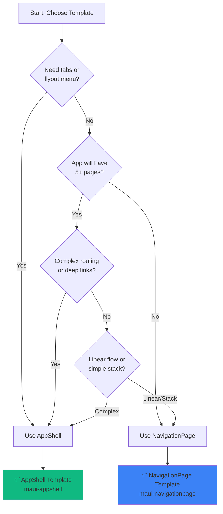

# MAUI Template Selection Guide

**Purpose**: Complete guide to choosing between AppShell and NavigationPage templates for .NET MAUI applications.

**Learn template selection in**:
- **2 minutes**: Quick Start
- **10 minutes**: Core Concepts
- **30 minutes**: Complete Reference

---

## Quick Start (2 minutes)

### Choose Your Template in 3 Questions

**Question 1**: Does your app need a flyout (hamburger) menu or tabs?
- **Yes** → Use **AppShell** template
- **No** → Continue to Question 2

**Question 2**: Do you need hierarchical navigation (push/pop stack)?
- **Yes, simple stack navigation** → Use **NavigationPage** template
- **Yes, but also complex routing** → Use **AppShell** template
- **No navigation needed** → Use **NavigationPage** template (simpler)

**Question 3**: Will your app grow to >5 pages?
- **Yes** → Use **AppShell** template (better for large apps)
- **No** → Either template works (prefer NavigationPage for simplicity)

### Quick Decision Matrix

| Use Case | Template | Why |
|----------|----------|-----|
| Mobile app with tabs/flyout | AppShell | Built-in tab bar and flyout menu |
| Wizard/onboarding flow | NavigationPage | Simple push/pop stack |
| Settings or form pages | NavigationPage | No complex navigation needed |
| E-commerce app | AppShell | Tabs (Home, Search, Cart, Profile) |
| Multi-section app | AppShell | Flyout for sections, tabs within sections |
| Simple utility app (1-3 pages) | NavigationPage | Less overhead |

**That's it!** Pick the template and initialize:

```bash
# AppShell template
agentic-init maui-appshell

# NavigationPage template
agentic-init maui-navigationpage
```

**Learn More**: See "Core Concepts" below for detailed comparison and examples.

---

## Core Concepts (10 minutes)

### AppShell Template

**Best For**:
- Apps with tabs or flyout menus
- Complex routing patterns
- Large apps (5+ pages)
- Modern, declarative navigation

**Architecture**:
```
AppShell.xaml (Navigation Structure)
├── FlyoutItem: Home
│   └── Tab: Dashboard
├── FlyoutItem: Products
│   ├── Tab: Product List
│   └── Tab: Categories
└── FlyoutItem: Settings
    └── Tab: User Settings

Routes (for modal/detail pages):
├── product-details
├── product-edit
└── settings-profile
```

**Navigation Style**:
```csharp
// Navigate to registered route
await Shell.Current.GoToAsync("product-details");

// Navigate with parameters
await Shell.Current.GoToAsync($"product-details?id={productId}");

// Navigate back
await Shell.Current.GoToAsync("..");

// Navigate to absolute path
await Shell.Current.GoToAsync("//products/product-list");
```

**Visual Structure**:

```
┌─────────────────────────────┐
│ ☰ Flyout Menu               │  ← Hamburger icon
├─────────────────────────────┤
│                             │
│   Page Content              │
│                             │
│                             │
├─────────────────────────────┤
│ [Home] [Shop] [Cart]        │  ← Bottom tabs
└─────────────────────────────┘
```

**Example Apps**:
- E-commerce (tabs: Home, Search, Cart, Profile)
- Social media (tabs: Feed, Search, Notifications, Profile)
- News reader (flyout: Sections, tabs: Top Stories, Saved)
- Banking (flyout: Accounts, Cards, Settings)

### NavigationPage Template

**Best For**:
- Simple hierarchical navigation
- Wizard/onboarding flows
- Utility apps (1-3 pages)
- Apps without tabs or flyouts

**Architecture**:
```
NavigationPage (Stack)
├── MainPage (root)
│   ├── Navigate to → DetailPage
│   │   └── Navigate to → EditPage
│   │       └── Pop back to → DetailPage
│   └── Pop back to → MainPage
```

**Navigation Style**:
```csharp
// Push to navigation stack
await Navigation.PushAsync(new DetailPage());

// Pop from navigation stack
await Navigation.PopAsync();

// Pop to root
await Navigation.PopToRootAsync();

// Replace current page (no back)
await Navigation.PushAsync(new DetailPage());
await Navigation.RemovePage(Navigation.NavigationStack[^2]);
```

**Visual Structure**:

```
┌─────────────────────────────┐
│ ← Title                     │  ← Back button in header
├─────────────────────────────┤
│                             │
│   Page Content              │
│                             │
│                             │
│                             │
└─────────────────────────────┘
```

**Example Apps**:
- Product configurator (step 1 → 2 → 3 → summary)
- Onboarding wizard (welcome → signup → profile → complete)
- Settings app (main settings → WiFi settings → network detail)
- Form submission (form → preview → submit)

### Feature Comparison

| Feature | AppShell | NavigationPage |
|---------|----------|----------------|
| **Flyout Menu** | ✅ Built-in | ❌ Manual implementation |
| **Bottom Tabs** | ✅ Built-in | ❌ Manual implementation |
| **Top Tabs** | ✅ Built-in | ❌ Manual implementation |
| **URI-based Routing** | ✅ Yes (`//section/page`) | ❌ No |
| **Query Parameters** | ✅ Yes (`?id=123`) | ❌ Manual |
| **Navigation Stack** | ✅ Yes | ✅ Yes |
| **Modal Navigation** | ✅ Yes | ✅ Yes |
| **Learning Curve** | Medium | Low |
| **Setup Complexity** | Medium | Low |
| **Best for Large Apps** | ✅ Yes | ⚠️ Becomes unwieldy |
| **Best for Small Apps** | ⚠️ Over-engineered | ✅ Yes |

### When to Use Each Template

#### Use AppShell When:

**Complex Navigation**:
- App has multiple sections (flyout menu)
- Bottom tabs within sections
- Deep linking required
- URI-based navigation needed

**Large-Scale Apps**:
- 5+ pages
- Multiple navigation patterns
- Team collaboration (navigation as data)

**Modern UI Patterns**:
- Tab-based navigation
- Flyout/drawer navigation
- Hybrid navigation (tabs + flyout)

**Example Scenario**:
```
Shopping App Requirements:
- Bottom tabs: Home, Categories, Cart, Profile
- Each tab has sub-pages (e.g., Product List → Product Details)
- Search page accessible from anywhere
- Deep links to products (myapp://product/123)

✅ Perfect fit for AppShell
```

#### Use NavigationPage When:

**Simple Navigation**:
- Linear page flow (A → B → C)
- Wizard/onboarding
- No tabs or flyout needed

**Small-Scale Apps**:
- 1-3 pages
- Simple utility apps
- MVP/prototype

**Stack-Based Flows**:
- Settings hierarchies
- Form submissions
- Detail/master patterns

**Example Scenario**:
```
Expense Tracker Requirements:
- Main screen: Expense list
- Tap expense → Detail screen
- Edit button → Edit screen
- Save → Back to detail

✅ Perfect fit for NavigationPage
```

### Migration Between Templates

**From NavigationPage to AppShell**:

When your app outgrows NavigationPage (adding tabs, flyout, complex routing):

```csharp
// Before (NavigationPage)
public partial class App : Application
{
    public App()
    {
        InitializeComponent();
        MainPage = new NavigationPage(new MainPage());
    }
}

// After (AppShell)
public partial class App : Application
{
    public App()
    {
        InitializeComponent();
        MainPage = new AppShell(); // AppShell handles navigation
    }
}
```

See [docs/migration/navigationpage-to-appshell.md](../migration/navigationpage-to-appshell.md) for complete migration guide.

**From AppShell to NavigationPage**:

Rare scenario. Only if you're simplifying the app. Not recommended.

**Learn More**: See "Complete Reference" below for detailed examples and decision tree.

---

## Complete Reference (30+ minutes)

### AppShell Template Deep Dive

#### Project Structure

```
src/
├── App.xaml                    # Application entry point
├── AppShell.xaml               # Navigation structure definition
├── AppShell.xaml.cs            # Route registration
├── Domain/
│   ├── Products/
│   │   ├── GetProducts.cs
│   │   └── GetProductById.cs
│   └── Repositories/
│       └── IProductRepository.cs
├── Data/
│   └── Repositories/
│       └── ProductRepository.cs
├── Presentation/
│   ├── Products/
│   │   ├── ProductListPage.xaml
│   │   ├── ProductListPage.xaml.cs
│   │   ├── ProductListViewModel.cs
│   │   ├── ProductDetailsPage.xaml
│   │   ├── ProductDetailsPage.xaml.cs
│   │   └── ProductDetailsViewModel.cs
│   └── Settings/
│       ├── SettingsPage.xaml
│       ├── SettingsPage.xaml.cs
│       └── SettingsViewModel.cs
└── MauiProgram.cs              # DI configuration
```

#### AppShell.xaml Structure

```xml
<?xml version="1.0" encoding="UTF-8" ?>
<Shell
    xmlns="http://schemas.microsoft.com/dotnet/2021/maui"
    xmlns:x="http://schemas.microsoft.com/winfx/2009/xaml"
    xmlns:pages="clr-namespace:ShoppingApp.Presentation"
    x:Class="ShoppingApp.AppShell"
    Title="Shopping App">

    <!-- Flyout Header -->
    <Shell.FlyoutHeader>
        <Grid BackgroundColor="{StaticResource Primary}" HeightRequest="150">
            <Label Text="Shopping App"
                   FontSize="24"
                   TextColor="White"
                   VerticalOptions="Center"
                   HorizontalOptions="Center" />
        </Grid>
    </Shell.FlyoutHeader>

    <!-- Flyout Footer -->
    <Shell.FlyoutFooter>
        <StackLayout Padding="20">
            <Label Text="Version 1.0.0" FontSize="12" TextColor="Gray" />
        </StackLayout>
    </Shell.FlyoutFooter>

    <!-- Main Sections (Flyout Items) -->

    <!-- Home Section -->
    <FlyoutItem Title="Home" Icon="home.png">
        <Tab Title="Dashboard">
            <ShellContent ContentTemplate="{DataTemplate pages:HomePage}" />
        </Tab>
    </FlyoutItem>

    <!-- Products Section with Tabs -->
    <FlyoutItem Title="Products" Icon="products.png">
        <Tab Title="All Products" Icon="list.png">
            <ShellContent ContentTemplate="{DataTemplate pages:ProductListPage}" />
        </Tab>
        <Tab Title="Categories" Icon="category.png">
            <ShellContent ContentTemplate="{DataTemplate pages:CategoryListPage}" />
        </Tab>
        <Tab Title="Favorites" Icon="favorite.png">
            <ShellContent ContentTemplate="{DataTemplate pages:FavoritesPage}" />
        </Tab>
    </FlyoutItem>

    <!-- Cart Section (no tabs) -->
    <FlyoutItem Title="Cart" Icon="cart.png">
        <ShellContent ContentTemplate="{DataTemplate pages:CartPage}" />
    </FlyoutItem>

    <!-- Settings Section -->
    <FlyoutItem Title="Settings" Icon="settings.png">
        <Tab Title="Account">
            <ShellContent ContentTemplate="{DataTemplate pages:AccountSettingsPage}" />
        </Tab>
        <Tab Title="App">
            <ShellContent ContentTemplate="{DataTemplate pages:AppSettingsPage}" />
        </Tab>
    </FlyoutItem>

    <!-- Bottom Tabs (Alternative to Flyout) -->
    <!--
    <TabBar>
        <Tab Title="Home" Icon="home.png">
            <ShellContent ContentTemplate="{DataTemplate pages:HomePage}" />
        </Tab>
        <Tab Title="Shop" Icon="products.png">
            <ShellContent ContentTemplate="{DataTemplate pages:ProductListPage}" />
        </Tab>
        <Tab Title="Cart" Icon="cart.png">
            <ShellContent ContentTemplate="{DataTemplate pages:CartPage}" />
        </Tab>
        <Tab Title="Profile" Icon="profile.png">
            <ShellContent ContentTemplate="{DataTemplate pages:ProfilePage}" />
        </Tab>
    </TabBar>
    -->

</Shell>
```

#### Route Registration (AppShell.xaml.cs)

```csharp
namespace ShoppingApp;

public partial class AppShell : Shell
{
    public AppShell()
    {
        InitializeComponent();

        // Register routes for navigation
        // These pages are NOT in the main navigation structure
        // They are accessed via Shell.Current.GoToAsync()

        Routing.RegisterRoute("product-details", typeof(ProductDetailsPage));
        Routing.RegisterRoute("product-edit", typeof(ProductEditPage));
        Routing.RegisterRoute("category-details", typeof(CategoryDetailsPage));
        Routing.RegisterRoute("cart-checkout", typeof(CheckoutPage));
        Routing.RegisterRoute("order-confirmation", typeof(OrderConfirmationPage));
        Routing.RegisterRoute("settings-profile", typeof(ProfileSettingsPage));
    }
}
```

#### Navigation Patterns

**Pattern 1: Navigate to Registered Route**

```csharp
// In ViewModel
[RelayCommand]
private async Task NavigateToProductDetailsAsync(Guid productId)
{
    await Shell.Current.GoToAsync($"product-details?id={productId}");
}

// In Page code-behind (receiving parameters)
[QueryProperty(nameof(ProductId), "id")]
public partial class ProductDetailsPage : ContentPage
{
    public Guid ProductId { get; set; }

    protected override void OnNavigatedTo(NavigatedToEventArgs args)
    {
        base.OnNavigatedTo(args);
        // Load product using ProductId
    }
}

// In ViewModel (receiving parameters)
[QueryProperty(nameof(ProductId), "id")]
public partial class ProductDetailsViewModel : ObservableObject
{
    private Guid _productId;

    public Guid ProductId
    {
        get => _productId;
        set
        {
            _productId = value;
            LoadProductAsync(value); // Load when parameter set
        }
    }
}
```

**Pattern 2: Navigate with Multiple Parameters**

```csharp
// Navigate with multiple parameters
await Shell.Current.GoToAsync($"product-edit?id={productId}&mode=edit");

// Receive parameters
[QueryProperty(nameof(ProductId), "id")]
[QueryProperty(nameof(Mode), "mode")]
public partial class ProductEditViewModel : ObservableObject
{
    public Guid ProductId { get; set; }
    public string Mode { get; set; }
}
```

**Pattern 3: Navigate with Complex Objects**

```csharp
// Pass complex object via dictionary
var parameters = new Dictionary<string, object>
{
    { "product", selectedProduct }
};

await Shell.Current.GoToAsync("product-details", parameters);

// Receive complex object
[QueryProperty(nameof(Product), "product")]
public partial class ProductDetailsViewModel : ObservableObject
{
    private Product _product;

    public Product Product
    {
        get => _product;
        set
        {
            _product = value;
            OnPropertyChanged();
        }
    }
}
```

**Pattern 4: Navigate Back**

```csharp
// Go back one page
await Shell.Current.GoToAsync("..");

// Go back multiple pages
await Shell.Current.GoToAsync("../..");

// Go to root
await Shell.Current.GoToAsync("//");

// Go to specific section
await Shell.Current.GoToAsync("//products/product-list");
```

**Pattern 5: Modal Navigation**

```csharp
// Navigate modally
await Shell.Current.GoToAsync("product-edit", animate: true);

// Close modal
await Shell.Current.GoToAsync("..", animate: true);
```

#### Navigation Service Abstraction

```csharp
namespace ShoppingApp.Presentation.Services;

public interface INavigationService
{
    Task NavigateToAsync(string route);
    Task NavigateToAsync(string route, Dictionary<string, object> parameters);
    Task GoBackAsync();
    Task GoToRootAsync();
}

public class NavigationService : INavigationService
{
    public async Task NavigateToAsync(string route)
    {
        await Shell.Current.GoToAsync(route);
    }

    public async Task NavigateToAsync(string route, Dictionary<string, object> parameters)
    {
        await Shell.Current.GoToAsync(route, parameters);
    }

    public async Task GoBackAsync()
    {
        await Shell.Current.GoToAsync("..");
    }

    public async Task GoToRootAsync()
    {
        await Shell.Current.GoToAsync("//");
    }
}

// Register in MauiProgram.cs
builder.Services.AddSingleton<INavigationService, NavigationService>();

// Use in ViewModel
public partial class ProductListViewModel : ObservableObject
{
    private readonly INavigationService _navigationService;

    [RelayCommand]
    private async Task NavigateToDetailsAsync(Guid id)
    {
        await _navigationService.NavigateToAsync(
            "product-details",
            new Dictionary<string, object> { { "id", id } }
        );
    }
}
```

### NavigationPage Template Deep Dive

#### Project Structure

```
src/
├── App.xaml                    # Application entry point
├── App.xaml.cs                 # NavigationPage initialization
├── Domain/
│   ├── Products/
│   │   ├── GetProducts.cs
│   │   └── GetProductById.cs
│   └── Repositories/
│       └── IProductRepository.cs
├── Data/
│   └── Repositories/
│       └── ProductRepository.cs
├── Presentation/
│   ├── Products/
│   │   ├── ProductListPage.xaml
│   │   ├── ProductListPage.xaml.cs
│   │   ├── ProductListViewModel.cs
│   │   ├── ProductDetailsPage.xaml
│   │   ├── ProductDetailsPage.xaml.cs
│   │   └── ProductDetailsViewModel.cs
│   └── Settings/
│       ├── SettingsPage.xaml
│       ├── SettingsPage.xaml.cs
│       └── SettingsViewModel.cs
└── MauiProgram.cs              # DI configuration
```

#### App Initialization (App.xaml.cs)

```csharp
namespace ShoppingApp;

public partial class App : Application
{
    public App()
    {
        InitializeComponent();

        // Initialize with NavigationPage
        MainPage = new NavigationPage(new MainPage())
        {
            BarBackgroundColor = Colors.Blue,
            BarTextColor = Colors.White
        };
    }
}
```

#### Navigation Patterns

**Pattern 1: Push to Stack**

```csharp
// In ViewModel (requires INavigationService)
[RelayCommand]
private async Task NavigateToDetailsAsync(Guid productId)
{
    var detailsPage = _serviceProvider.GetRequiredService<ProductDetailsPage>();
    detailsPage.BindingContext = _serviceProvider.GetRequiredService<ProductDetailsViewModel>();

    // Pass parameter to ViewModel
    ((ProductDetailsViewModel)detailsPage.BindingContext).ProductId = productId;

    await Navigation.PushAsync(detailsPage);
}

// In Page code-behind (simpler)
private async void OnProductTapped(object sender, EventArgs e)
{
    var product = (Product)((TappedEventArgs)e).Parameter;
    var detailsPage = new ProductDetailsPage(product);
    await Navigation.PushAsync(detailsPage);
}
```

**Pattern 2: Pop from Stack**

```csharp
// Go back one page
await Navigation.PopAsync();

// Go back with animation control
await Navigation.PopAsync(animated: true);
```

**Pattern 3: Pop to Root**

```csharp
// Go back to root page
await Navigation.PopToRootAsync();
```

**Pattern 4: Replace Current Page**

```csharp
// Push new page
await Navigation.PushAsync(new DetailPage());

// Remove previous page (no back button)
Navigation.RemovePage(Navigation.NavigationStack[^2]);
```

**Pattern 5: Modal Navigation**

```csharp
// Push modal page
await Navigation.PushModalAsync(new SettingsPage());

// Close modal
await Navigation.PopModalAsync();
```

#### Passing Parameters

**Constructor Injection** (Recommended):

```csharp
// Page with constructor parameter
public partial class ProductDetailsPage : ContentPage
{
    public ProductDetailsPage(Product product)
    {
        InitializeComponent();
        BindingContext = new ProductDetailsViewModel(product);
    }
}

// Navigate with constructor parameter
var product = Products.FirstOrDefault(p => p.Id == selectedId);
await Navigation.PushAsync(new ProductDetailsPage(product));
```

**BindingContext Property**:

```csharp
// Create page
var detailsPage = new ProductDetailsPage();

// Create and configure ViewModel
var viewModel = new ProductDetailsViewModel();
viewModel.ProductId = productId;

// Set BindingContext
detailsPage.BindingContext = viewModel;

// Navigate
await Navigation.PushAsync(detailsPage);
```

**Public Property** (Simple scenarios):

```csharp
// Page with public property
public partial class ProductDetailsPage : ContentPage
{
    public Guid ProductId { get; set; }

    protected override async void OnAppearing()
    {
        base.OnAppearing();
        await LoadProductAsync(ProductId);
    }
}

// Navigate and set property
var detailsPage = new ProductDetailsPage { ProductId = productId };
await Navigation.PushAsync(detailsPage);
```

#### Navigation Service Abstraction

```csharp
namespace ShoppingApp.Presentation.Services;

public interface INavigationService
{
    Task PushAsync(Page page);
    Task PopAsync();
    Task PopToRootAsync();
    Task PushModalAsync(Page page);
    Task PopModalAsync();
}

public class NavigationService : INavigationService
{
    private INavigation Navigation =>
        Application.Current?.MainPage?.Navigation
        ?? throw new InvalidOperationException("Navigation not available");

    public async Task PushAsync(Page page)
    {
        await Navigation.PushAsync(page);
    }

    public async Task PopAsync()
    {
        await Navigation.PopAsync();
    }

    public async Task PopToRootAsync()
    {
        await Navigation.PopToRootAsync();
    }

    public async Task PushModalAsync(Page page)
    {
        await Navigation.PushModalAsync(page);
    }

    public async Task PopModalAsync()
    {
        await Navigation.PopModalAsync();
    }
}

// Register in MauiProgram.cs
builder.Services.AddSingleton<INavigationService, NavigationService>();

// Use in ViewModel
public partial class ProductListViewModel : ObservableObject
{
    private readonly INavigationService _navigationService;
    private readonly IServiceProvider _serviceProvider;

    [RelayCommand]
    private async Task NavigateToDetailsAsync(Guid id)
    {
        var detailsPage = _serviceProvider.GetRequiredService<ProductDetailsPage>();
        var viewModel = _serviceProvider.GetRequiredService<ProductDetailsViewModel>();
        viewModel.ProductId = id;
        detailsPage.BindingContext = viewModel;

        await _navigationService.PushAsync(detailsPage);
    }
}
```

### Decision Tree



### Comparison Matrix

| Aspect | AppShell | NavigationPage |
|--------|----------|----------------|
| **Initial Setup** | Complex (AppShell.xaml, routes) | Simple (one line in App.xaml.cs) |
| **Learning Curve** | Steeper (new concepts) | Gentle (familiar stack pattern) |
| **Navigation Code** | `Shell.Current.GoToAsync("route")` | `Navigation.PushAsync(page)` |
| **Parameter Passing** | Query strings or dictionary | Constructor or properties |
| **Flyout Menu** | Built-in, declarative | Manual implementation needed |
| **Tabs (Bottom)** | Built-in, declarative | Manual implementation needed |
| **Tabs (Top)** | Built-in, declarative | Manual implementation needed |
| **URI Routing** | ✅ Full support | ❌ Not available |
| **Deep Linking** | ✅ Easy | ⚠️ Manual |
| **Navigation Stack** | ✅ Yes | ✅ Yes |
| **Modal Pages** | ✅ Yes | ✅ Yes |
| **Back Button** | ✅ Automatic | ✅ Automatic |
| **Navigation Bar** | ✅ Customizable | ✅ Customizable |
| **Best for MVPs** | ⚠️ Over-engineered | ✅ Quick to start |
| **Best for Production** | ✅ Scalable | ⚠️ Grows unwieldy |
| **Team Collaboration** | ✅ Navigation as data | ⚠️ Code-based |
| **Testing** | ✅ Easier (routes) | ⚠️ Harder (page instances) |

---

## Examples

### Example 1: E-Commerce App (AppShell)

**Requirements**:
- Bottom tabs: Home, Shop, Cart, Profile
- Each tab has hierarchical navigation
- Product search accessible from anywhere
- Deep links to products

**Implementation**:

```xml
<!-- AppShell.xaml -->
<Shell xmlns="http://schemas.microsoft.com/dotnet/2021/maui"
       xmlns:pages="clr-namespace:ECommerceApp.Presentation">

    <TabBar>
        <Tab Title="Home" Icon="home.png">
            <ShellContent ContentTemplate="{DataTemplate pages:HomePage}" />
        </Tab>

        <Tab Title="Shop" Icon="shop.png">
            <ShellContent ContentTemplate="{DataTemplate pages:ProductListPage}" />
        </Tab>

        <Tab Title="Cart" Icon="cart.png">
            <ShellContent ContentTemplate="{DataTemplate pages:CartPage}" />
        </Tab>

        <Tab Title="Profile" Icon="profile.png">
            <ShellContent ContentTemplate="{DataTemplate pages:ProfilePage}" />
        </Tab>
    </TabBar>

</Shell>
```

```csharp
// AppShell.xaml.cs
public partial class AppShell : Shell
{
    public AppShell()
    {
        InitializeComponent();

        // Register detail/modal pages
        Routing.RegisterRoute("product-details", typeof(ProductDetailsPage));
        Routing.RegisterRoute("product-search", typeof(ProductSearchPage));
        Routing.RegisterRoute("checkout", typeof(CheckoutPage));
        Routing.RegisterRoute("order-confirmation", typeof(OrderConfirmationPage));
    }
}

// Navigation
await Shell.Current.GoToAsync($"product-details?id={productId}");
```

**Why AppShell**: Bottom tabs, hierarchical navigation within tabs, deep linking.

### Example 2: Settings App (NavigationPage)

**Requirements**:
- Main settings page
- Hierarchical settings (WiFi → Network → Details)
- Simple push/pop navigation
- No tabs or flyout

**Implementation**:

```csharp
// App.xaml.cs
public partial class App : Application
{
    public App()
    {
        InitializeComponent();
        MainPage = new NavigationPage(new SettingsPage());
    }
}

// Navigation
await Navigation.PushAsync(new WiFiSettingsPage());
await Navigation.PushAsync(new NetworkDetailsPage(network));
await Navigation.PopAsync();
```

**Why NavigationPage**: Simple hierarchical flow, no tabs/flyout needed, small app.

### Example 3: Onboarding Wizard (NavigationPage)

**Requirements**:
- Linear flow: Welcome → Sign Up → Profile → Complete
- No back button on some pages
- Progress indicator
- No tabs or flyout

**Implementation**:

```csharp
// App.xaml.cs
public partial class App : Application
{
    public App()
    {
        InitializeComponent();
        MainPage = new NavigationPage(new WelcomePage())
        {
            BarBackgroundColor = Colors.Blue
        };
    }
}

// Navigation
await Navigation.PushAsync(new SignUpPage());

// Remove back button
NavigationPage.SetHasBackButton(this, false);

// Complete wizard (replace stack)
await Navigation.PushAsync(new HomePage());
Navigation.RemovePage(Navigation.NavigationStack[0]); // Remove welcome
Navigation.RemovePage(Navigation.NavigationStack[0]); // Remove signup
Navigation.RemovePage(Navigation.NavigationStack[0]); // Remove profile
```

**Why NavigationPage**: Linear wizard flow, simple stack manipulation, no complex routing.

### Example 4: Banking App (AppShell)

**Requirements**:
- Flyout: Accounts, Cards, Investments, Settings
- Tabs within Accounts: Checking, Savings, Credit
- Deep links to transactions
- Secure navigation

**Implementation**:

```xml
<!-- AppShell.xaml -->
<Shell xmlns="http://schemas.microsoft.com/dotnet/2021/maui"
       xmlns:pages="clr-namespace:BankingApp.Presentation">

    <FlyoutItem Title="Accounts" Icon="accounts.png">
        <Tab Title="Checking">
            <ShellContent ContentTemplate="{DataTemplate pages:CheckingPage}" />
        </Tab>
        <Tab Title="Savings">
            <ShellContent ContentTemplate="{DataTemplate pages:SavingsPage}" />
        </Tab>
        <Tab Title="Credit">
            <ShellContent ContentTemplate="{DataTemplate pages:CreditPage}" />
        </Tab>
    </FlyoutItem>

    <FlyoutItem Title="Cards" Icon="cards.png">
        <ShellContent ContentTemplate="{DataTemplate pages:CardsPage}" />
    </FlyoutItem>

    <FlyoutItem Title="Investments" Icon="investments.png">
        <ShellContent ContentTemplate="{DataTemplate pages:InvestmentsPage}" />
    </FlyoutItem>

    <FlyoutItem Title="Settings" Icon="settings.png">
        <ShellContent ContentTemplate="{DataTemplate pages:SettingsPage}" />
    </FlyoutItem>

</Shell>
```

**Why AppShell**: Flyout menu for sections, tabs within sections, complex routing.

---

## FAQ

### Q: Can I switch templates later?

**A**: Yes, but it requires refactoring navigation code. See [docs/migration/navigationpage-to-appshell.md](../migration/navigationpage-to-appshell.md) for migration guide.

**Recommendation**: Choose carefully upfront based on app scope. For uncertain projects, start with NavigationPage (simpler) and migrate to AppShell if needed.

### Q: Can I mix AppShell and NavigationPage?

**A**: No. You must choose one as your app's root navigation container. However, AppShell includes NavigationPage functionality (push/pop), so you don't need both.

### Q: Which template is better for beginners?

**A**: **NavigationPage** - simpler concepts, less setup, familiar stack-based navigation.

### Q: Which template is better for production apps?

**A**: **AppShell** - more scalable, better for large apps, modern navigation patterns. However, NavigationPage is perfectly fine for small production apps.

### Q: How do I add tabs to NavigationPage?

**A**: Manual implementation using `TabbedPage`:

```csharp
public partial class App : Application
{
    public App()
    {
        InitializeComponent();

        var tabbedPage = new TabbedPage();
        tabbedPage.Children.Add(new NavigationPage(new HomePage()) { Title = "Home" });
        tabbedPage.Children.Add(new NavigationPage(new ShopPage()) { Title = "Shop" });
        tabbedPage.Children.Add(new NavigationPage(new CartPage()) { Title = "Cart" });

        MainPage = tabbedPage;
    }
}
```

**However**: If you need tabs, AppShell is recommended (cleaner, more maintainable).

### Q: How do I implement a flyout menu in NavigationPage?

**A**: Manual implementation using `FlyoutPage`:

```csharp
public partial class App : Application
{
    public App()
    {
        InitializeComponent();

        var flyoutPage = new FlyoutPage
        {
            Flyout = new FlyoutMenuPage(), // Menu page
            Detail = new NavigationPage(new HomePage()) // Content page
        };

        MainPage = flyoutPage;
    }
}
```

**However**: If you need a flyout, AppShell is recommended (built-in, declarative).

### Q: Does template choice affect Domain/Repository layers?

**A**: No. Domain operations, Repositories, Services, and ErrorOr patterns work identically in both templates. Only the Presentation layer (navigation code) differs.

### Q: Can I use both templates in a multi-project solution?

**A**: Yes, if you have separate MAUI projects. But within a single MAUI project, choose one template.

---

## Related Documentation

- [Domain Layer Pattern](../patterns/domain-layer-pattern.md) - Verb-based operations with ErrorOr
- [Creating Local Templates](./creating-local-templates.md) - Customize templates for your team
- [AppShell Navigation Guide](https://learn.microsoft.com/en-us/dotnet/maui/fundamentals/shell/) - Microsoft AppShell docs
- [NavigationPage Guide](https://learn.microsoft.com/en-us/dotnet/maui/user-interface/pages/navigationpage) - Microsoft NavigationPage docs

---

**Last Updated**: 2025-10-15
**Version**: 1.0.0
**Maintained By**: AI Engineer Team
