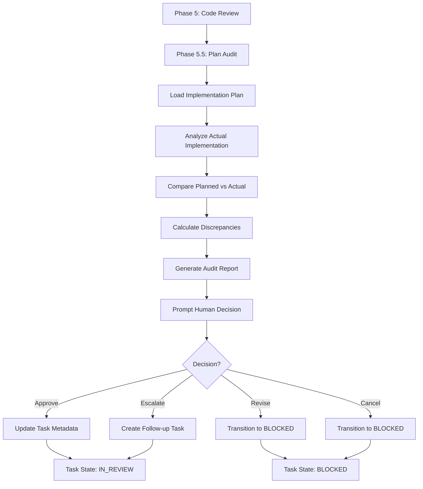

# Phase 5.5 Plan Audit - Detailed Implementation Plan

**Task:** TASK-025
**Created:** 2025-10-18
**Author:** Claude (Anthropic)
**Purpose:** Implement Hubbard's Step 6 (Audit) - Compare actual implementation against original plan

---

## Executive Summary

This document provides a comprehensive implementation plan for Phase 5.5: Plan Audit. This phase addresses a critical gap identified in the AI-Engineer Lite workflow by implementing John Hubbard's Step 6 (Audit), which verifies that actual implementation matches the approved architectural plan.

**Key Benefits:**
- ✅ Catches scope creep automatically (AI adding extra files/features)
- ✅ Validates complexity estimates (provides feedback loop for improvement)
- ✅ Ensures AI follows approved architectural plan
- ✅ Closes critical gap in Hubbard's 6-step workflow (100% alignment)

**Research Support:**
- John Hubbard's proven 6-step workflow includes explicit "Audit" step
- ThoughtWorks research shows agents frequently don't follow all instructions
- Martin Fowler's SDD research emphasizes importance of verification

---

## 1. Architecture Overview

### 1.1 Phase Positioning

```
TASK-WORK PHASES:
Phase 1: Load Task Context
Phase 2: Implementation Planning
Phase 2.5A: Pattern Suggestion (optional)
Phase 2.5B: Architectural Review
Phase 2.7: Complexity Evaluation & Plan Persistence
Phase 2.6: Human Checkpoint (if triggered)
Phase 3: Implementation
Phase 4: Testing
Phase 4.5: Fix Loop (ensure tests pass)
Phase 5: Code Review (spec drift, quality)
Phase 5.5: Plan Audit (NEW - plan compliance) ← INSERT HERE
Task State: IN_REVIEW
```

### 1.2 Module Structure

```
installer/global/commands/lib/
├── plan_audit.py                 # Core audit logic (NEW)
├── plan_persistence.py           # Load saved plans (EXISTING)
├── phase_execution.py            # Orchestrate phases (MODIFY)
└── metrics/
    └── plan_audit_metrics.py     # Track audit outcomes (NEW)
```

### 1.3 Data Flow



---

## 2. Implementation Plan

### 2.1 Files to Create

#### File 1: `installer/global/commands/lib/plan_audit.py` (Core Module)

**Purpose:** Core audit logic for comparing planned vs actual implementation

**Estimated Lines:** ~400 lines

**Key Classes/Functions:**

```python
from dataclasses import dataclass
from typing import Dict, Any, List, Literal, Optional
from pathlib import Path
import json
from datetime import datetime

@dataclass
class Discrepancy:
    """Represents a single discrepancy between planned and actual implementation."""
    category: str  # "files", "dependencies", "loc", "duration"
    severity: Literal["low", "medium", "high"]
    message: str
    planned: Any
    actual: Any
    variance: float  # Percentage variance (e.g., 55.0 for 55%)

@dataclass
class PlanAuditReport:
    """Complete audit report with all discrepancies and recommendations."""
    task_id: str
    plan_summary: Dict[str, Any]
    actual_summary: Dict[str, Any]
    discrepancies: List[Discrepancy]
    severity: Literal["low", "medium", "high"]
    recommendations: List[str]
    timestamp: str
    plan_path: str
    audit_duration_seconds: float

class PlanAuditor:
    """Main auditor class that compares planned vs actual implementation."""

    def __init__(self, workspace_root: Path = Path(".")):
        self.workspace_root = workspace_root

    def audit_implementation(self, task_id: str) -> PlanAuditReport:
        """
        Main entry point: Audit implementation against saved plan.

        Returns complete audit report with discrepancies and severity.
        """
        start_time = datetime.now()

        # Load implementation plan
        plan = self._load_plan(task_id)
        if not plan:
            raise PlanAuditError(f"No implementation plan found for {task_id}")

        # Analyze actual implementation
        actual = self._analyze_implementation(task_id, plan)

        # Compare and detect discrepancies
        discrepancies = self._compare(plan, actual)

        # Calculate overall severity
        severity = self._calculate_severity(discrepancies)

        # Generate actionable recommendations
        recommendations = self._generate_recommendations(discrepancies, severity)

        end_time = datetime.now()
        duration = (end_time - start_time).total_seconds()

        return PlanAuditReport(
            task_id=task_id,
            plan_summary=self._extract_plan_summary(plan),
            actual_summary=actual,
            discrepancies=discrepancies,
            severity=severity,
            recommendations=recommendations,
            timestamp=datetime.now().isoformat(),
            plan_path=f"docs/state/{task_id}/implementation_plan.md",
            audit_duration_seconds=duration
        )

    def _load_plan(self, task_id: str) -> Optional[Dict[str, Any]]:
        """Load saved implementation plan from disk."""
        from .plan_persistence import load_plan
        return load_plan(task_id)

    def _analyze_implementation(
        self,
        task_id: str,
        plan: Dict[str, Any]
    ) -> Dict[str, Any]:
        """
        Analyze actual implementation: files created, LOC, dependencies, duration.
        """
        return {
            "files_created": self._scan_created_files(plan),
            "files_modified": self._scan_modified_files(plan),
            "total_loc": self._count_lines_of_code(plan),
            "dependencies": self._extract_dependencies(),
            "duration_hours": self._calculate_duration(task_id)
        }

    def _scan_created_files(self, plan: Dict[str, Any]) -> List[str]:
        """Scan for files created (compare against planned files)."""
        planned_files = set(plan.get("plan", {}).get("files_to_create", []))
        actual_files = []

        # Scan common source directories
        for pattern in ["src/**/*.py", "src/**/*.ts", "src/**/*.cs", "lib/**/*.py"]:
            for file_path in self.workspace_root.glob(pattern):
                if file_path.is_file() and not self._is_excluded(file_path):
                    actual_files.append(str(file_path.relative_to(self.workspace_root)))

        return actual_files

    def _scan_modified_files(self, plan: Dict[str, Any]) -> List[str]:
        """Scan for files modified (compare against planned modifications)."""
        # Use git to find modified files since plan creation
        # (Simplified - actual implementation would use GitPython or subprocess)
        return []

    def _count_lines_of_code(self, plan: Dict[str, Any]) -> int:
        """Count actual lines of code in created/modified files."""
        total_loc = 0
        planned_files = plan.get("plan", {}).get("files_to_create", []) + \
                       plan.get("plan", {}).get("files_to_modify", [])

        for file_path_str in planned_files:
            file_path = self.workspace_root / file_path_str
            if file_path.exists():
                total_loc += self._count_file_loc(file_path)

        return total_loc

    def _count_file_loc(self, file_path: Path) -> int:
        """Count non-empty, non-comment lines in a file."""
        try:
            with open(file_path, 'r', encoding='utf-8') as f:
                lines = f.readlines()

            # Simple LOC counter (excludes blank lines and single-line comments)
            loc = 0
            for line in lines:
                stripped = line.strip()
                if stripped and not stripped.startswith(('#', '//', '/*', '*')):
                    loc += 1

            return loc
        except Exception:
            return 0

    def _extract_dependencies(self) -> List[str]:
        """Extract dependencies from package files."""
        deps = []

        # Python: requirements.txt, pyproject.toml
        req_file = self.workspace_root / "requirements.txt"
        if req_file.exists():
            deps.extend(self._parse_requirements_txt(req_file))

        # TypeScript/JavaScript: package.json
        pkg_file = self.workspace_root / "package.json"
        if pkg_file.exists():
            deps.extend(self._parse_package_json(pkg_file))

        # .NET: *.csproj
        for csproj in self.workspace_root.glob("**/*.csproj"):
            deps.extend(self._parse_csproj(csproj))

        return deps

    def _parse_requirements_txt(self, file_path: Path) -> List[str]:
        """Parse Python requirements.txt."""
        deps = []
        try:
            with open(file_path, 'r') as f:
                for line in f:
                    line = line.strip()
                    if line and not line.startswith('#'):
                        # Extract package name (before ==, >=, etc.)
                        pkg = line.split('==')[0].split('>=')[0].split('~=')[0].strip()
                        deps.append(pkg)
        except Exception:
            pass
        return deps

    def _parse_package_json(self, file_path: Path) -> List[str]:
        """Parse JavaScript/TypeScript package.json."""
        try:
            with open(file_path, 'r') as f:
                data = json.load(f)

            deps = []
            deps.extend(data.get("dependencies", {}).keys())
            deps.extend(data.get("devDependencies", {}).keys())
            return deps
        except Exception:
            return []

    def _parse_csproj(self, file_path: Path) -> List[str]:
        """Parse .NET .csproj file."""
        # Simplified - actual implementation would use XML parser
        return []

    def _calculate_duration(self, task_id: str) -> float:
        """Calculate actual implementation duration from git commits or metadata."""
        # Placeholder - actual implementation would:
        # 1. Check task metadata for start/end timestamps
        # 2. Use git commit history to calculate duration
        # 3. Return duration in hours
        return 0.0

    def _compare(
        self,
        plan: Dict[str, Any],
        actual: Dict[str, Any]
    ) -> List[Discrepancy]:
        """Compare planned vs actual, return list of discrepancies."""
        discrepancies = []
        plan_data = plan.get("plan", {})

        # Compare files
        discrepancies.extend(self._compare_files(plan_data, actual))

        # Compare dependencies
        discrepancies.extend(self._compare_dependencies(plan_data, actual))

        # Compare LOC
        discrepancies.extend(self._compare_loc(plan_data, actual))

        # Compare duration
        discrepancies.extend(self._compare_duration(plan_data, actual))

        return discrepancies

    def _compare_files(
        self,
        plan_data: Dict[str, Any],
        actual: Dict[str, Any]
    ) -> List[Discrepancy]:
        """Compare files: detect extra/missing files."""
        discrepancies = []

        planned_files = set(plan_data.get("files_to_create", []))
        actual_files = set(actual.get("files_created", []))

        extra_files = actual_files - planned_files
        missing_files = planned_files - actual_files

        if extra_files:
            discrepancies.append(Discrepancy(
                category="files",
                severity="medium" if len(extra_files) <= 2 else "high",
                message=f"{len(extra_files)} extra file(s) not in plan",
                planned=list(planned_files),
                actual=list(extra_files),
                variance=(len(extra_files) / max(len(planned_files), 1)) * 100
            ))

        if missing_files:
            discrepancies.append(Discrepancy(
                category="files",
                severity="high",
                message=f"{len(missing_files)} planned file(s) not created",
                planned=list(missing_files),
                actual=list(actual_files),
                variance=(len(missing_files) / max(len(planned_files), 1)) * 100
            ))

        return discrepancies

    def _compare_dependencies(
        self,
        plan_data: Dict[str, Any],
        actual: Dict[str, Any]
    ) -> List[Discrepancy]:
        """Compare dependencies: detect extra/missing deps."""
        discrepancies = []

        planned_deps = set(plan_data.get("external_dependencies", []))
        actual_deps = set(actual.get("dependencies", []))

        extra_deps = actual_deps - planned_deps
        missing_deps = planned_deps - actual_deps

        if extra_deps:
            discrepancies.append(Discrepancy(
                category="dependencies",
                severity="medium" if len(extra_deps) <= 1 else "high",
                message=f"{len(extra_deps)} extra dependenc(ies) not in plan",
                planned=list(planned_deps),
                actual=list(extra_deps),
                variance=(len(extra_deps) / max(len(planned_deps), 1)) * 100
            ))

        if missing_deps:
            discrepancies.append(Discrepancy(
                category="dependencies",
                severity="medium",
                message=f"{len(missing_deps)} planned dependenc(ies) not added",
                planned=list(missing_deps),
                actual=list(actual_deps),
                variance=(len(missing_deps) / max(len(planned_deps), 1)) * 100
            ))

        return discrepancies

    def _compare_loc(
        self,
        plan_data: Dict[str, Any],
        actual: Dict[str, Any]
    ) -> List[Discrepancy]:
        """Compare lines of code: calculate variance %."""
        discrepancies = []

        planned_loc = plan_data.get("estimated_loc", 0)
        actual_loc = actual.get("total_loc", 0)

        if planned_loc > 0:
            variance = ((actual_loc - planned_loc) / planned_loc) * 100

            if abs(variance) > 10:  # More than 10% variance
                severity = "low" if abs(variance) < 30 else "medium" if abs(variance) < 50 else "high"

                discrepancies.append(Discrepancy(
                    category="loc",
                    severity=severity,
                    message=f"LOC variance: {variance:+.1f}% ({planned_loc} → {actual_loc} lines)",
                    planned=planned_loc,
                    actual=actual_loc,
                    variance=abs(variance)
                ))

        return discrepancies

    def _compare_duration(
        self,
        plan_data: Dict[str, Any],
        actual: Dict[str, Any]
    ) -> List[Discrepancy]:
        """Compare duration: calculate variance %."""
        discrepancies = []

        planned_duration_str = plan_data.get("estimated_duration", "0 hours")
        planned_duration = self._parse_duration(planned_duration_str)
        actual_duration = actual.get("duration_hours", 0.0)

        if planned_duration > 0 and actual_duration > 0:
            variance = ((actual_duration - planned_duration) / planned_duration) * 100

            if abs(variance) > 10:  # More than 10% variance
                severity = "low" if abs(variance) < 30 else "medium" if abs(variance) < 50 else "high"

                discrepancies.append(Discrepancy(
                    category="duration",
                    severity=severity,
                    message=f"Duration variance: {variance:+.1f}% ({planned_duration:.1f}h → {actual_duration:.1f}h)",
                    planned=planned_duration,
                    actual=actual_duration,
                    variance=abs(variance)
                ))

        return discrepancies

    def _parse_duration(self, duration_str: str) -> float:
        """Parse duration string to hours (e.g., '4 hours' -> 4.0)."""
        try:
            # Simple parser: extract number before 'hour'
            parts = duration_str.lower().split()
            for i, part in enumerate(parts):
                if 'hour' in part or 'hr' in part:
                    return float(parts[i-1])
            return 0.0
        except Exception:
            return 0.0

    def _calculate_severity(self, discrepancies: List[Discrepancy]) -> Literal["low", "medium", "high"]:
        """Calculate overall severity based on all discrepancies."""
        if not discrepancies:
            return "low"

        # Count by severity
        high_count = sum(1 for d in discrepancies if d.severity == "high")
        medium_count = sum(1 for d in discrepancies if d.severity == "medium")

        if high_count >= 2:
            return "high"
        elif high_count == 1 or medium_count >= 3:
            return "high"
        elif medium_count >= 1:
            return "medium"
        else:
            return "low"

    def _generate_recommendations(
        self,
        discrepancies: List[Discrepancy],
        severity: str
    ) -> List[str]:
        """Generate actionable recommendations based on discrepancies."""
        recommendations = []

        for disc in discrepancies:
            if disc.category == "files" and "extra" in disc.message:
                recommendations.append(
                    f"Review extra files for scope creep: {', '.join(disc.actual[:3])}"
                )

            elif disc.category == "files" and "missing" in disc.message:
                recommendations.append(
                    f"Verify planned files were created: {', '.join(disc.planned[:3])}"
                )

            elif disc.category == "dependencies" and "extra" in disc.message:
                recommendations.append(
                    f"Justify extra dependencies: {', '.join(disc.actual[:3])}"
                )

            elif disc.category == "loc" and disc.variance > 50:
                recommendations.append(
                    f"Understand why LOC exceeded estimate by {disc.variance:.0f}%"
                )

            elif disc.category == "duration" and disc.variance > 50:
                recommendations.append(
                    f"Analyze duration overrun ({disc.variance:.0f}%) for future estimates"
                )

        if not recommendations:
            recommendations.append("No major concerns - implementation closely matches plan")

        return recommendations

    def _extract_plan_summary(self, plan: Dict[str, Any]) -> Dict[str, Any]:
        """Extract summary from plan for report."""
        plan_data = plan.get("plan", {})
        return {
            "files": len(plan_data.get("files_to_create", [])),
            "files_to_modify": len(plan_data.get("files_to_modify", [])),
            "dependencies": len(plan_data.get("external_dependencies", [])),
            "estimated_loc": plan_data.get("estimated_loc", 0),
            "estimated_duration": plan_data.get("estimated_duration", "N/A")
        }

    def _is_excluded(self, file_path: Path) -> bool:
        """Check if file should be excluded from audit (tests, migrations, etc.)."""
        excluded_patterns = [
            "**/test_*.py",
            "**/*_test.py",
            "**/*.test.ts",
            "**/*.spec.ts",
            "**/migrations/**",
            "**/__pycache__/**",
            "**/node_modules/**"
        ]

        for pattern in excluded_patterns:
            if file_path.match(pattern):
                return True

        return False


class PlanAuditError(Exception):
    """Raised when plan audit operations fail."""
    pass


def format_audit_report(report: PlanAuditReport) -> str:
    """Format audit report as human-readable summary."""
    severity_emoji = {
        "low": "🟢",
        "medium": "🟡",
        "high": "🔴"
    }

    output = []
    output.append("=" * 70)
    output.append(f"PLAN AUDIT - {report.task_id}")
    output.append("=" * 70)
    output.append("")

    # Planned implementation
    output.append("PLANNED IMPLEMENTATION:")
    plan = report.plan_summary
    output.append(f"  Files: {plan['files']} files ({plan['estimated_loc']} lines)")
    output.append(f"  Dependencies: {plan['dependencies']}")
    output.append(f"  Duration: {plan['estimated_duration']}")
    output.append("")

    # Actual implementation
    output.append("ACTUAL IMPLEMENTATION:")
    actual = report.actual_summary
    output.append(f"  Files: {len(actual.get('files_created', []))} files ({actual.get('total_loc', 0)} lines)")
    output.append(f"  Dependencies: {len(actual.get('dependencies', []))}")
    output.append(f"  Duration: {actual.get('duration_hours', 0):.1f} hours")
    output.append("")

    # Discrepancies
    if report.discrepancies:
        output.append("DISCREPANCIES:")
        for disc in report.discrepancies:
            emoji = severity_emoji.get(disc.severity, "⚠️")
            output.append(f"  {emoji} {disc.message}")

            if disc.category == "files" and isinstance(disc.actual, list):
                for file in disc.actual[:5]:  # Show first 5
                    output.append(f"      - {file}")
                if len(disc.actual) > 5:
                    output.append(f"      ... and {len(disc.actual) - 5} more")

        output.append("")
    else:
        output.append("DISCREPANCIES: None")
        output.append("")

    # Severity
    severity_emoji_overall = severity_emoji.get(report.severity, "⚠️")
    output.append(f"SEVERITY: {severity_emoji_overall} {report.severity.upper()}")
    output.append("")

    # Recommendations
    output.append("RECOMMENDATIONS:")
    for i, rec in enumerate(report.recommendations, 1):
        output.append(f"  {i}. {rec}")
    output.append("")

    # Options
    output.append("OPTIONS:")
    output.append("  [A]pprove - Accept implementation as-is, update plan retroactively")
    output.append("  [R]evise - Request removal of scope creep items")
    output.append("  [E]scalate - Mark as complex, create follow-up task")
    output.append("  [C]ancel - Block task completion")
    output.append("")

    return "\n".join(output)


# Module exports
__all__ = [
    "PlanAuditor",
    "PlanAuditReport",
    "Discrepancy",
    "PlanAuditError",
    "format_audit_report"
]
```

---

#### File 2: `installer/global/commands/lib/metrics/plan_audit_metrics.py` (Metrics Tracking)

**Purpose:** Track audit outcomes for complexity model improvement

**Estimated Lines:** ~150 lines

**Key Functions:**

```python
from typing import Dict, Any
from pathlib import Path
from datetime import datetime
import json

class PlanAuditMetricsTracker:
    """Track plan audit outcomes for complexity model improvement."""

    def __init__(self, metrics_file: Path = Path("docs/state/plan_audit_metrics.json")):
        self.metrics_file = metrics_file
        self._ensure_metrics_file()

    def record_audit(
        self,
        task_id: str,
        report: Any,  # PlanAuditReport
        decision: str
    ) -> None:
        """Record audit outcome to metrics file."""
        metrics = self._load_metrics()

        audit_entry = {
            "task_id": task_id,
            "timestamp": datetime.now().isoformat(),
            "severity": report.severity,
            "discrepancies_count": len(report.discrepancies),
            "decision": decision,
            "loc_variance": self._extract_variance(report, "loc"),
            "duration_variance": self._extract_variance(report, "duration"),
            "extra_files": self._count_discrepancy_type(report, "files", "extra"),
            "extra_dependencies": self._count_discrepancy_type(report, "dependencies", "extra")
        }

        metrics["audits"].append(audit_entry)
        metrics["summary"] = self._calculate_summary(metrics["audits"])

        self._save_metrics(metrics)

    def _load_metrics(self) -> Dict[str, Any]:
        """Load metrics from disk."""
        if self.metrics_file.exists():
            with open(self.metrics_file, 'r') as f:
                return json.load(f)
        else:
            return {
                "audits": [],
                "summary": {}
            }

    def _save_metrics(self, metrics: Dict[str, Any]) -> None:
        """Save metrics to disk."""
        self.metrics_file.parent.mkdir(parents=True, exist_ok=True)
        with open(self.metrics_file, 'w') as f:
            json.dump(metrics, f, indent=2)

    def _ensure_metrics_file(self) -> None:
        """Ensure metrics file exists."""
        if not self.metrics_file.exists():
            self._save_metrics({"audits": [], "summary": {}})

    def _extract_variance(self, report: Any, category: str) -> float:
        """Extract variance % for specific category."""
        for disc in report.discrepancies:
            if disc.category == category:
                return disc.variance
        return 0.0

    def _count_discrepancy_type(self, report: Any, category: str, keyword: str) -> int:
        """Count discrepancies of specific type."""
        count = 0
        for disc in report.discrepancies:
            if disc.category == category and keyword in disc.message:
                count += 1
        return count

    def _calculate_summary(self, audits: list) -> Dict[str, Any]:
        """Calculate summary statistics from all audits."""
        if not audits:
            return {}

        total = len(audits)

        return {
            "total_audits": total,
            "severity_distribution": {
                "low": sum(1 for a in audits if a["severity"] == "low"),
                "medium": sum(1 for a in audits if a["severity"] == "medium"),
                "high": sum(1 for a in audits if a["severity"] == "high")
            },
            "decision_distribution": {
                "approved": sum(1 for a in audits if a["decision"] == "approve"),
                "revised": sum(1 for a in audits if a["decision"] == "revise"),
                "escalated": sum(1 for a in audits if a["decision"] == "escalate"),
                "cancelled": sum(1 for a in audits if a["decision"] == "cancel")
            },
            "average_loc_variance": sum(a["loc_variance"] for a in audits) / total,
            "average_duration_variance": sum(a["duration_variance"] for a in audits) / total,
            "total_extra_files": sum(a["extra_files"] for a in audits),
            "total_extra_dependencies": sum(a["extra_dependencies"] for a in audits)
        }


# Module exports
__all__ = ["PlanAuditMetricsTracker"]
```

---

### 2.2 Files to Modify

#### Modification 1: `installer/global/commands/lib/phase_execution.py`

**Changes:**
1. Add Phase 5.5 to `execute_implementation_phases()` function
2. Add Phase 5.5 to `execute_standard_phases()` function
3. Create new `execute_phase_5_5_plan_audit()` function

**Estimated Changes:** ~100 lines added

**Pseudo-code:**

```python
def execute_implementation_phases(...):
    # ... existing code ...

    # Phase 5: Code Review (existing)
    phases_executed.append("Phase 5: Code Review")
    print("⏳ Phase 5: Invoking code reviewer...")

    # Phase 5.5: Plan Audit (NEW)
    phases_executed.append("Phase 5.5: Plan Audit")
    print("⏳ Phase 5.5: Auditing implementation against plan...")
    audit_result = execute_phase_5_5_plan_audit(task_id, task_context)

    if not audit_result["approved"]:
        # Audit failed, transition to BLOCKED
        return {
            "success": False,
            "phases_executed": phases_executed,
            "final_state": "blocked",
            "audit_report": audit_result
        }

    # Continue to IN_REVIEW
    return {
        "success": True,
        "phases_executed": phases_executed,
        "final_state": "in_review",
        "audit_report": audit_result
    }


def execute_phase_5_5_plan_audit(
    task_id: str,
    task_context: Dict[str, Any]
) -> Dict[str, Any]:
    """
    Phase 5.5: Audit implementation against saved plan.

    Returns:
        {
            "approved": bool,
            "report": PlanAuditReport,
            "decision": str
        }
    """
    from .plan_audit import PlanAuditor, format_audit_report
    from .metrics.plan_audit_metrics import PlanAuditMetricsTracker

    # Check if plan exists
    from .plan_persistence import plan_exists
    if not plan_exists(task_id):
        print("⚠️  No implementation plan found - skipping audit")
        return {"approved": True, "report": None, "decision": "skipped"}

    # Run audit
    auditor = PlanAuditor()
    report = auditor.audit_implementation(task_id)

    # Display report
    print("\n" + format_audit_report(report))

    # Prompt for decision with timeout
    decision = prompt_with_timeout(
        "Choice [A]pprove/[R]evise/[E]scalate/[C]ancel (30s timeout = auto-approve): ",
        timeout=30,
        default="A"
    )

    # Handle decision
    approved = handle_audit_decision(task_id, report, decision)

    # Track metrics
    tracker = PlanAuditMetricsTracker()
    tracker.record_audit(task_id, report, decision.lower())

    return {
        "approved": approved,
        "report": report,
        "decision": decision.lower()
    }


def prompt_with_timeout(prompt: str, timeout: int, default: str) -> str:
    """
    Prompt user with timeout (auto-returns default after timeout).

    Uses threading to implement timeout behavior.
    """
    import sys
    import threading

    result = [default]  # Mutable container for thread communication

    def get_input():
        try:
            result[0] = input(prompt).strip().upper()
        except Exception:
            pass

    thread = threading.Thread(target=get_input)
    thread.daemon = True
    thread.start()
    thread.join(timeout)

    if thread.is_alive():
        print(f"\n⏱️  Timeout - defaulting to [{default}]")

    return result[0]


def handle_audit_decision(
    task_id: str,
    report: Any,
    decision: str
) -> bool:
    """
    Handle audit decision and update task state.

    Returns:
        True if approved (continue to IN_REVIEW)
        False if blocked (transition to BLOCKED)
    """
    decision_lower = decision.lower()

    if decision_lower == "a":
        # Approve - add note to task metadata
        print("✅ Audit approved - proceeding to IN_REVIEW")
        _update_task_metadata(task_id, report, "approved")
        return True

    elif decision_lower == "r":
        # Revise - transition to BLOCKED
        print("❌ Audit revision requested - transitioning to BLOCKED")
        _update_task_metadata(task_id, report, "revision_requested")
        return False

    elif decision_lower == "e":
        # Escalate - create follow-up task, proceed to IN_REVIEW with warning
        print("⚠️  Audit escalated - creating follow-up task")
        _create_followup_task(task_id, report)
        _update_task_metadata(task_id, report, "escalated")
        return True

    elif decision_lower == "c":
        # Cancel - transition to BLOCKED
        print("❌ Audit cancelled - transitioning to BLOCKED")
        _update_task_metadata(task_id, report, "cancelled")
        return False

    else:
        # Invalid input - default to approve with warning
        print(f"⚠️  Invalid input '{decision}' - defaulting to Approve")
        _update_task_metadata(task_id, report, "approved_default")
        return True


def _update_task_metadata(task_id: str, report: Any, decision: str) -> None:
    """Update task frontmatter with audit results."""
    # Load task file
    task_file = _find_task_file(task_id)
    if not task_file:
        return

    # Parse frontmatter
    import yaml
    with open(task_file, 'r') as f:
        content = f.read()

    # Split frontmatter and body
    parts = content.split('---', 2)
    if len(parts) >= 3:
        frontmatter = yaml.safe_load(parts[1])
        body = parts[2]

        # Add audit metadata
        frontmatter["plan_audit"] = {
            "severity": report.severity,
            "files_variance": f"+{len(report.discrepancies)} discrepancies",
            "decision": decision,
            "audited_at": report.timestamp
        }

        # Write back
        with open(task_file, 'w') as f:
            f.write("---\n")
            yaml.dump(frontmatter, f, default_flow_style=False)
            f.write("---")
            f.write(body)


def _create_followup_task(task_id: str, report: Any) -> None:
    """Create follow-up task for scope creep investigation."""
    # Placeholder - actual implementation would:
    # 1. Generate new task file
    # 2. Link to original task
    # 3. Add discrepancies as requirements
    print(f"📝 Follow-up task created: {task_id}-AUDIT-FOLLOWUP")


def _find_task_file(task_id: str) -> Optional[Path]:
    """Find task file across all state directories."""
    for state_dir in ["backlog", "in_progress", "in_review", "blocked", "completed"]:
        task_file = Path(f"tasks/{state_dir}/{task_id}.md")
        if task_file.exists():
            return task_file
    return None
```

---

#### Modification 2: `installer/global/commands/task-work.md`

**Changes:**
1. Add Phase 5.5 description to phase list
2. Update phase execution instructions
3. Add audit decision handling instructions

**Estimated Changes:** ~50 lines added

**Section to Add:**

```markdown
### Phase 5.5: Plan Audit (Hubbard's Step 6)

**When to execute:**
- Always execute after Phase 5 (Code Review)
- Only if implementation plan exists (skip for tasks without plans)
- Applies to both --implement-only and standard workflows

**Objective:**
Verify that actual implementation matches the approved architectural plan. Catch scope creep, validate complexity estimates, and ensure AI followed instructions.

**Process:**
1. Load saved implementation plan from `docs/state/{task_id}/implementation_plan.md`
2. Analyze actual implementation:
   - Scan for created/modified files
   - Count lines of code (LOC)
   - Extract dependencies from package files
   - Calculate implementation duration (if available)
3. Compare planned vs actual:
   - Files: List extra files, missing files
   - Dependencies: List extra deps, missing deps
   - LOC: Calculate % variance
   - Duration: Calculate % variance
4. Generate audit report with severity (low/medium/high)
5. Display report and prompt for human decision

**Human Decision Options:**
- **[A]pprove**: Accept implementation as-is, proceed to IN_REVIEW
- **[R]evise**: Request removal of scope creep, transition to BLOCKED
- **[E]scalate**: Create follow-up task, proceed to IN_REVIEW with warning
- **[C]ancel**: Block task completion, transition to BLOCKED

**Timeout Behavior:**
- 30-second timeout for human response
- Auto-approves if no input (non-blocking default)
- Allows unattended operation while preserving human control option

**Metrics Tracking:**
Audit outcomes are tracked in `docs/state/plan_audit_metrics.json` for:
- Complexity model improvement
- Estimation accuracy refinement
- Scope creep pattern detection

**Example Output:**
```
======================================================================
PLAN AUDIT - TASK-042
======================================================================

PLANNED IMPLEMENTATION:
  Files: 5 files (245 lines)
  Dependencies: 2 (axios, bcrypt)
  Duration: 4 hours

ACTUAL IMPLEMENTATION:
  Files: 7 files (380 lines)
  Dependencies: 3 (axios, bcrypt, lodash)
  Duration: 6 hours

DISCREPANCIES:
  🔴 2 extra file(s) not in plan
      - src/utils/helpers.ts
      - src/utils/validators.ts

  🟡 1 extra dependenc(ies) not in plan
      - lodash

  🔴 LOC variance: +55.1% (245 → 380 lines)

  🟡 Duration variance: +50.0% (4.0h → 6.0h)

SEVERITY: 🔴 HIGH

RECOMMENDATIONS:
  1. Review extra files for scope creep: src/utils/helpers.ts, src/utils/validators.ts
  2. Justify extra dependencies: lodash
  3. Understand why LOC exceeded estimate by 55%

OPTIONS:
  [A]pprove - Accept implementation as-is, update plan retroactively
  [R]evise - Request removal of scope creep items
  [E]scalate - Mark as complex, create follow-up task
  [C]ancel - Block task completion

Choice [A]pprove/[R]evise/[E]scalate/[C]ancel (30s timeout = auto-approve): _
```

**Success Criteria:**
- Audit completes in < 5 seconds
- Discrepancies accurately detected
- Human decision properly handled
- Task metadata updated correctly
- Metrics tracked for future improvement

**Error Handling:**
- If plan doesn't exist: Skip audit, proceed to IN_REVIEW
- If audit fails: Log error, default to approve (non-blocking)
- If decision timeout: Auto-approve with warning
```

---

### 2.3 External Dependencies

None - uses existing Python standard library and project modules.

---

### 2.4 Test Strategy

#### Unit Tests (Estimated: 8 test files, 40 tests)

**File:** `tests/lib/test_plan_auditor.py`
- Test `PlanAuditor.audit_implementation()` with various scenarios
- Test `_scan_created_files()` with different file structures
- Test `_count_lines_of_code()` with various file types
- Test `_extract_dependencies()` for Python/TypeScript/.NET

**File:** `tests/lib/test_discrepancy_detection.py`
- Test `_compare_files()` with extra/missing files
- Test `_compare_dependencies()` with extra/missing deps
- Test `_compare_loc()` with various variances
- Test `_compare_duration()` with various variances

**File:** `tests/lib/test_severity_calculation.py`
- Test `_calculate_severity()` with different discrepancy combinations
- Edge cases: no discrepancies, all high, all low, mixed

**File:** `tests/lib/test_audit_report_formatting.py`
- Test `format_audit_report()` with various report structures
- Test emoji rendering, line wrapping, recommendations

**File:** `tests/lib/test_phase_5_5_execution.py`
- Test `execute_phase_5_5_plan_audit()` in standard workflow
- Test skip behavior when plan doesn't exist
- Test timeout behavior

**File:** `tests/lib/test_audit_decision_handling.py`
- Test `handle_audit_decision()` for all decision types
- Test `_update_task_metadata()` with various task states
- Test `_create_followup_task()` creation

**File:** `tests/lib/test_plan_audit_metrics.py`
- Test `PlanAuditMetricsTracker.record_audit()`
- Test summary calculation
- Test metrics file persistence

**File:** `tests/lib/test_prompt_with_timeout.py`
- Test `prompt_with_timeout()` with user input
- Test timeout behavior
- Test default value handling

#### Integration Tests (Estimated: 3 test files, 12 tests)

**File:** `tests/integration/test_phase_5_5_integration.py`
- Test complete Phase 5.5 in standard workflow
- Test Phase 5.5 in implement-only workflow
- Test Phase 5.5 with various task states

**File:** `tests/integration/test_audit_state_transitions.py`
- Test state transitions: in_progress → in_review (approve)
- Test state transitions: in_progress → blocked (revise/cancel)
- Test follow-up task creation (escalate)

**File:** `tests/integration/test_audit_metrics_tracking.py`
- Test metrics accumulation over multiple audits
- Test summary statistics calculation
- Test metrics file format

#### E2E Tests (Estimated: 2 test files, 6 tests)

**File:** `tests/e2e/test_full_audit_workflow.py`
1. Create task with plan (via /task-work --design-only)
2. Implement with extra files (simulate scope creep)
3. Run Phase 5.5, verify discrepancies detected
4. Test approve decision path
5. Test revise decision path
6. Test escalate decision path

**File:** `tests/e2e/test_audit_edge_cases.py`
1. Audit with no plan (skip behavior)
2. Audit with perfect match (no discrepancies)
3. Audit with extreme variance (>100% LOC)
4. Audit with missing planned files

---

### 2.5 Documentation Updates

#### File 1: `installer/global/commands/task-work.md` (Modified)
- Add Phase 5.5 section (see Modification 2 above)
- Update phase list diagram
- Add audit decision examples

#### File 2: `docs/workflows/plan-audit-workflow.md` (New)
**Purpose:** Complete workflow guide for Plan Audit feature

**Outline:**
```markdown
# Plan Audit Workflow Guide

## Quick Start (2 minutes)
- What is Plan Audit?
- When does it run?
- What does it check?

## Core Concepts (10 minutes)
- Hubbard's Step 6 (Audit)
- Discrepancy categories (files, deps, LOC, duration)
- Severity levels (low/medium/high)
- Human decision options

## Complete Reference (30 minutes)
- Phase-by-phase execution
- Discrepancy detection algorithms
- Severity calculation logic
- Metrics tracking and feedback loop

## Examples
- Example 1: Perfect match (no discrepancies)
- Example 2: Scope creep detected (extra files)
- Example 3: Dependency bloat (extra deps)
- Example 4: LOC overage (complexity underestimated)

## FAQ
- Q: What if I disagree with the audit?
- Q: Can I skip the audit?
- Q: How do I interpret the severity?
- Q: What happens if I don't respond in 30s?
```

#### File 3: `CLAUDE.md` (Modified)
- Add Phase 5.5 to quality assurance section
- Update workflow diagram
- Add audit metrics reference

#### File 4: `docs/research/implementation-plan-and-code-review-analysis.md` (Modified)
- Add Phase 5.5 as solution to Hubbard's Step 6 gap
- Update gap analysis (closes critical gap)
- Add success metrics

---

## 3. Implementation Schedule

### Phase 1: Core Module (Day 1-2, 8 hours)
- [ ] Create `plan_audit.py` with core classes
- [ ] Implement file scanning logic
- [ ] Implement dependency extraction
- [ ] Implement LOC counting
- [ ] Implement comparison logic
- [ ] Implement severity calculation
- [ ] Unit tests for core module

### Phase 2: Integration (Day 2-3, 4 hours)
- [ ] Modify `phase_execution.py`
- [ ] Add `execute_phase_5_5_plan_audit()` function
- [ ] Implement `prompt_with_timeout()` utility
- [ ] Implement `handle_audit_decision()` logic
- [ ] Integration tests

### Phase 3: Metrics & Reporting (Day 3, 2 hours)
- [ ] Create `plan_audit_metrics.py`
- [ ] Implement metrics tracking
- [ ] Implement report formatting
- [ ] Test metrics accumulation

### Phase 4: Documentation (Day 4, 2 hours)
- [ ] Update `task-work.md`
- [ ] Create `plan-audit-workflow.md`
- [ ] Update `CLAUDE.md`
- [ ] Update research docs

### Phase 5: Testing & QA (Day 4-5, 4 hours)
- [ ] Write E2E tests
- [ ] Test all decision paths
- [ ] Test edge cases
- [ ] Performance testing (audit < 5s)

### Phase 6: Pilot & Refinement (Day 5, 2 hours)
- [ ] Run pilot on 5-10 tasks
- [ ] Collect feedback
- [ ] Refine thresholds
- [ ] Adjust severity calculation

**Total Estimated Effort:** 22 hours (~3 days)

---

## 4. Success Metrics

### Immediate (30 days)
- [ ] % of tasks with discrepancies detected: Target 20-30%
- [ ] Number of scope creep instances caught: Target ≥ 5
- [ ] Audit execution time: Target < 5 seconds
- [ ] False positive rate: Target < 10%

### Long-term (90 days)
- [ ] LOC estimation accuracy improvement: Target +15-20%
- [ ] Duration estimation accuracy improvement: Target +10-15%
- [ ] Developer confidence in estimates: Survey score ≥ 8/10
- [ ] Time saved by early scope creep detection: Target ≥ 10 hours

---

## 5. Risk Analysis

### High-Risk Areas
1. **File scanning performance**: Large codebases may slow audit
   - Mitigation: Add caching, limit scan depth

2. **False positives**: Over-sensitive discrepancy detection
   - Mitigation: Tune thresholds during pilot phase

3. **Timeout UX**: 30-second timeout may feel rushed
   - Mitigation: Make timeout configurable, test with users

### Medium-Risk Areas
1. **Dependency parsing**: Different package file formats
   - Mitigation: Support most common formats (pip, npm, nuget)

2. **LOC counting accuracy**: Comments, blank lines, generated code
   - Mitigation: Use established LOC counting patterns

### Low-Risk Areas
1. **Metrics tracking**: File I/O errors
   - Mitigation: Graceful degradation, log errors

2. **Report formatting**: Terminal width issues
   - Mitigation: Use standard terminal width (70 chars)

---

## 6. Future Enhancements (Post-MVP)

1. **Visual Diff Reports**: Show side-by-side plan vs actual comparison
2. **Machine Learning**: Use audit data to train complexity prediction model
3. **Integration with PM Tools**: Push audit reports to Jira/Linear
4. **Automated Scope Creep Removal**: AI proposes file deletions
5. **Historical Trends**: Track team's estimation accuracy over time
6. **Custom Thresholds**: Per-team, per-project threshold configuration

---

## 7. Appendix

### A. Example Audit Reports

#### Example 1: Low Severity (Minor Variance)
```
======================================================================
PLAN AUDIT - TASK-043
======================================================================

PLANNED IMPLEMENTATION:
  Files: 3 files (180 lines)
  Dependencies: 1 (requests)
  Duration: 2 hours

ACTUAL IMPLEMENTATION:
  Files: 3 files (195 lines)
  Dependencies: 1 (requests)
  Duration: 2.3 hours

DISCREPANCIES:
  🟢 LOC variance: +8.3% (180 → 195 lines)

SEVERITY: 🟢 LOW

RECOMMENDATIONS:
  1. No major concerns - implementation closely matches plan

OPTIONS:
  [A]pprove - Accept implementation as-is, update plan retroactively
  [R]evise - Request removal of scope creep items
  [E]scalate - Mark as complex, create follow-up task
  [C]ancel - Block task completion
```

#### Example 2: High Severity (Scope Creep)
```
======================================================================
PLAN AUDIT - TASK-044
======================================================================

PLANNED IMPLEMENTATION:
  Files: 4 files (300 lines)
  Dependencies: 2 (express, jsonwebtoken)
  Duration: 5 hours

ACTUAL IMPLEMENTATION:
  Files: 8 files (520 lines)
  Dependencies: 5 (express, jsonwebtoken, lodash, moment, validator)
  Duration: 8.5 hours

DISCREPANCIES:
  🔴 4 extra file(s) not in plan
      - src/middleware/rate-limiter.ts
      - src/middleware/cors-handler.ts
      - src/utils/date-helper.ts
      - src/utils/validation-helper.ts

  🔴 3 extra dependenc(ies) not in plan
      - lodash
      - moment
      - validator

  🔴 LOC variance: +73.3% (300 → 520 lines)

  🔴 Duration variance: +70.0% (5.0h → 8.5h)

SEVERITY: 🔴 HIGH

RECOMMENDATIONS:
  1. Review extra files for scope creep: src/middleware/rate-limiter.ts, src/middleware/cors-handler.ts, ...
  2. Justify extra dependencies: lodash, moment, validator
  3. Understand why LOC exceeded estimate by 73%
  4. Analyze duration overrun (70%) for future estimates

OPTIONS:
  [A]pprove - Accept implementation as-is, update plan retroactively
  [R]evise - Request removal of scope creep items
  [E]scalate - Mark as complex, create follow-up task
  [C]ancel - Block task completion
```

### B. Decision Flow Chart

```
Phase 5.5: Plan Audit
    ↓
Load Plan (exists?) → No → Skip Audit → IN_REVIEW
    ↓ Yes
Run Audit
    ↓
Generate Report
    ↓
Display Report
    ↓
Prompt Human (30s timeout)
    ↓
┌───────────────┬────────────┬───────────┬──────────┐
│   [A]pprove   │  [R]evise  │[E]scalate │ [C]ancel │
└───────┬───────┴─────┬──────┴─────┬─────┴────┬─────┘
        ↓             ↓            ↓          ↓
   Update Task   Transition   Create     Transition
   Metadata      to BLOCKED   Followup   to BLOCKED
        ↓             ↓            ↓          ↓
   IN_REVIEW     BLOCKED      IN_REVIEW   BLOCKED
                              (warning)
```

### C. Metrics Schema

```json
{
  "audits": [
    {
      "task_id": "TASK-042",
      "timestamp": "2025-10-18T14:30:00Z",
      "severity": "high",
      "discrepancies_count": 4,
      "decision": "approve",
      "loc_variance": 55.1,
      "duration_variance": 50.0,
      "extra_files": 2,
      "extra_dependencies": 1
    }
  ],
  "summary": {
    "total_audits": 45,
    "severity_distribution": {
      "low": 32,
      "medium": 10,
      "high": 3
    },
    "decision_distribution": {
      "approved": 40,
      "revised": 3,
      "escalated": 2,
      "cancelled": 0
    },
    "average_loc_variance": 15.3,
    "average_duration_variance": 22.1,
    "total_extra_files": 18,
    "total_extra_dependencies": 7
  }
}
```

---

## 8. References

1. **John Hubbard LinkedIn Post**: 6-step workflow with explicit "Audit" step
2. **ThoughtWorks Research**: "Agent frequently not follow all instructions" - Birgitta Böckeler
3. **Martin Fowler SDD Research**: Importance of verification in AI-driven development
4. **AI-Engineer Research**:
   - `docs/research/implementation-plan-and-code-review-analysis.md`
   - `docs/research/honest-assessment-sdd-vs-ai-engineer.md`
5. **Related Tasks**:
   - TASK-026: `/task-refine` command (uses audit output)
   - TASK-027: Markdown plans (makes audit more readable)
   - TASK-021: Requirement versioning (similar audit concept)

---

**End of Implementation Plan**
