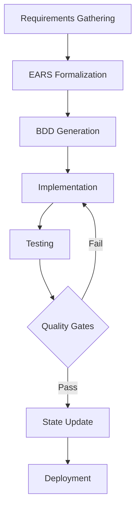

# Agentic Flow Development Workflow

## Complete Development Lifecycle

The Agentic Flow workflow provides a systematic approach from requirements gathering through deployment, with quality gates and verification at each stage.

## 🔄 Workflow Overview



## Phase 1: Requirements Gathering 📝

### Interactive Q&A Process

The `/gather-requirements` command initiates an interactive session:

#### Discovery Questions (High-Level)
- **What** problem are we solving?
- **Who** are the users/stakeholders?
- **Why** is this important?
- **When** is it needed?
- **Where** will it be used?
- **How** will success be measured?

#### Exploration (Detailed)
- Specific features and behaviors
- Edge cases and error conditions
- Performance requirements
- Security considerations
- Integration points

#### Validation
- Confirm completeness
- Verify consistency
- Check testability
- Ensure measurability

### Output
```markdown
## Gathered Requirements
- Natural language requirements
- Acceptance criteria
- Constraints and assumptions
- Priority assignments
```

## Phase 2: EARS Formalization 🎯

### Process
Use `/formalize-ears` to convert requirements:

1. **Analyze Requirements**: Identify patterns
2. **Apply EARS Notation**: Choose appropriate pattern
3. **Structure Statement**: Create formal notation
4. **Add Metadata**: Priority, status, links
5. **Validate**: Check completeness

### EARS Patterns Quick Reference
```markdown
Ubiquitous:    The [system] shall [behavior]
Event-Driven:  When [trigger], the [system] shall [response]
State-Driven:  While [state], the [system] shall [behavior]
Unwanted:      If [error], then the [system] shall [recovery]
Optional:      Where [feature], the [system] shall [capability]
```

### Quality Checklist
- [ ] Each requirement is atomic
- [ ] Measurable criteria included
- [ ] Correct pattern applied
- [ ] Traceability established
- [ ] Metadata complete

## Phase 3: BDD Generation 🧪

### Scenario Creation
Use `/generate-bdd` to create test scenarios:

#### Mapping Process
```gherkin
EARS: When [user logs in], the system shall [authenticate]
  ↓
BDD:  Scenario: Successful login
        Given a registered user
        When they submit valid credentials
        Then they are authenticated
```

#### Scenario Types
- **Happy Path**: Normal successful flow
- **Edge Cases**: Boundary conditions
- **Error Scenarios**: Failure handling
- **Performance**: Response time requirements

### Validation Criteria
- [ ] All requirements covered
- [ ] Concrete examples used
- [ ] Independent scenarios
- [ ] Proper tags applied
- [ ] Test data defined

## Phase 4: Implementation 💻

### Development Process

**IMPORTANT**: The `/task-work` command automates the complete implementation workflow with built-in quality gates. The phases below are executed automatically:

#### Phase Breakdown (Automated in /task-work)
```
Phase 1: Requirements Analysis
Phase 2: Implementation Planning
Phase 2.5: Architectural Review (NEW - SOLID/DRY/YAGNI) ✨
Phase 2.6: Human Checkpoint (Optional - Triggered for critical tasks) ✨
Phase 3: Implementation
Phase 4: Testing
Phase 5: Code Review
```

**NEW: Architectural Review** - Before any code is written, the system now reviews the planned architecture for SOLID, DRY, and YAGNI compliance. This catches design issues when they're cheap to fix (design phase) rather than expensive to fix (refactoring phase).

**Benefits**:
- 40-50% time savings by catching issues early
- 85% of architectural issues caught before implementation
- Reduced technical debt accumulation
- Better design decisions

#### 1. Branch Creation
```bash
# Feature branch
git checkout -b feature/TASK-123-user-auth

# Bugfix branch
git checkout -b bugfix/TASK-456-login-fix

# Chore branch
git checkout -b chore/TASK-789-deps-update
```

#### 2. TDD/BDD Approach
```javascript
// 1. Write failing test
test('should authenticate user', () => {
  expect(authenticate(validUser)).toBe(true);
});

// 2. Implement minimal code
function authenticate(user) {
  return validateCredentials(user);
}

// 3. Refactor for quality
function authenticate(user) {
  const validated = validateCredentials(user);
  if (validated) createSession(user);
  return validated;
}
```

#### 3. Commit Practices
```bash
# Conventional commits
feat: add user authentication
fix: resolve login validation error
test: add auth integration tests
docs: update auth documentation
refactor: simplify auth logic
chore: update dependencies
```

### Code Review Checklist
- [ ] Requirements satisfied
- [ ] Architecture matches approved design from Phase 2.5
- [ ] SOLID/DRY/YAGNI principles applied correctly
- [ ] All tests passing
- [ ] Documentation updated
- [ ] Security reviewed
- [ ] Performance acceptable
- [ ] Code maintainable

**Note**: Most architectural issues should be caught in Phase 2.5 (architectural review). If they're found in Phase 5 (code review), this indicates the architectural review needs strengthening.

## Phase 5: Testing 🔍

### Test Execution Strategy

#### Test Pyramid
```
        /\
       /E2E\      <- User journeys (Few)
      /------\
     /  Integ  \   <- Component interaction (Some)
    /----------\
   /    Unit    \  <- Individual functions (Many)
  /--------------\
```

#### Execution Order
1. **Unit Tests** - Fast feedback (milliseconds)
2. **Integration Tests** - Component verification (seconds)
3. **BDD Scenarios** - Behavior validation (seconds)
4. **E2E Tests** - Journey validation (minutes)
5. **Performance Tests** - Load testing (minutes)

### Test Metrics
```yaml
test_results:
  unit:
    total: 245
    passed: 245
    coverage: 87%
    duration: 1.2s
  
  integration:
    total: 42
    passed: 42
    duration: 15s
  
  bdd:
    scenarios: 28
    passed: 28
    steps: 156
    duration: 45s
  
  e2e:
    journeys: 5
    passed: 5
    duration: 3m 20s
```

## Phase 6: Quality Gates 🚦

### Gate Configuration

#### Pre-Commit Gates
```yaml
pre_commit:
  - code_formatting: required
  - linting: required
  - unit_tests: required
  - complexity_check: warning
```

#### Pre-Merge Gates
```yaml
pre_merge:
  - test_coverage: ≥80%
  - ears_compliance: 100%
  - bdd_coverage: ≥95%
  - security_scan: no_critical
  - code_review: approved
```

#### Pre-Deploy Gates
```yaml
pre_deploy:
  - all_tests: passing
  - performance: <200ms
  - documentation: complete
  - stakeholder_approval: yes
```

### Gate Failure Recovery
1. **Identify** - Which gate failed?
2. **Analyze** - Root cause analysis
3. **Fix** - Address the issue
4. **Verify** - Re-run validation
5. **Document** - Record exception if needed

## Phase 7: State Management 📊

### Progress Tracking
Use `/update-state` to maintain progress:

#### Task Status Flow
```
TODO → IN_PROGRESS → REVIEW → TESTING → DONE
              ↓
           BLOCKED
```

#### Sprint Progress
```markdown
Sprint 3 Progress
━━━━━━━━━━━━━━━━━━━━━━━━━━━━━━━━
Completed:  ████████████░░░░░░░░ 60%
Velocity:   18/30 points
Days Left:  5
Blockers:   2
```

### State Update Template
```markdown
## Task: TASK-123
**Status**: In Progress → Complete
**Completed**:
- ✅ EARS requirements (5/5)
- ✅ BDD scenarios (12/12)
- ✅ Implementation
- ✅ Tests (100% coverage)
- ✅ Code review
- ✅ Documentation

**Metrics**:
- Time: 16h (estimated: 20h)
- Quality: All gates passed
- Defects: 0
```

## 🛠 Automation & Tools

### Git Hooks

#### Pre-Commit Hook
```bash
#!/bin/bash
# .git/hooks/pre-commit

echo "🔍 Running pre-commit checks..."

# Format code
npm run format || exit 1

# Run linting
npm run lint || exit 1

# Run unit tests
npm test:unit || exit 1

# Validate EARS
agentecflow validate-ears || exit 1

echo "✅ Pre-commit checks passed!"
```

#### Post-Test Hook
```bash
#!/bin/bash
# .claude/hooks/post-test.sh

# Update coverage
agentecflow update-coverage

# Update test results
agentecflow update-test-results

# Check quality gates
agentecflow check-gates

# Update state
agentecflow update-state --auto
```

### CI/CD Pipeline

```yaml
name: Agentic Flow Pipeline

on: [push, pull_request]

jobs:
  validate:
    runs-on: ubuntu-latest
    steps:
      - uses: actions/checkout@v3
      - run: agentecflow validate-ears
      - run: agentecflow validate-bdd
  
  test:
    needs: validate
    runs-on: ubuntu-latest
    steps:
      - uses: actions/checkout@v3
      - run: npm ci
      - run: npm test
      - run: agentecflow check-coverage
  
  quality:
    needs: test
    runs-on: ubuntu-latest
    steps:
      - uses: actions/checkout@v3
      - run: agentecflow check-gates
      - run: npm audit
      - run: npm run performance-test
  
  deploy:
    needs: quality
    if: github.ref == 'refs/heads/main'
    runs-on: ubuntu-latest
    steps:
      - uses: actions/checkout@v3
      - run: agenticflow verify-deployment
      - run: npm run deploy
```

## 📈 Metrics & Reporting

### Velocity Metrics
```yaml
velocity:
  sprint_1: 21 points
  sprint_2: 24 points
  sprint_3: 19 points
  average: 21.3 points
  trend: stable
```

### Quality Metrics
```yaml
quality:
  defect_rate: 2.3%
  test_coverage: 86%
  code_complexity: 7.8
  technical_debt: 24 hours
  documentation: 94%
```

### Success Indicators
- ✅ 100% requirements in EARS format
- ✅ >95% BDD scenario coverage
- ✅ All quality gates passing
- ✅ Velocity ±10% variance
- ✅ <5% defect rate

## 🎯 Best Practices

### Requirements
1. **Be Specific** - Avoid ambiguous language
2. **Make Measurable** - Include quantifiable criteria
3. **Keep Atomic** - One requirement per statement
4. **Ensure Testable** - Can be verified

### Development
1. **Test First** - Write tests before code
2. **Commit Often** - Small, focused commits
3. **Document Decisions** - Use ADRs
4. **Review Thoroughly** - Quality over speed

### Testing
1. **Automate Everything** - Manual testing is rare
2. **Test Early** - Shift left approach
3. **Maintain Coverage** - Keep above thresholds
4. **Use Real Data** - Realistic test scenarios

### Collaboration
1. **Communicate Progress** - Regular updates
2. **Share Knowledge** - Document learnings
3. **Review Together** - Pair on complex work
4. **Celebrate Success** - Acknowledge achievements

## 🚨 Troubleshooting

### Common Issues & Solutions

| Issue | Solution |
|-------|----------|
| Unclear requirements | Run additional Q&A session |
| Failing BDD scenarios | Review requirement interpretation |
| Low test coverage | Add missing test cases |
| Quality gates failing | Focus on specific metrics |
| Blocked tasks | Escalate and document |
| Low velocity | Review estimates and impediments |

## 📚 Quick Reference

### Essential Commands
```bash
# Requirements
/gather-requirements     # Start Q&A session
/formalize-ears         # Convert to EARS
/validate-requirements  # Check quality

# Testing
/generate-bdd          # Create scenarios
/execute-tests         # Run test suite
/coverage-report       # View coverage

# Implementation (NEW: Includes Architectural Review)
/task-work TASK-XXX    # Complete implementation workflow with:
                       #   - Requirements analysis
                       #   - Implementation planning
                       #   - Architectural review (Phase 2.5) ✨
                       #   - Optional human checkpoint (Phase 2.6) ✨
                       #   - Implementation
                       #   - Testing
                       #   - Code review

# Management
/update-state          # Update progress
/sprint-report         # View sprint status
/quality-dashboard     # Check metrics
```

### File Locations
```
docs/requirements/     # EARS requirements
docs/bdd/features/    # Gherkin scenarios
docs/adr/             # Architecture decisions
docs/state/           # Progress tracking
tests/                # Test implementations
.claude/              # Configuration
```

---

*Follow this workflow for consistent, quality-driven development with full traceability from requirements to deployment.*
